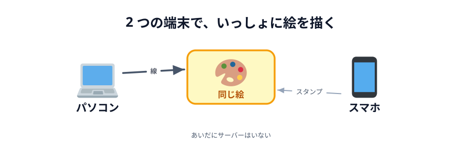

# 01 何を作るか

このハンズオンで作るのは、**2 つの端末でいっしょに絵を描けるお絵かきツール**です。
自分の PC で線を引くと、となりの人のスマホにその線がその場で現れます。

書くのは `index.html`・`style.css`・`main.js` の 3 ファイルだけです。
サーバーのプログラムは 1 行も書きません。

## まず完成版を触ってみる

このハンズオンで作るものは 2 つあります。**ボタンで光る**（03 章のゴール）と、
**いっしょにお絵かき**（05 章のゴール）です。どちらもこのページの中で動くので、
先に触ってみてください。

それぞれ上下 2 つ並べてあります。上下で「2 台の端末」だと思ってください。
操作はどちらも同じで、**上で「へやをつくる」→ 下で「へやにはいる」**だけです。

:::warning
あいことばは、**光るほうとお絵かきのほうで別のもの**にしてください。
2 つのアプリは同じ付け方でへやの名前を作るので、同じあいことばを使うと
光るほうとお絵かきのほうがつながってしまい、どちらも動きません。
:::

### ボタンで光る（03 章で作ります）

1. 上下の **あいことば** を、**同じ文字列**に書き換えます。
   `test` のままだと、いま同じページを見ている他の人とぶつかります。
   自分の名前やニックネームなど、かぶらないものにしてください
2. **上**で「へやをつくる」を押します → `あいてを待っています…` になります
3. **下**で「へやにはいる」を押します → 両方が `つながりました` になります
4. どちらかで「ひからせる」を押すと、**もう一方の「あいて」の丸**が同じ色に光ります

::preview[上の端末]{src="03-connect/06-deploy" height="420"}

::preview[下の端末]{src="03-connect/06-deploy" height="420"}

### いっしょにお絵かき（05 章で作ります）

1. 上下の **あいことば** を、さっきとは**別の**文字列に、上下そろえて書き換えます
2. **上**で「へやをつくる」→ **下**で「へやにはいる」で `つながりました` になります
3. 上のキャンバスをドラッグすると、下にも同じ線が出ます
4. 色・けしごむ・スタンプも、そのまま相手に届きます

::preview[上の端末]{src="05-drawing/08-deploy" height="520"}

::preview[下の端末]{src="05-drawing/08-deploy" height="520"}

うまくいかないときは、上下で違うあいことばを入れていないか、
両方とも「へやをつくる」を押していないかを確かめてください。

## この画面は、途中でどこも経由していない

おもしろいのはここからです。上のブラウザから下のブラウザへ、光った色も線のデータも
**どこかのサーバーを経由せずに、直接**渡っています。

いつもの Web は「ブラウザ → サーバー → ブラウザ」でした。今回は違います。
このやり方を **P2P（ピア・ツー・ピア）** と呼び、ブラウザでそれをやるための仕組みが
**WebRTC** です。生の WebRTC は書くことが多いので、**PeerJS** という
ライブラリで包んで使います。

くわしい仕組みは、自分の手でつないだあとの [04 章](../../04-how-it-works/01-compare/LECTURE.md) で見ます。
ここでは「直接つながっているらしい」とだけ覚えておいてください。

## 進む順番

このあとは、こういう順番で進みます。

1. **準備**（この章）— エディタ・Netlify Drop
2. **設計** — どんな要望から始まったのか、何を作るのか、何をデータとして送るのか、どの順で作るのか
3. **実装 1** — 「ボタンを押すと相手の丸が光る」だけの小さいものを作る。
   できたら Netlify に公開して、**本当に自分のスマホと PC** でつなぐ
4. **仕組み** — つながったものを分解して、どうやって直接つながっているのかを見る
5. **実装 2** — 同じ仕組みのまま、お絵かきツールに育てる

先に「光るだけ」を作ってからお絵かきに進みます。
なぜその順番なのかは、次の章の [02 節](../../02-design/02-blueprint/LECTURE.md) で決めます。
