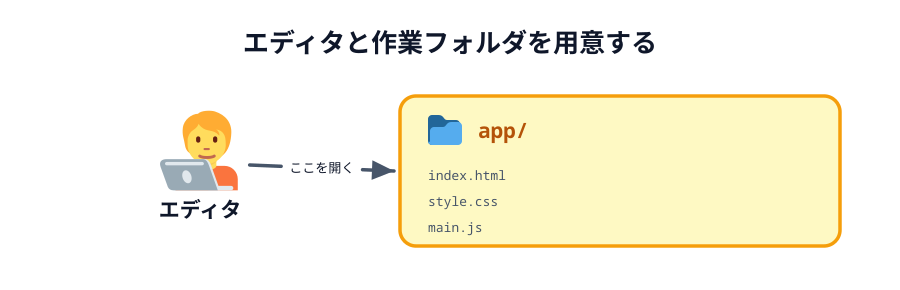
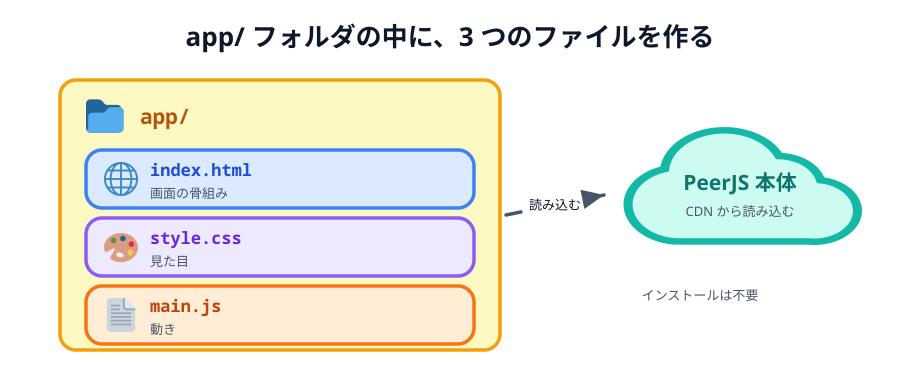

# 02 エディタを用意する



コードを書くために、テキストエディタを用意します。おすすめは無料の
**Visual Studio Code（VS Code）** です。すでに **Cursor** や **Windsurf**、**VSCodium** を使っている人は、
そのままで大丈夫です。これらはどれも VS Code をもとに作られたエディタなので、画面も操作もほぼ同じです。

## エディタを入れる

まだ入っていなければ、公式サイトからダウンロードしてインストールします。どれか1つで構いません。

- Visual Studio Code: https://code.visualstudio.com/
- Cursor: https://cursor.com/
- Windsurf: https://windsurf.com/

このあとの説明は VS Code の画面を前提に書きますが、Cursor などでも読み替えずにそのまま進められます。

## 作業フォルダを作る

このハンズオンでは、1 つの `app/` フォルダの中にファイルを作っていきます。
どこでもいいので `app` という名前のフォルダを作り、エディタの「フォルダを開く」から開いておきましょう。



_図: 開くのは `app/` フォルダ 1 つだけ。中の 3 ファイルはまだ無く、[03 章](../../03-connect/01-page/LECTURE.md) で作る。_

各節の完成例は ZIP でダウンロードできます。展開すると `app/` フォルダが出てくるので、
**いま使っている `app/` に上書き**すれば、その節の状態から続きを始められます。

## Live Server を入れる（推奨）

`index.html` はダブルクリック（`file://`）で開いても動きます。実は PeerJS もそのまま動きます。
それでも **Live Server** を入れておくことをおすすめします。ファイルを保存するたびに
ブラウザが自動でリロードされるので、書く → 確かめる、の往復がとても速くなるからです。

> **2 台で試すときは Live Server では足りません。** `file://` も `localhost` も、
> となりの端末からは開けないからです。2 台で動かすのは
> [03 章の最後](../../03-connect/04-deploy/LECTURE.md) で Netlify に公開してからになります。

Cursor / Windsurf / VSCodium といった **VS Code 系のエディタ**でも、まったく同じ拡張機能が使えます。
違うのは「拡張機能をどこから取ってくるか（マーケットプレイス）」だけです。自分の使っているエディタの
手順を下から選んでください。

### VS Code の場合

取得先は **VS Code Marketplace** です。

- Live Server（VS Code Marketplace）: https://marketplace.visualstudio.com/items?itemName=ritwickdey.LiveServer

1. 左側のバーにある拡張機能アイコン（四角が4つ並んだマーク）をクリックします。ショートカットは `Cmd + Shift + X`（Windows は `Ctrl + Shift + X`）です。
2. 上の検索ボックスに `Live Server` と入力します。
3. 作者が `Ritwick Dey` のものを選び、**Install（インストール）** ボタンを押します。
4. 右下のバーに **Go Live** と表示されれば完了です。

### Cursor の場合

Cursor は VS Code をもとに作られたエディタなので、画面も手順もほぼ同じです。ただし取得先が
VS Code Marketplace ではなく **Open VSX** という別のマーケットプレイスになっています。Live Server は
Open VSX にも公開されているので、そのまま検索して入れられます。

- Live Server（Open VSX）: https://open-vsx.org/extension/ritwickdey/LiveServer

1. 左側のバーにある拡張機能アイコンをクリックします（`Cmd + Shift + X` / `Ctrl + Shift + X`）。
2. 検索ボックスに `Live Server` と入力します。
3. 作者が `Ritwick Dey` のものを選び、**Install** を押します。
4. 右下のバーに **Go Live** と表示されれば完了です。

似た名前の別の拡張機能が並ぶことがあります。作者が `Ritwick Dey` になっているかを必ず確かめてください。

### Windsurf / VSCodium など、その他の VS Code 系の場合

これらも Open VSX から拡張機能を取得します。手順は Cursor と同じで、拡張機能パネルから
`Live Server`（作者 `Ritwick Dey`）を検索してインストールします。

### 検索しても出てこないときは

マーケットプレイスに表示されない場合は、拡張機能のファイル（`.vsix`）を直接入れられます。

1. Open VSX の Live Server のページ https://open-vsx.org/extension/ritwickdey/LiveServer を開きます。
2. **Download** から `.vsix` ファイルを保存します。
3. エディタで拡張機能パネルを開き、右上の `...`（三点メニュー）→ **Install from VSIX...** を選びます。
4. 保存した `.vsix` を選ぶとインストールされます。

### そもそも拡張機能を入れられないときは

会社の PC などで拡張機能を入れられない場合は、`file://` で開くか、
ターミナルから簡易サーバーを立てても進められます。
`app/` フォルダの中で次のどちらかを実行し、表示された URL をブラウザで開いてください。

```sh
# Python が入っている場合
python3 -m http.server 8000
# → http://localhost:8000/ を開く
```

```sh
# Node.js が入っている場合
npx serve
# → 表示された http://localhost:3000 などを開く
```

止めるときはターミナルで `Ctrl + C` を押します。

### アンインストールの手順

ハンズオンが終わって不要になったら、次の手順で消せます。VS Code でも Cursor でも同じです。
書いたファイルは消えません。

1. 左側のバーの拡張機能アイコンをクリックします。
2. 検索ボックスに `Live Server` と入力するか、「インストール済み（Installed）」の一覧から探します。
3. `Live Server` の歯車アイコン（または右クリック）→ **Uninstall（アンインストール）** を選びます。
4. 「Restart Extensions（拡張機能の再読み込み）」が出たら押します。これで削除完了です。

## 次の節へ

[03 PeerJS Cloud を確かめる](../03-peerjs-cloud/LECTURE.md)
