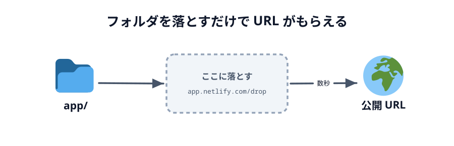
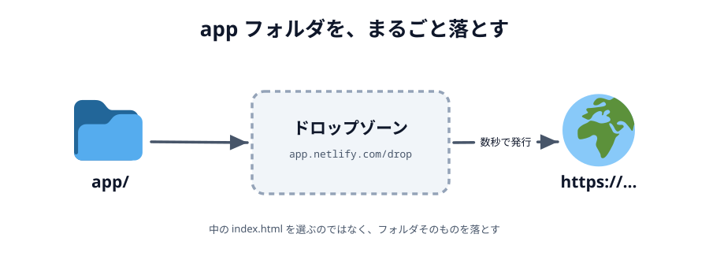

# 03 Netlify Drop



作ったものを **2 台の端末で動かす**ためには、インターネット上の住所（URL）が要ります。
`file://` も `http://localhost` も、自分の端末の中だけの住所なので、
となりのスマホからは開けないからです。

そこで **Netlify Drop** を使います。フォルダをブラウザにドラッグ&ドロップするだけで、
`https://....netlify.app` という URL がその場でもらえます。

**この節では、おためし用のページを使って最後まで公開します。**
自分で作ったアプリを公開するのは [03 章の最後](../../03-connect/06-deploy/LECTURE.md) ですが、
そのとき初めて触るより、いま一度通しておくほうが速いからです。

## Netlify Drop とは

**Netlify Drop**（https://app.netlify.com/drop）は、フォルダをブラウザに落とすだけで
Web サイトとして公開してくれるサービスです。フォルダの中身が、そのまま配られます。

### アカウントなしでできること

このハンズオンは、**アカウントを作らずに**進めます。

- フォルダを落として、`https://<でたらめな名前>.netlify.app` という URL をもらう
- その URL を、自分の PC でもスマホでも開く

ただし、アカウントなしの公開は**おためし扱い**で、決まりが 2 つあります。

- **開くときにパスワードを聞かれる。** パスワードは公開した直後の画面に出ている `My-Drop-Site` です。
  落とした本人のブラウザでも、スマホでも、最初に 1 回入れます
- **1 時間で期限が切れる。** 公開した直後の画面に、残り時間が出ています

1 時間で消えるのは、このハンズオンでは困りません。
コードを足したらそのたびに落とし直すので、いつも新しい URL を使うことになるからです。

### アカウントを作れば、消えなくなります

公開した直後の画面にある **Claim this site** を押すと、Netlify のアカウント（無料）を作って、
そのサイトを自分のものとして紐づけられます。
**紐づけたサイトは 1 時間たっても消えません。** 開くときのパスワードも要らなくなります。
作ったものを勉強会のあとも残しておきたい人は、最後に公開したものを紐づけてください。

### 公開したものを見られる人

パスワードの `My-Drop-Site` は、Netlify Drop を使う全員に共通です。
つまり、**URL を知っている人なら誰でも開けます**。
このハンズオンで作るものに個人情報は入りませんが、
**あいことばを知られると、他人が同じ「へや」に入れる**ことは覚えておいてください。

このあと公開するおためしページは、終わったら放っておいて構いません。1 時間で消えます。

## やってみる

ここから実際に公開します。5 ステップ、5 分ほどです。

### 1. サンプルをダウンロード

中身は `index.html` と `style.css` の 2 ファイルだけの、ただのページです。
JavaScript も PeerJS もまだ出てきません。下のパネルの
**「コードをダウンロード」**から ZIP を落としてください。

::codeview[おためし用のページ]{defaultFile="index.html"}

ブラウザで開くと、こう表示されるページです。

::preview[おためし用のページ（公開するとこれが出ます）]{height="380"}

### 2. 展開する

ダウンロードした ZIP をダブルクリックすると（Windows は右クリック →「すべて展開」）、
`app` というフォルダが出てきます。中に `index.html` と `style.css` が入っていれば大丈夫です。

```text
app/
├── index.html
└── style.css
```

:::warning
これは公開の練習用なので、[02 エディタを用意する](../02-editor/LECTURE.md) で作った
**作業用の `app/` とは別物**です。中身が混ざらないよう、作業用の `app/` の中には展開せず、
ダウンロードフォルダに置いたままにしてください。
:::

### 3. アップロードする

1. https://app.netlify.com/drop を開きます（ログインは要りません）
2. 点線で囲まれた四角（ドロップゾーン）に、いま展開した `app` フォルダを**まるごとドラッグ&ドロップ**します
3. 数秒待つと画面が切り替わり、`https://<でたらめな名前>.netlify.app` が発行されます

切り替わった画面には、URL のほかに**パスワード**（`My-Drop-Site`）と**残り時間**（1 時間から減っていきます）が出ています。
この画面は次の手順で使うので、閉じずにおいてください。



_図: 落とすのはフォルダそのもの。中の `index.html` を選ぶのではない。_

:::warning
落とすのは `app` フォルダ**そのもの**です。`index.html` が URL の直下に来る必要があります。
`app` の親フォルダ（`01-introduction-03-netlify` のような名前になっていることがあります）を落とすと、
`https://....netlify.app/app/` のように 1 階層深い URL になります。
:::

### 4. 確認する

発行された URL をクリックして開きます。
最初に `Password protected site` という画面が出るので、さっきの画面に出ていたパスワード
`My-Drop-Site` を入れて **Submit** を押します。さっきプレビューで見たページが出れば成功です。

そのまま、**スマホでも同じ URL を開いてみてください。** スマホでも同じパスワードを 1 回入れます。
手元のファイルは 1 つも動かしていないのに、別の端末から同じページが見えます。
これが「インターネット上の住所をもらう」ということです。

:::notice
URL は毎回でたらめな名前（`curious-otter-3f1a2b` のような）になります。
スマホで手入力するのは大変なので、**自分あてにメッセージアプリで送る**のが一番早いです。
:::

### 5. 更新する

コードを直したら、また同じページ（https://app.netlify.com/drop）にフォルダを落とします。
手順は 3. とまったく同じです。

展開した `app/style.css` の 2 行目あたりにある `--accent` の色を書き換えて保存し、
`app` フォルダをもう一度ドロップゾーンに落としてみましょう。

```css
:root {
  /* ここを #4cc9f0 などに書き換えてみる */
  --accent: #ffd60a;
}
```

新しい URL が発行され、開くと（パスワードはさっきと同じです）丸の色が変わっているはずです。

**そのかわり、毎回あたらしい URL になります。** 落とすたびに別のサイトが作られるからです。
さっきの URL も期限が切れるまでは生きているので、見比べてみてください。
相手に URL を伝えていたら、伝え直すことになります。

アカウントに紐づければ同じ URL のまま中身だけ差し替えることもできるのですが、ダッシュボードを開いて
プロジェクトを探して…と手順が増えます。このハンズオンでは
**「落とす → 新しい URL が出る → それを使う」だけ**で通します。覚えることが 1 つで済むほうが速いからです。
