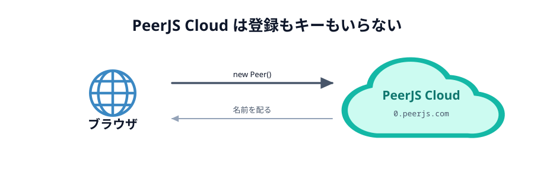

# 03 PeerJS Cloud を確かめる



ブラウザ同士を直接つなぐには、**最初のひと声だけ**、共通の場所を経由する必要があります。
その場所を PeerJS では **PeerServer** と呼び、公式が無料で開放しているものが
**PeerJS Cloud** です。

このハンズオンでは PeerJS Cloud をそのまま使います。

## 登録もキーもいりません

うれしいことに、PeerJS Cloud は **アカウント登録もキーの発行も不要**です。
`new Peer()` と書いた時点で、自動的につながります。

```js
// これだけで PeerJS Cloud につながる
const peer = new Peer();
```

接続先は `0.peerjs.com` の 443 番ポートで、ライブラリの中に最初から書いてあります。
だからこの節でやることは「準備」ではなく「**ちゃんとつながるか確かめる**」だけです。

## つながるか確かめる

下のボタンを押してください。**名前が返ってきたら成功**です。

::preview[押すと PeerJS Cloud につないで、配られた名前を表示します]{demo="peer-check" height="220"}

`つながりました。あなたに配られた名前: 8f3a1c9e-...` のような文字列が出れば、
このネットワークから PeerJS Cloud に届いています。

::codeview[このデモの中身]{path="demos/peer-check"}

## いま何が起きたか

`new Peer()` を書くと、ブラウザは PeerJS Cloud に「参加します」と挨拶をします。
すると Cloud 側が、**世界中で重複しない名前**を 1 つ配ってくれます。
それが `peer.on('open', ...)` で受け取った ID です。

この名前は、あとで相手が自分を呼び出すときの宛先になります。
[03 章](../../03-connect/02-peer/LECTURE.md) では、この配られた名前を使う代わりに
「あいことば」を自分から名乗る形にします。

:::warning
PeerJS Cloud は世界中の人と共有している 1 つのサーバーです。
`test` や `room1` のような短い名前を自分から名乗ると、**すでに誰かが使っている**ことが
よくあります。このハンズオンでは `webrtc-handson-` という長い前置きを付けて、
ぶつかりにくくします。
:::

## つながらなかったときは

`つながりませんでした: network` などが出たら、次を確認してください。

- 会社や学校のネットワークが WebSocket をふさいでいることがあります。スマホのテザリングなど、
  別の回線で試してみてください
- PeerJS Cloud 自体が落ちている可能性もあります。https://status.peerjs.com/ で状態を確認できます

## 次の節へ

[04 Netlify のアカウントを作る](../04-netlify/LECTURE.md)
