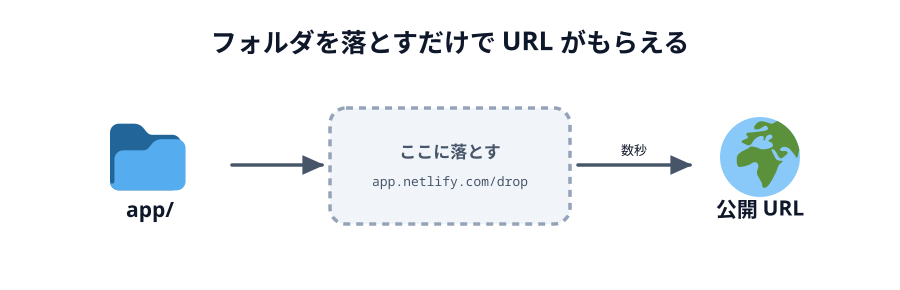
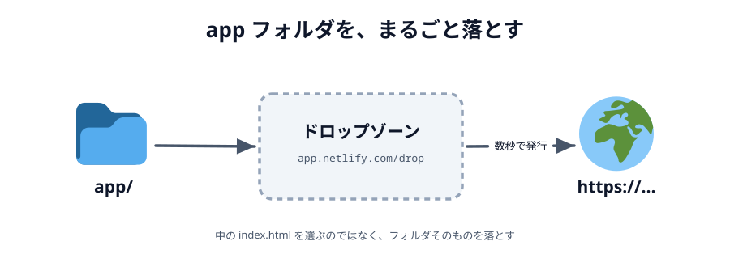

# 04 Netlify Drop で公開してみる



作ったものを **2 台の端末で動かす**ためには、インターネット上の住所（URL）が要ります。
`file://` も `http://localhost` も、自分の端末の中だけの住所なので、
となりのスマホからは開けないからです。

そこで **Netlify Drop** を使います。フォルダをブラウザにドラッグ&ドロップするだけで、
`https://....netlify.app` という URL がその場でもらえます。

**この節では、おためし用のページを使って最後まで公開します。**
自分で作ったアプリを公開するのは [03 章の最後](../../03-connect/06-deploy/LECTURE.md) ですが、
そのとき初めて触るより、いま一度通しておくほうが速いからです。

## Netlify Drop とは

**Netlify** は、できあがったファイルを預かってインターネットに配ってくれるサービスです。
その中でいちばん手前にある入口が **Netlify Drop**（https://app.netlify.com/drop）で、
このページにフォルダを落とすと、それだけで公開が終わります。

落としたときに向こうで起きているのは、次の 3 つだけです。

1. フォルダの中のファイルがまるごとアップロードされる
2. `https://<でたらめな名前>.netlify.app` という住所が 1 つ割り当てられる
3. その住所を開くと、フォルダの中の `index.html` が返ってくる

つまり、**フォルダの中身がそのまま Web サイトになります**。
`index.html` から見た `style.css` や `main.js` の位置関係も、手元とまったく同じです。

### 組み立て（ビルド）はしません

Netlify Drop は、落としたものを**そのまま配る**だけの仕組みです。変換も組み立てもしません。
だから落とすフォルダには、ブラウザがそのまま読めるファイル
（`index.html` / `style.css` / `main.js`）が入っていれば足ります。
このハンズオンで育てていく `app` フォルダはまさにその形なので、いつでもそのまま落とせます。

### ターミナルも Git も要りません

ふつう Web サイトの公開には、コマンドを打ったり、Git でコードを預けたりする手順が要ります。
Drop はそこを全部とばして、**ブラウザの操作だけ**で完結します。
このハンズオンでは公開を何度かやるので、いちばん短い道を選んでいます。

### アカウントも要りません

Drop は登録もログインもしないまま使えます。
公開したあとに「このサイトを自分のものにしませんか」と誘われることがありますが、
**無視して構いません**。URL はそのまま生きています。

## やってみる

ここから実際に公開します。4 ステップ、5 分ほどです。

### 1. おためし用の ZIP をダウンロードする

中身は `index.html` と `style.css` の 2 ファイルだけの、ただのページです。
JavaScript も PeerJS もまだ出てきません。下のパネルの
**「コードをダウンロード」**から ZIP を落としてください。

::codeview[おためし用のページ]{defaultFile="index.html"}

ブラウザで開くと、こう表示されるページです。

::preview[おためし用のページ（公開するとこれが出ます）]{height="380"}

### 2. 展開する（解凍する）

ダウンロードした ZIP をダブルクリックすると（Windows は右クリック →「すべて展開」）、
`app` というフォルダが出てきます。中に `index.html` と `style.css` が入っていれば大丈夫です。

```text
app/
├── index.html
└── style.css
```

:::warning
これは公開の練習用なので、[02 エディタを用意する](../02-editor/LECTURE.md) で作った
**作業用の `app/` とは別物**です。中身が混ざらないよう、作業用の `app/` の中には展開せず、
ダウンロードフォルダに置いたままにしてください。
:::

### 3. ドロップゾーンに落とす

1. https://app.netlify.com/drop を開きます（ログインは要りません）
2. 点線で囲まれた四角（ドロップゾーン）に、いま展開した `app` フォルダを**まるごとドラッグ&ドロップ**します
3. 数秒待つと `https://<でたらめな名前>.netlify.app` が発行されます



_図: 落とすのはフォルダそのもの。中の `index.html` を選ぶのではない。_

:::warning
落とすのは `app` フォルダ**そのもの**です。`index.html` が URL の直下に来る必要があります。
`app` の親フォルダ（`01-introduction-04-netlify` のような名前になっていることがあります）を落とすと、
`https://....netlify.app/app/` のように 1 階層深い URL になります。
:::

### 4. 開いて確かめる

発行された URL をクリックして開きます。さっきプレビューで見たページが出れば成功です。

そのまま、**スマホでも同じ URL を開いてみてください。** 手元のファイルは 1 つも動かしていないのに、
別の端末から同じページが見えます。これが「インターネット上の住所をもらう」ということです。

:::notice
URL は毎回でたらめな名前（`curious-otter-3f1a2b` のような）になります。
スマホで手入力するのは大変なので、**自分あてにメッセージアプリで送る**のが一番早いです。
:::

## 直したら、もう一度落とすだけ

コードを直したら、また同じページ（https://app.netlify.com/drop）にフォルダを落とします。
手順は 1 回目とまったく同じです。

せっかくなので、ここで 1 回やってみましょう。展開した `app/style.css` の 2 行目あたりにある
`--accent` の色を書き換えて保存し、`app` フォルダをもう一度ドロップゾーンに落とします。

```css
:root {
  /* ここを #4cc9f0 などに書き換えてみる */
  --accent: #ffd60a;
}
```

新しい URL が発行され、開くと丸の色が変わっているはずです。

**そのかわり、毎回あたらしい URL になります。** 落とすたびに別のサイトが作られるからです。
さっきの URL もそのまま生きているので、見比べてみてください。
相手に URL を伝えていたら、伝え直すことになります。

同じ URL のまま中身だけ差し替える方法もあるのですが、ダッシュボードを開いて
プロジェクトを探して…と手順が増えます。このハンズオンでは
**「落とす → 新しい URL が出る → それを使う」だけ**で通します。覚えることが 1 つで済むほうが速いからです。

## 公開したものは誰でも見られます

Netlify で公開した URL は、知っている人なら誰でも開けます。
このハンズオンで作るものに個人情報は入りませんが、
**あいことばを知られると、他人が同じ「へや」に入れる**ことは覚えておいてください。

いま公開したおためしページは、放っておいて構いません。
消したい場合は、公開直後に出てくる「このサイトを自分のものにする」からアカウントに紐づけると、
ダッシュボードから削除できるようになります。紐づけないままだと、あとから探す手段はありません。
