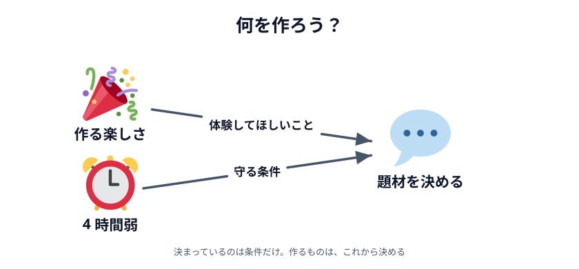
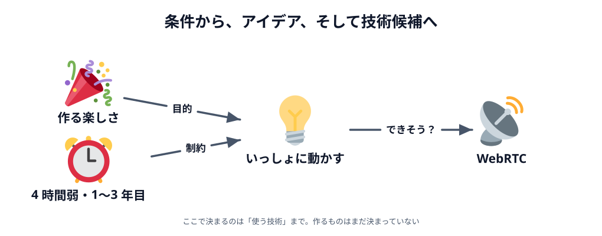

# 01 背景 — 何を作ろう？

この章では、コードを 1 行も書きません。かわりに、**この勉強会がどうやって生まれたのか**を話します。

アプリの設計は、いきなり画面やコードを考えることではありません。
何を実現したいのかを考え、制約を整理し、実現できるのかを調べ、
その結果をもとに**作るものと作る順番**を決めていきます。

この節はその一歩目、まだ何も決まっていないところからです。

## 勉強会で何を体験してもらいたいか

今回の勉強会は、**エンジニア歴 1〜3 年くらいの方**を主な対象にしています。
時間は **4 時間弱**。1 日がかりではありません。

この条件で最初に考えたのは、「何を教えるか」ではなく
「**何を体験して帰ってもらうか**」でした。

いまは AI に頼めば、簡単なアプリなら短い時間で作れます。
わたしたちも毎日使っていますし、この勉強会でも使ってかまいません。
だからこそ、**わざわざ集まって過ごす時間で何ができるか**を考えたいと思いました。

行き着いたのは、次の 2 つです。

- **自分で作ったものが、目の前で動く**
- **それを、その場でほかの人と試せる**

2 つ目は、1 人で画面に向かっているとなかなか味わえません。
人が集まっている日にしかできないことなので、ここを大事にすることにしました。

## どんな技術を使おう？

題材の相談は、主催者とわたし（講師）で進めました。

まず出たのは「**これまでの勉強会で扱っていない技術を使いたい**」という話です。
候補には画像解析やデータベース設計なども上がりました。どちらも面白いテーマです。

ただ、今回の条件に当てはめて考えると、少し窮屈でした。
4 時間弱のあいだに「動いた！」までたどり着けるか、
そして 1〜3 年目の方が手を動かしながら楽しめるか。
このものさしで見ると、今回は別のテーマのほうがよさそうでした。

そこで出てきたのが、**ブラウザ同士でリアルタイム通信ができる WebRTC** というアイデアです。

## WebRTC で何ができそう？

WebRTC を使うと、離れたブラウザ同士でリアルタイムに情報をやり取りできます。
つまり、**PC とスマホのような複数の端末で、一緒に操作できるアプリ**が作れそうです。

完成したものを参加者同士で試せたら面白そうだ、というところまでは見えました。
さっき大事にすると決めた「その場でほかの人と試せる」に、ちょうど重なります。

_図: 技術の優劣を比べたわけではなく、条件に合うものを探した結果。_

ただし、この時点ではまだ**やると決めていません**。
4 時間弱の勉強会で簡単に実現できるのかが、まったく分からなかったからです。

:::notice
ここで決まったのは「**使う技術**」であって「**作るもの**」ではありません。
題材の相談はたいていこの粒度で止まります。
「リアルタイム通信で何か作る」から「お絵かきツールを作る」までには、まだ距離があります。
:::

:::questions

- 4 時間弱という時間は、題材を選ぶときの条件になる [o]
- AI があるので、勉強会でアプリを作ることに意味はない [x]
- 「リアルタイム通信で何か作る」まで決まれば、作るものも決まったことになる [x]
- 使えそうな技術が見つかったら、実現できるかを調べる必要がある [o]

:::

次の節では、これが本当に実現できるのかを調べます。
