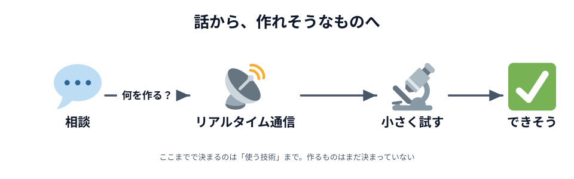
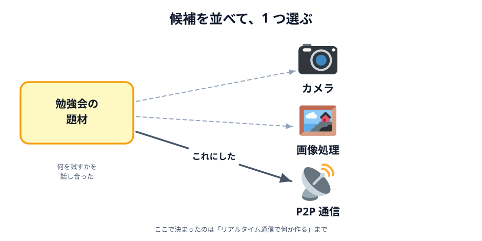
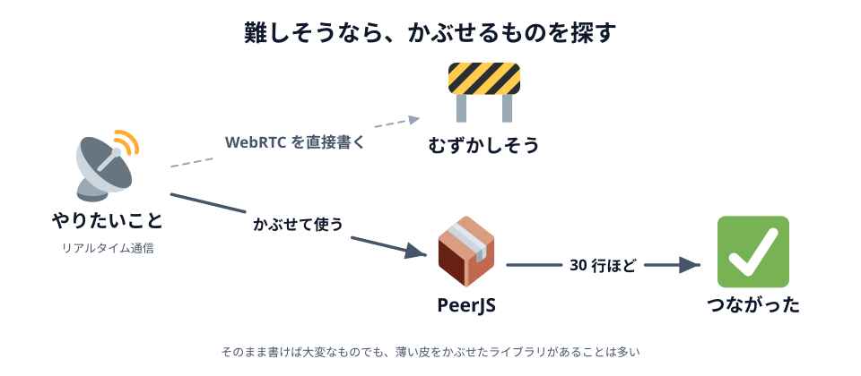

# 01 要望を整理する

この教材は「勉強会で何を作ろうか」という雑談から始まりました。この節では、その相談が「リアルタイム通信で何か作る」に落ち着くまでを、そのまま振り返ります。

この章ではコードを 1 行も書きません。
遠回りに見えるかもしれませんが、ここを飛ばすと「作りながら考える」ことになります。
作りながら考えると、あとから「これも要るのか」が出てきて、書いたものを捨てることになります。

## ふだんから、新しい技術は触っておく

わたしは、新しい技術の名前を見かけたら、とりあえず触ってみるようにしています。
ちゃんと作るわけではなく、公式ページのサンプルを動かして、少しいじってみる程度です。

これを続けていると、だんだん**「いまはこういうことが簡単にできるようになったのか」という感覚**が
たまってきます。個々のやり方は忘れてしまっても、「できる／できない」の線引きだけは残ります。

この感覚が効いてくるのは、何かを相談されたときです。
「こういうのやりたいんだけど」と言われて、その場で候補をいくつか出せるかどうかは、
その日に調べる力よりも、**それまでに何を触ってきたか**で決まります。

## 「勉強会で何を作るか」の相談から始まった

きっかけは、勉強会の題材をどうするか、という相談でした。
テーマが先にあったわけではなく、「次は何をやろうか」から始まっています。

そこで、試してみたい技術を出し合いました。

_図: まず候補を並べる。選ぶのはそのあと。_

- **カメラ** — ブラウザからカメラを使う
- **画像処理** — 撮った画像や読み込んだ画像を加工する
- **P2P 通信** — ブラウザ同士を直接つなぐ

話しているうちに、**リアルタイム通信が良さそうだ**という方向に固まりました。
動いたときの驚きが大きく、しかも「ブラウザだけで完結する」という意外性があったからです。

ここで注意したいのは、**この時点で決まったのは「使う技術」であって「作るもの」ではない**ことです。
要望はたいてい、この粒度でやってきます。
「リアルタイム通信で何かやりたい」から「お絵かきツールを作る」までには、まだ距離があります。

## 難しそうなものを、簡単にできないか調べた

方向が決まったので、次は調べる番です。

ブラウザでリアルタイム通信をするなら **WebRTC** だ、というところまでは知っていました。
ただ、**難しそうだ**という印象も同時に持っていました。
聞こえてくる言葉が、シグナリング、STUN、TURN、ICE と、どれも初めて見るものばかりだったからです。
勉強会の題材にするには重すぎるように思えました。

そこで、ChatGPT に「リアルタイム通信をもっと簡単にできないか」と相談してみました。
返ってきたのが **PeerJS** です。WebRTC の面倒なところをまとめて引き受けてくれるライブラリで、
数十行あれば 2 つのブラウザをつなげる、という説明でした。

_図: そのまま書くと大変なものでも、薄い皮をかぶせたものがあることは多い。_

そのまま書くと大変な技術には、**扱いやすくしたものがかぶせてあることが多い**。
これは WebRTC に限った話ではありません。難しそうだと思ったら、
自分でやる前に「もっと簡単に使えるものは無いか」を一度探すと、そこで話が終わることがあります。

:::notice
**使える部品を探すのも設計のうちです。**
「まず WebRTC を理解してから」と始めていたら、勉強会の準備は終わりませんでした。
**あるものを使い、自分で書くところを減らす**のは、作る前にやる判断のひとつです。
ここで出てきた PeerJS と、その相手探しを引き受けてくれる PeerJS Cloud は、
[03 章 04 節](../../03-connect/04-peer/LECTURE.md) で実際に使います。
:::

## 決める前に、小さく試す

提案されただけでは採用できません。**本当に動くのか**を自分で確かめました。

やったことは単純で、2 つのタブをつないで文字列を 1 つ送るだけの、短いページを書いただけです。
凝ったことは何もしません。**いちばん不安なところだけ**を切り出して動かします。

これで「ある程度はできそうだ」と分かりました。
逆に、ここで通らなければ題材ごと考え直していたはずです。
カメラや画像処理の候補が残っていたのは、そのためでもあります。

**分からないものは、作ると決める前に、小さく動かして確かめる。**
このやり方は、このあと作る順番を決めるときにもう一度出てきます。

:::questions

- ふだんからいろいろ試しておくと、題材の候補が出たときに判断が早くなる [o]
- 「リアルタイム通信で何か作る」まで決まれば、作るものも決まったことになる [x]
- 難しそうな技術は、もっと簡単に扱えるものが無いかを先に探すとよい [o]
- AI にライブラリを提案されたら、自分で動かさずに採用してよい [x]
- 作ると決める前に小さく動かしておくと、あとで詰まりにくい [o]

:::

作るものは、まだ決まっていません。
次の節で、ここまでに分かったことを要件にして、作るものと作る順番を決めます。
