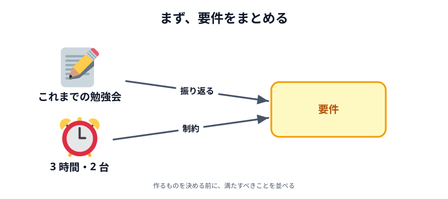
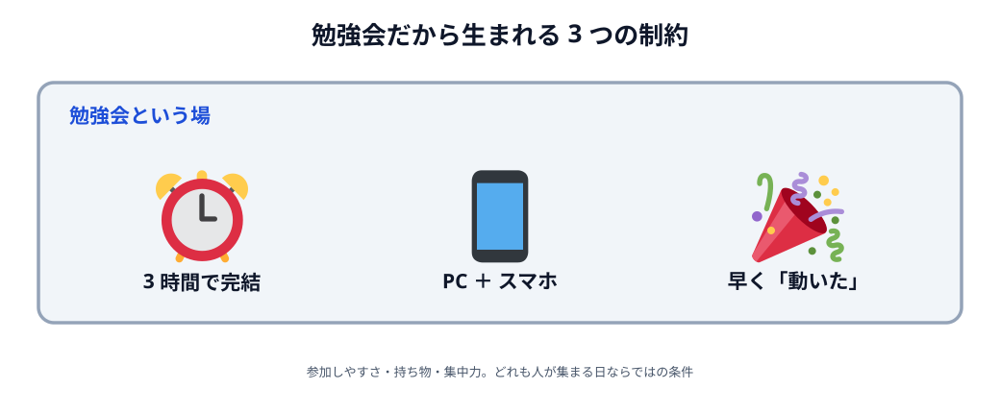
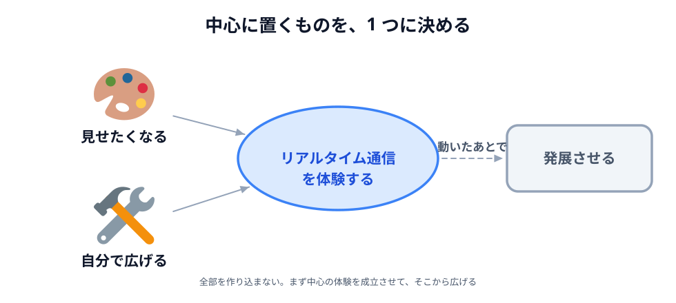

# 01 要件をまとめる

この章では、コードを 1 行も書きません。かわりに、**この勉強会がどう設計されたのか**を追いかけます。

設計は、いきなり画面やコードを考えることではありません。
まず**満たすべきことを並べて**、そこから作るものと作る順番を決めていきます。

この節はその一歩目、**要件をまとめる**ところです。

## 勉強会のコンセプト

この勉強会のコンセプトは、**プログラミング歴 1〜3 年くらいのエンジニア**に向けて、
**実際に手を動かしながらモノを作ることを楽しんでもらう**ことです。

そこに私が付け足して大切にしているのが、
**現場では忘れがちな原理や設計のようなところに、少しでも触れてもらう**ことです。
その場で動くものができて終わりではなく、あとから別の場面にも応用が効く力を持ち帰ってほしいからです。

そのうえで主催者の方と話し、**これまで扱っていない「リアルタイム通信」をテーマにする**ことにしました。

決まったのはここまでです。この段階では、**何を作るか**はまだ決めていません。

## 勉強会だから生まれる制約

次に、**勉強会という場だから生まれる制約**を並べました。
技術的に難しいかどうかとは別の、人が集まる日ならではの条件です。

**参加しやすいように、1 日・3 時間程度で完結させます。**
何日にも分けたり、朝から晩までかかったりすると、それだけで参加のハードルが上がります。

**PC を 2 台用意する前提にしません。**
リアルタイム通信は、**本当に 2 台**でつないだときにいちばん手ごたえがあります。
とはいえ 2 台目の PC を持ってきてもらうのは大変なので、**PC ＋ スマートフォン**で試せる形にします。

**早い段階で「動いた・面白い」を体験できるようにします。**
3 時間もあると、途中で集中力が切れることがあります。
最後まで作り切らないと何も動かない構成だと、そこで止まってしまいます。

_図: どれも技術的な制約ではなく、集まってやるから生まれた条件。_

## 作るものに求める要件

制約が出そろったので、**作るものに求めること**を 3 つにまとめました。

**1. リアルタイム通信を実際に操作して体験できること。**
読んで分かるのではなく、自分で操作して、その結果が相手の画面に出るところまで見えるものにします。

**2. 人に見せたくなるキャッチーな成果物になること。**
リアルタイム通信の典型的なサンプルはチャットアプリですが、
それだと「動いた」で終わってしまいがちです。
完成したものを、その場でとなりの人に見せたくなるかどうかを条件に入れます。

**3. あとから自分で発展させられること。**
基本の部分を完成させたあと、自分なりに機能を足していける形にします。
勉強会が終わったあとも触り続けられるかどうか、という条件です。

この「自分で」には、**AI に頼んで機能を足すこと**も含めます。
ハンズオンで全体の流れを追っておけば、**どの部分を AI にカスタマイズさせればいいか**を考えやすくなります。
丸ごと作らせるのではなく、作りが分かっているものに手を入れてもらう形です。

## 制約と要件をまとめる

制約と要件が出そろいました。あとは、**今ある制約の中で要件を満たす方法**を考えます。

3 時間はそれほど長くありません。しかもこの時間には、準備や仕組みの解説も含まれます。
手を動かせるのはそのうちの一部なので、全部を作り込むことはできません。
だから、何を中心に置くかを決めて、そこから組み立てます。

**リアルタイム通信の技術を使いながら、キャッチーなモノをつくる。**
ここが中心です。通信のしくみを実際に動かして体験し、できあがったものが人に見せたくなる形になっていること。

**限られた時間で、AI を使いながらでも拡張できる程度の理解を持たせる。**
すべてを自分で書けるようになる必要はありません。
どこで何をしているかが分かっていて、AI に頼みながらでも手を入れられる状態を目指します。

**全体の流れで「できそう」と思ってもらい、続けてもらう。**
その日に動いて終わりではなく、帰ったあとも自分で触り続けられる手ごたえを残します。

逆に、全部の機能がそろって初めて動く作り方は選びません。
これが、今回の勉強会の内容の要件です。

_図: 制約の中で要件を満たすとは、何を捨てるかではなく、何を中心に置くかを決めること。_

要件はまとまりました。次の節では、ここから作るものと作る順番を決めます。
