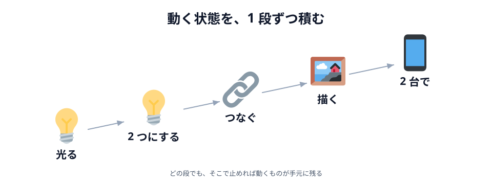
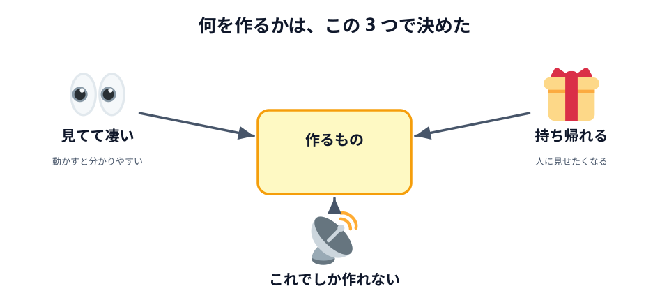
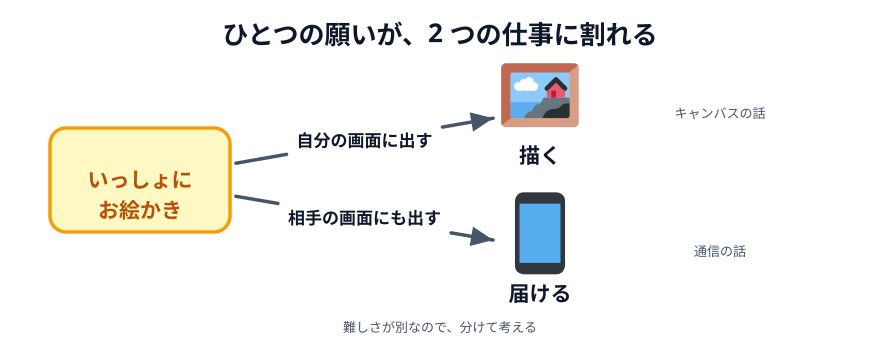
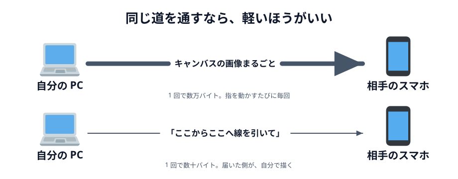
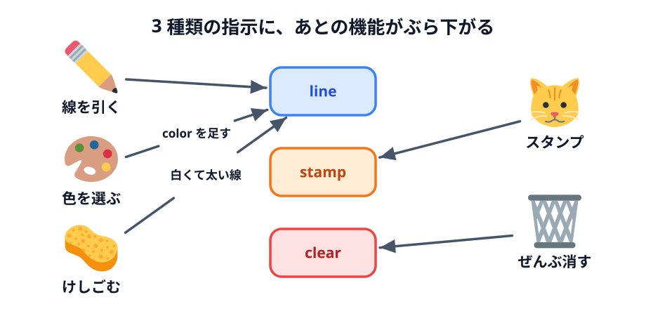
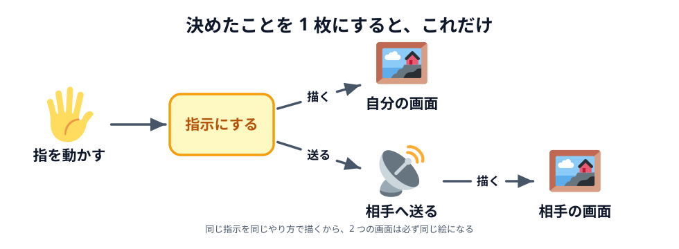
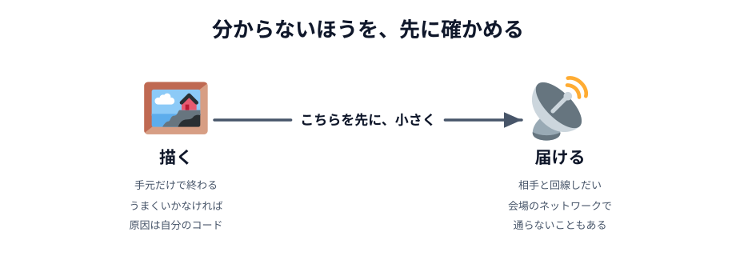
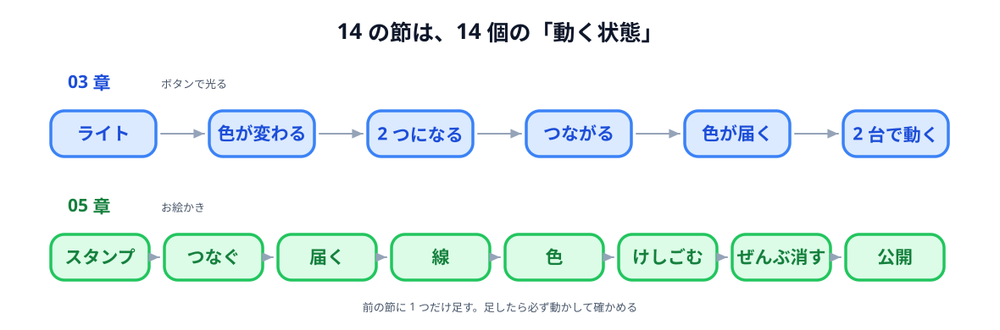
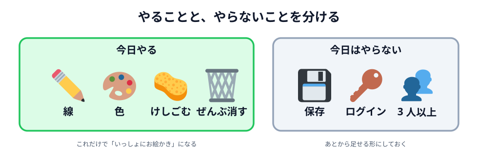

# 02 要件を決めて、設計に落とす



前の節で分かったのは「PeerJS を使えば何かできそうだ」までです。この節では、そこから作るものを決め、何を送るかを決め、どの順で作るかまでを一気に決めます。

ここで決めたことが、このあとの 03 章と 05 章の中身そのものになります。
コードはまだ出てきません。

## 何が大事かを先に決めた

作るものを考える前に、**何を大事にするか**を先に決めました。
ここが決まっていないと、候補が出てきたときに比べようがないからです。

まず、過去にやった勉強会を思い出して、**どこまでなら当日に終わるか**を見積もりました。
半日で、参加者が自分の手で書き上げられる分量。だいたい 300 行くらいが上限です。

そのうえで、大事にすることを 3 つに絞りました。



_図: 3 つとも満たすものを探す。1 つでも欠けると、作ってもつまらない。_

- **見てて凄そうであること** — 動かした瞬間に「おっ」となる。説明が要らない
- **持ち帰って人に見せたときに、凄いと言われること** — 勉強会が終わったあとも遊べる
- **リアルタイム通信でしかできないこと** — これが無いと、題材にした意味がない

3 つ目がいちばん効きました。
「べつにサーバーでもできるよね」と言われてしまうものは、この勉強会では作る意味がありません。

## お絵かきアプリにする

3 つのものさしに当てて選んだ結果が、**2 人でいっしょに絵を描ける道具**です。

自分が引いた線が、となりの人の画面にその場で現れる。
これは見た目で分かりますし、人に見せても伝わりますし、リアルタイムでないと成立しません。

ただ、この一言のままでは、どこから手を付ければいいのか分かりません。
そこで、**2 つの仕事に割ります**。



_図: 難しさが別なので、分けて考える。_

- **描く** — 自分がドラッグしたら、自分の画面に線が出る
- **届ける** — その線が、相手の画面にも出る

この 2 つは、まったく別の仕事です。
「描く」はブラウザの中だけで終わる話で、「届ける」は相手の端末と回線が相手の話です。
**この節のあいだ、ずっとこの 2 語で考えます。**

## 要る機能を、まず全部書き出した

作るものが決まったら、次は何ができれば完成なのかを並べます。
ここでは減らしません。**まず全部出す**のが大事です。

| 機能                     | いつ使うか                 | 無いとどう困るか                   |
| ------------------------ | -------------------------- | ---------------------------------- |
| 線を引く                 | ずっと                     | お絵かきにならない                 |
| 相手の画面にも出る       | ずっと                     | 1 人で描いているだけになる         |
| 色を選ぶ                 | 描き分けたいとき           | 誰が描いたのか分からない           |
| けしごむ                 | 間違えたとき               | やり直せない                       |
| ぜんぶ消す               | 描き直したいとき           | 1 か所ずつ消すことになる           |
| スタンプ                 | 気分を出したいとき         | 無くてもいいが、あると楽しい       |
| スマホでも動く           | 2 台目がスマホのとき       | PC を 2 台用意しないといけなくなる |
| あとから来た人にも見える | 相手が遅れて入ってきたとき | 相手の画面だけ白紙のままになる     |

この表の「無いとどう困るか」の欄が、あとで効いてきます。
**困り方が小さいものは、後回しにできる**からです。

### 利用者が言わない機能

完成版には、上の表に無いものも出てきます。

- **あいことば**の入力欄
- **へやをつくる** / **へやにはいる** のボタン
- `つながりました` という表示
- `そのあいことばは使われています` というエラー

「お絵かきがしたい」と言う人は、こんなものは頼みません。
でも、**相手を見つける手段が無ければ「届ける」は成立しません**。

これが **作り手が自分で気づいて足す機能** です。
利用者が口にするのは「やりたいこと」だけで、それを成立させるために何が要るかは作る側が考えます。
エラーの表示も同じ仲間で、何が起きたのか分からないと、利用者は打つ手がなくなります。

### 機能ではなく、全体にかかる条件

一覧に混ざりやすいものが、もう 1 つあります。

- スマホでも動く
- サーバーのプログラムを書かない
- ブラウザで開くだけで動く

これらは、ボタンのような**機能ではありません**。全体にかかる**条件**です。
「けしごむ」は後から足せますが、条件は後から足せません。

たとえばマウス専用で全部作ってしまうと、あとから指の操作に対応させるには、
操作を受け取っているところを全部書き直すことになります。
**条件は、最初から守りながら作ります。**

## 「描く」はキャンバスに任せる

ここから、2 つの仕事をそれぞれ**何で実現するか**を決めます。まず「描く」ほうです。

ブラウザには `<canvas>` という「絵を描くための板」が最初から付いています。
線も、丸も、文字も置けます。自分で用意するものは何もありません。

曲線を引く機能はありませんが、それで困りません。
**指が動いた分だけ短い直線を引き続ける**と、人の目には曲線に見えます。
絵文字は文字として置けるので、スタンプもこれで作れます。

マウスと指をどう扱うかも、ブラウザ側に用意があります。
マウスもタッチも同じ扱いにできる仕組みがあるので、**両対応のために 2 通り書く必要はありません**。
さっき「スマホでも動く」を条件にしましたが、それはこれで守れます。

## 送るのは「絵」ではなく「描く操作」

こちらが本題です。相手の画面に同じ絵を出すために、**何を送るか**。
この節でいちばん大事な決めごとがここです。

案は 2 つあります。

1. **絵そのものを送る** — 描くたびに、キャンバスの画像をまるごと相手に送る
2. **描く操作を送る** — 「ここからここへ、この色で線を引いて」と指示だけ送り、
   受け取った側が自分で描く



_図: 同じ区間でも、載せるものを変えれば道は細くて済む。_

大きさが全然違います。キャンバスの画像は 1 枚で数万バイトあります。
指を動かすたびに送るとなると、1 秒に何十回もそれを送ることになります。

指示のほうは、こういうものです。

```js
{ type: 'line', x1: 120, y1: 80, x2: 124, y2: 86, color: '#333333', width: 4 }
```

これで 100 バイト弱です。**数百分の 1 以下**になります。
しかも「線が指についてくる」ように見せたいなら、軽いほうが圧倒的に有利です。

**2 を選びます。**

### 指示の形

送るものを「指示」と決めたので、次は**その中身**を決めます。
さっき「やる」と決めた機能から、必要なものは 3 種類だと分かります。

| 種類    | 何を伝えるか     | 中身                                         |
| ------- | ---------------- | -------------------------------------------- |
| `line`  | 線を 1 本引いて  | どこから・どこへ・何色で・どのくらいの太さで |
| `stamp` | スタンプを置いて | どこに・どの絵文字を                         |
| `clear` | ぜんぶ消して     | （中身は要らない）                           |

形にすると、こうなります。

```js
{ type: 'line',  x1: 120, y1: 80, x2: 124, y2: 86, color: '#333333', width: 4 }
{ type: 'stamp', x: 300, y: 200, emoji: '🐱' }
{ type: 'clear' }
```

決め方のルールは 2 つだけです。

- **相手の画面が同じ絵になるのに必要な情報は、全部入れる。**
  色を入れ忘れると、相手の画面では違う色の線になります
- **要らない情報は入れない。**
  「誰が描いたか」は、絵を再現するのに要りません。だから入れません

`type` を付けているのは、受け取った側が**見分けるため**です。
届いたものが線なのかスタンプなのか分からないと、どう描けばいいか決められません。

### 指示にすると、あとが足し算になる

先に指示の形を決めたので、残りの機能は**指示に情報を足すか、種類を 1 つ増やすだけ**になります。



_図: どの機能も、新しい仕組みを必要としない。_

| 足したい機能             | やること                                           |
| ------------------------ | -------------------------------------------------- |
| 色を選ぶ                 | `line` の `color` に選んだ色を入れる               |
| けしごむ                 | `color` を白に、`width` を太くした `line` を送る   |
| ぜんぶ消す               | `clear` を送る                                     |
| スタンプ                 | `stamp` を送る                                     |
| あとから来た人にも見せる | 出した指示を貯めておいて、つながった瞬間に送り直す |
| スマホでも同じ位置に出る | 座標をキャンバスの大きさに直してから指示に入れる   |

けしごむが「白い太い線」なのがポイントです。
**新しい種類を増やさずに済むなら、増やさない。** そのほうが、受け取る側も簡単になります。

### 自分の画面も、同じ指示で描く

素直に考えると「自分の画面は自分で直接描いて、相手には指示を送る」となりそうですが、
そうしません。自分の操作も**いったん指示にしてから**、2 か所に流します。



_図: 同じ指示を同じやり方で描くから、2 つの画面は必ず同じ絵になる。_

こうすると、自分の画面も相手の画面も**まったく同じ道具で描かれます**。
片方だけ線が太い、片方だけ色が違う、ということが起きません。

さらに、受け取った指示を描く仕組みと、自分の指示を描く仕組みが**同じ 1 つ**で済みます。
書く量が減って、直す場所も 1 か所になります。

## 届け方を決める

最後に、指示を**どうやって相手に届けるか**です。

条件を並べると、こうなります。

- 相手は **2 人**（3 人以上はやらないと決めた）
- **その場で同時**に描く。遅れると「いっしょに描いている」感じが消える
- **残さない**（保存はやらないと決めた）
- **サーバーのプログラムを書かない**

この条件なら、あいだにサーバーを置く必要がありません。
**ブラウザ同士を直接つなぐ**のがいちばん軽くて速い。このやり方を **P2P** と呼びます。
ブラウザで P2P をやるための仕組みが **WebRTC**、それを短く書けるようにしたライブラリが
前の節で見つけた **PeerJS** です。

ただし、直接つなぐにも「相手を見つける」手伝いは要ります。
それをやってくれるのが、[03 章 04 節](../../03-connect/04-peer/LECTURE.md)
で使う **PeerJS Cloud** と、そこで名乗る「あいことば」です。

:::notice
**なぜサーバー経由だと困るのか**、**つながるまでに何が起きているのか**は、
ここでは決めた理由だけにしておきます。
03 章でつないだあとの [04 章](../../04-how-it-works/01-compare/LECTURE.md) で、
動いているものを手元に置きながら確かめます。
:::

ここまでで決めたことは、全部この形に収まります。

> 指を動かす → **指示にする** → 自分の画面に描く／相手へ送る → 相手の画面に描く

書くファイルは `index.html`・`style.css`・`main.js` の 3 つだけです。
完成コードは 300 行ちょっとになりますが、**その全部がこの 1 行の中に収まります**。

## どの順で作るかを決める

設計の最後は、**どの順で作るか**です。
順番なんて後でいいと思うかもしれませんが、ここがいちばん差が出ます。
同じものを作っても、順番しだいで「1 時間で動く」にも「半日詰まる」にもなります。

まず、**一気に作らない**と決めました。
300 行を最初から一気に書くと、ほぼ確実に**動かないものが 1 つ**できあがります。
そして動かないときに、300 行のどこが悪いのか手がかりがありません。
キャンバスが悪いのか、つなぐところが悪いのか、送る中身が悪いのか、全部が同時に疑わしくなります。

だから、**30 行ずつ育てます**。
1 回に足すのは 1 つだけ。足したら動かす。動いたら次へ。
こうすると、動かなくなった瞬間に「いま足した 1 つが原因」だと分かります。

:::notice
**AI にコードを書いてもらうときも同じです。**
「お絵かきアプリを作って」と頼めば 300 行が一度に返ってきますが、
そのままでは、どこが「描く」でどこが「届ける」なのか、
どの行が無いと動かないのかが読めません。
1 つずつ足して、そのたびに動かしていれば、**1 行ごとに理由が分かります**。
この教材が 14 の節に切ってあるのは、そのためです。
:::

### 章をまたぐ順番 — 分からないものを先に

次に、「描く」と「届ける」のどちらから手を付けるかです。



_図: 手元で完結するほうではなく、相手と回線しだいのほうを先に試す。_

- **描く** は、自分のパソコンの中だけで完結します。
  うまくいかなければ原因は自分のコードで、何度でも試せます
- **届ける** は、相手の端末と、そのときの回線しだいです。
  会場のネットワークによっては通らないこともあります

だから **「届ける」を先に**確かめます。
ここが通らないと分かったら、回線を変えるなどの手を早く打てるからです。
逆に、お絵かきを完璧に作ってから最後に通信を試して駄目だったら、目も当てられません。

**分からないほうを、先に、小さく試す。** 前の節で PeerJS を小さく動かしたのと同じ考え方です。

そこで、**届けるところだけを取り出した、いちばん小さいもの**を 03 章として切り出しました。
それが「**ボタンを押すと、相手の丸が同じ色に光る**」です。

- キャンバスは要りません。丸が 2 つあればいい
- 送るのは**色 1 個**だけ。座標も線も要りません
- それでも、つなぐ・送る・受け取るは全部入っています

ここができてしまえば、お絵かきは「送るデータを色から線の座標に変える」だけになります。

### 章の中の順番 — 簡単なものを先に

章をまたぐ順番は「分からないものを先に」でした。
ところが**章の中の順番は逆**で、**簡単なものを先に**作ります。

一覧をもう一度見ると、**これが無いとそもそも成立しない**のは
「線を引く」と「相手の画面にも出る」の 2 つだけです。
色もけしごむもスタンプも、無くても「いっしょにお絵かき」は成立します。
つまり、この 2 つが**動く最小**で、残りは全部足し算です。

ただし動く最小は**ゴール**であって、そこへの**道**は別に決められます。
そこで 05 章は、いちばん簡単なスタンプから始めます。

- 早い段階で時間切れになっても、**手元に動くものが残る**ようにする（まずスタンプ）
- そのあと、本来やりたかった**線を引く**を作る
- ここから先はリッチにする機能として、**色・けしごむ・ぜんぶ消す**を足す
- もっと作りたい人向けの機能は、[06 章](../../06-extra/01-cursor/LECTURE.md) に分けておく

### 14 の節に割る

「光る」と「お絵かき」を、それぞれ**1 節 = 1 つの動く状態**に割ります。



_図: 前の節に 1 つだけ足す。足したら必ず動かして確かめる。_

**03 章（ボタンで光る）**

| 節  | 終わったとき動くもの           | 足すもの           |
| --- | ------------------------------ | ------------------ |
| 01  | 丸が 1 つ表示される            | 3 つのファイル     |
| 02  | 押すたびに色が変わる           | ランダムな色       |
| 03  | 「じぶん」「あいて」の丸が並ぶ | 丸をもう 1 つ      |
| 04  | 2 つのタブがつながる           | PeerJS             |
| 05  | 押すと相手の丸が光る           | 色を送る・受け取る |
| 06  | スマホと PC でつながる         | あいことば欄・公開 |

最初の 3 節は**通信がまったく出てきません**。
「部品をつかむ → 押されたら色を塗る」という型だけを先に作ります。
この型ができていれば、04 節で通信を足すときに、通信だけに集中できます。

**05 章（お絵かき）**

| 節  | 終わったとき動くもの         | 送る指示          |
| --- | ---------------------------- | ----------------- |
| 01  | クリックでスタンプが置ける   | （まだ送らない）  |
| 02  | 2 つのタブがつながる         | （まだ送らない）  |
| 03  | スタンプが相手にも出る       | `stamp`           |
| 04  | ドラッグで線が引ける         | `line`            |
| 05  | 色を選べる                   | `line` + `color`  |
| 06  | けしごむが使える             | 白くて太い `line` |
| 07  | ぜんぶ消せる                 | `clear`           |
| 08  | あとから来た人にも絵が見える | 貯めた指示を再送  |

こちらも 1 つずつに理由があります。

- **まず 1 人で遊べるものを作る。** 01 節は通信がいっさい出てきません。
  キャンバスの使い方でつまずいているのか、つなぐところでつまずいているのかを、
  同時に疑わなくて済みます
- **つなぐのと、送るのを分ける。** 02 節は 03 章で書いたつなぐコードを持ってくるだけで、
  中身は 1 行も送りません。「つながった」までを先に確かめてから、03 節で中身を流します
- **スタンプが線より先。** 1 回押して 1 個置くほうが、
  ドラッグ中ずっと線を引き続けるより簡単です
- **送る仕組みを、種類が増える前に作る。** 03 節で「指示を送って、受け取って描く」の
  土台を作っておけば、04 節以降は指示の種類を増やすだけになります
- **けしごむは色のあと。** けしごむは「白い太い線」なので、
  色を送れるようになってから作るほうが自然です
- **履歴は最後。** これは機能というより仕上げなので、全部そろってから足します

どの節も、大事なのは**毎回、動く状態で終わる**ことです。
途中で時間切れになっても、そこまでのものは手元で動きます。

## 選ばなかったもの

最後に、**選ばなかったもの**も書いておきます。
やらないと決めたことを残しておくと、あとで「これもできるのでは」と思ったときに、
一度考えた話なのかどうかがすぐ分かります。

まず、題材そのものの候補です。リアルタイム通信で作れるものは他にもありましたが、
3 つのものさしに当てて落としました。

| 選ばなかった題材 | 理由                                                                             |
| ---------------- | -------------------------------------------------------------------------------- |
| チャットアプリ   | ありきたりで、作っていて楽しくない。そもそも作りたい人がいない                   |
| 対戦ゲーム       | ゲームのルールを作るほうが大変になる。先に作って配ると、自分で作った感じがしない |
| ビデオ通話       | 1 人でハンズオンを進めているあいだは楽しめない。音が出ると周りの迷惑にもなる     |

チャットアプリは「見てて凄そう」に引っかかりました。
対戦ゲームは、リアルタイム通信ではなくゲームロジックが主役になってしまいます。
ビデオ通話は、**その場に相手がいないと確かめられない**のが致命的でした。

次に、お絵かきアプリの中で**今日はやらない**と決めた機能です。



_図: 「やらない」と決めたものは、あとから足せる形にしておく。_

| やらないこと | 理由                                                               |
| ------------ | ------------------------------------------------------------------ |
| 保存         | 描いたものを残すには、置き場所（サーバーやデータベース）が要る     |
| ログイン     | 誰が誰かを覚えるには、これも置き場所が要る                         |
| 3 人以上     | 「誰と誰をつなぐか」という別の設計が要る                           |
| 取り消し     | 「1 つ前」を覚えておく必要があり、相手の画面とも揃えないといけない |

どれも「難しすぎるから」ではありません。**今日の範囲を超えるから**です。
サーバーのプログラムを 1 行も書かない方針なので、置き場所が要るものは自然に外れます。

:::notice
「やらない」と決めたものも、あとから足せる形にしておけば、いつでも戻ってこられます。
指示を送り合う形にしてあるので、3 人以上をつなぐときも、送る先が増えるだけで済みます。
:::

:::questions

- 「いっしょにお絵かき」は、「描く」と「届ける」の 2 つの仕事に分けられる [o]
- 思いついた機能は、全部作ると決めてから始めるのがいちばん早い [x]
- 「線を引いて」という指示は、キャンバスの画像よりずっと小さい [o]
- 指示の形を先に決めておくと、色やけしごむは情報を足すだけで作れる [o]
- 章をまたぐ順番は「分からないほうを先に」、章の中の順番は「簡単なほうを先に」で決めた [o]

:::

設計はここまでです。次の章から、いよいよ手を動かします。
