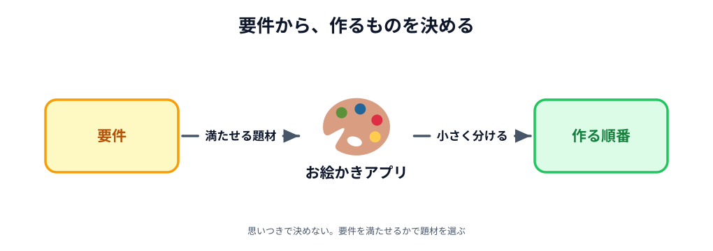
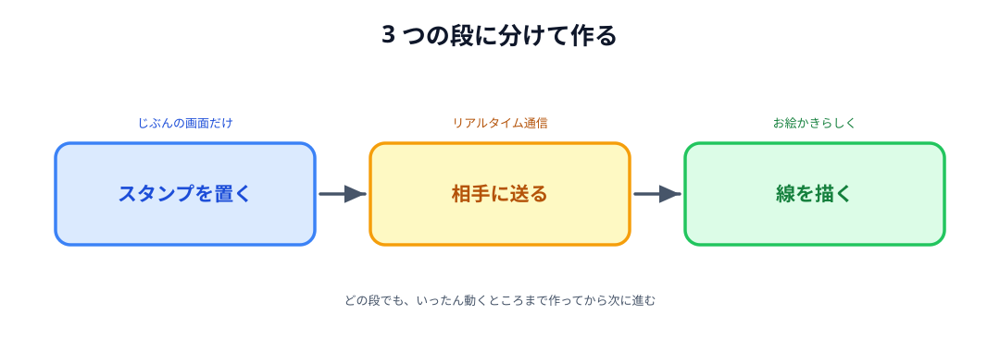

# 02 要件から設計する

要件はまとまりました。残っているのは、**何を作るか**・**どう分けるか**・**何で作るか**・**どの順で作るか**です。

この節で決めたことが、そのまま次の章からの進み方になります。

## 要件から題材を決める

題材は、思いついたものから選ぶのではなく、**前の節でまとめた要件を満たせるか**で選びます。

見るのは 2 つです。**準備や解説と合わせて 3 時間に収まること**と、**完成したときに見せたくなること**。
この 2 つは引っぱり合います。短時間で作れるものほど地味になりやすく、
派手なものほど時間がかかるからです。

凝ったゲームは後者に寄りすぎていて、3 時間には収まりません。

その間にあるものとして決めたのが、**2 人でリアルタイムに操作できるお絵かきアプリ**です。
描いた線がその場で相手の画面に出るので通信を体験でき、
出来上がった絵はそのまま人に見せられます。

_図: どちらが描いた線も、その場で両方の画面に出る。_

## 最小の体験に分解する

題材は決まりましたが、お絵かきアプリをまるごと作ろうとすると、
動くものが見えるまでに時間がかかります。
要件の「早い段階で動いたと感じられること」に反します。

そこで、**それぞれ単体で動く 3 つの段**に分けました。

1. **まず、自分の画面に絵文字のスタンプを置けるようにする。**
   通信はまだしません。クリックした場所にスタンプが出るところまでです。
2. **次に、置いたスタンプをリアルタイムで相手の画面にも表示する。**
   ここで初めて通信が入ります。自分の操作が相手の画面に出た時点で、今回の中心は達成です。
3. **その後、スタンプから線を描く機能へ発展させる。**
   通信のしくみは 2 のままで、送るものを増やしていきます。

_図: どの段でも、いったん動くところまで作ってから次に進む。_

3 つに分けておくと、途中で止まっても**そこまでは動くもの**が手元に残ります。
動かなくなったときに「いま足したものが原因だ」と切り分けられるのも、分けておく利点です。

## 要件に合わせて技術を決める

作るものと順番が見えたので、**何で作るか**を決めます。ここでも基準は要件です。

**PC とスマートフォンのブラウザだけで動かせる構成にします。**
書くのは HTML・CSS・JavaScript だけで、サーバーのプログラムは書きません。
参加者の環境をそろえる手間がなくなり、2 台目がスマートフォンでもそのまま動きます。

**WebRTC の接続には PeerJS / PeerJS Cloud を使います。**
ブラウザ同士は、いきなり直接つながれません。
「そちらはどこにいますか」を最初にやり取りする**シグナリング**という仕組みが別に要ります。
これを自前で用意すると、それだけで 3 時間が終わってしまいます。
PeerJS Cloud は、そのシグナリングサーバーを自分たちで構築しなくても使えます。

**公開には Netlify Drop を使います。**
手元のファイルをブラウザで開いただけでは、となりのスマートフォンからは見えません。
Netlify Drop なら、フォルダをブラウザに落とすだけで公開できます。
[01 章 03 節](../../01-introduction/03-netlify/LECTURE.md) でもう触ったものです。

| やりたいこと           | 使うもの     |
| ---------------------- | ------------ |
| ブラウザ同士をつなぐ   | PeerJS       |
| つなぐ前のシグナリング | PeerJS Cloud |
| アプリを公開する       | Netlify Drop |

この 3 つの関係は、次のようになっています。

_図: 上と下は別の話。同じ図に描いてあるが、つながってはいない。_

見てほしいのは、**PeerJS Cloud が通るのは「つなぐ前」だけ**だということです。
つながったあとのデータは、2 台のブラウザのあいだを直接流れます。
Netlify はアプリのページを配るだけで、こちらも通信には関わりません。

:::notice
シグナリングで実際に何をやり取りしているのかは、
[04 章 03 節](../../04-how-it-works/03-signaling/LECTURE.md) で見ます。
ここでは「**ブラウザ同士がつながり始めるために要る仕組み**」とだけ分かれば十分です。
:::

## ここまでの流れをまとめる

最後に、ここまでの流れを実装の順番としてまとめます。

1. **要件を整理する** — 制約の中で、満たすべきことを並べる（前の節）
2. **要件から設計する** — 題材・分け方・使う技術を決める（この節）
3. **重要な機能を優先して実装する** — 自分の操作が、相手のキャンバスに反映されるところまで
4. **より豪華な機能を追加していく** — 色やけしごむは、そのあとに回す

この順番にする狙いは、**重要な機能を先に作って、実際に触ってみる**ことです。
触ってみてはじめて、**作っている方向が間違っていないか**を確かめられます。
色やけしごむをそろえてから通信に取りかかると、方向がずれていたときに戻る量が大きくなります。

現場で作るときも同じです。
先に小さく動くものができていれば、**それを人に見せて、方向が合っているかを見てもらえます。**
仕様を読んでもらうより、動くものを触ってもらうほうが、ずれは早く見つかります。

そして、**要件を自分で決められるなら、それを AI に作らせることもできます。**
AI は気を利かせて、頼んでいない機能までひと通り作ってしまうことがあります。
一度にできあがってしまった分だけ、あとからカスタマイズしづらくなります。
だからこそ、**要件を AI と一緒に決めて、その最小構成だけを作らせる**進め方が役に立つかもしれません。
何を中心に置いて、何をあとに回すか。ここで考えてきたことは、そのまま AI への頼み方になります。

この流れは、勉強会に限らず、限られた時間で何かを作るときにそのまま使えます。

設計はここまでです。次の章から、いよいよ手を動かします。
