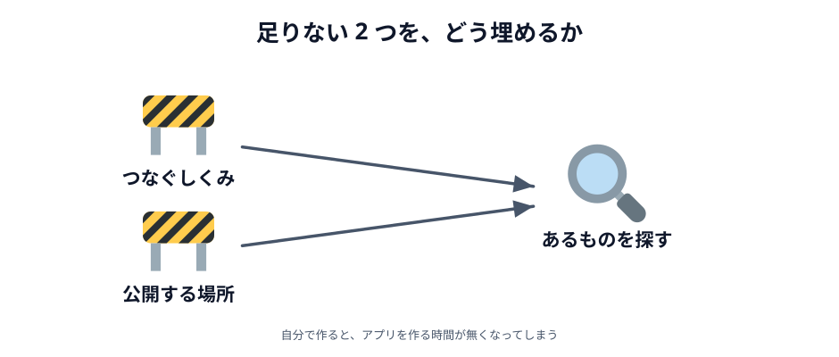
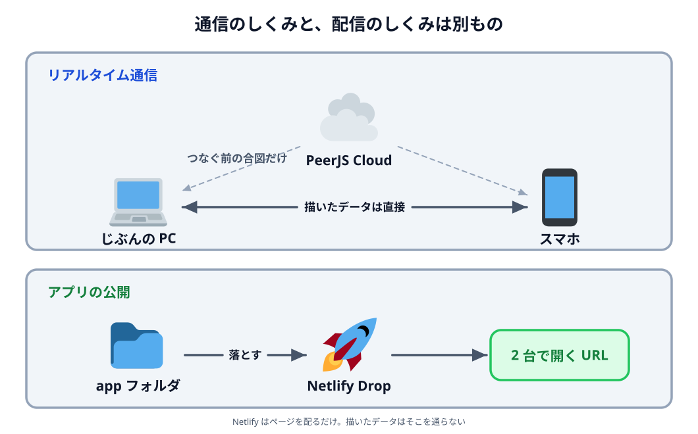

# 02 調査 — どうすれば実現できる？

「リアルタイム通信で何か作る」までは決まりました。
でも、それが 4 時間弱で作れるのかは、まだ分かりません。

この節は、**やると決める前に調べたこと**です。

## 実現するために必要なこと

WebRTC でリアルタイム通信ができること自体は知っていました。
ただ、**難しそうだ**という印象も同時に持っていました。
調べたかったのは、その手前と後ろにある**2 つの手間**です。

**1 つ目は、ブラウザ同士をつなぐ手間です。**
ブラウザ同士は、いきなり直接つながれません。
「そちらはどこにいますか」を最初にやり取りして、
つなぎ始めるための仕組みが別に要ります。これを**シグナリング**と呼びます。

**2 つ目は、アプリを公開する手間です。**
参加者が PC とスマホの 2 台で試すには、アプリをインターネットに置く必要があります。
手元のファイルをブラウザで開いただけでは、となりのスマホからは見えません。

どちらも、自前で用意しようとすると時間がかかります。
そして**そこで時間を使い切ると、肝心のアプリを作る時間が無くなります**。

そこで、この 2 つを簡単に済ませる方法を探すことにしました。

:::notice
シグナリングで実際に何をやり取りしているのかは、
[04 章 03 節](../../04-how-it-works/03-signaling/LECTURE.md) で見ます。
ここでは「**ブラウザ同士がつながり始めるために要る仕組み**」とだけ分かれば十分です。
:::

## ChatGPT を使って実現方法を調べる

探し方は単純で、ChatGPT に相談しました。
聞いたのは「ブラウザ同士のリアルタイム通信を簡単に実現して、
作ったアプリを公開するにはどうすればいいか」です。

返ってきたのが、次の 2 つでした。

- **PeerJS Cloud** — シグナリングサーバーを自分たちで構築しなくても使える。
  **PeerJS** という、WebRTC を短く書けるようにしたライブラリとセットで使う
- **Netlify Drop** — フォルダをブラウザに落とすだけで Web アプリを公開できる。
  [01 章 03 節](../../01-introduction/03-netlify/LECTURE.md) でもう触ったものです

この 2 つを使えば、通信サーバーの構築も複雑なデプロイ作業も要らなさそうだ、と考えました。

大事なのは、**AI に答えを出してもらって終わりにしなかった**ことです。
ここで欲しかったのは答えではなく、**実現方法の候補**でした。
名前が分かったものは、あとから自分で小さく動かして、本当に動くかを確かめています。

## 今回の勉強会で使う技術を決める

調べた結果、使うものはこう決まりました。

| やりたいこと           | 使うもの     |
| ---------------------- | ------------ |
| ブラウザ同士をつなぐ   | PeerJS       |
| つなぐ前のシグナリング | PeerJS Cloud |
| アプリを公開する       | Netlify Drop |

この 3 つの関係は、次のようになっています。

_図: 上と下は別の話。同じ図に描いてあるが、つながってはいない。_

見てほしいのは、**PeerJS Cloud が通るのは「つなぐ前」だけ**だということです。
つながったあとのデータは、2 台のブラウザのあいだを直接流れます。
Netlify はアプリのページを配るだけで、こちらも通信には関わりません。

あわせて、最後まで守る条件も決めました。

- **スマホでも動く** — 2 台目はスマホになる人が多いはずなので
- **サーバーのプログラムを書かない** — 書くのは HTML・CSS・JavaScript だけ

通信サーバーを自作しないと決めたことで、
今日の時間は**アプリそのものを作ること**に使えます。

:::questions

- ブラウザ同士を直接つなぐには、つなぎ始めるための仕組みが別に要る [o]
- 今回はシグナリングサーバーを自分たちで作る [x]
- AI は、実現方法の候補を探すのに使える [o]
- 描いたデータは、いつも PeerJS Cloud を経由して相手に届く [x]
- Netlify Drop は、アプリを公開するための仕組みである [o]

:::

実現できそうだと分かりました。次の節で、いよいよ作るものを決めます。
