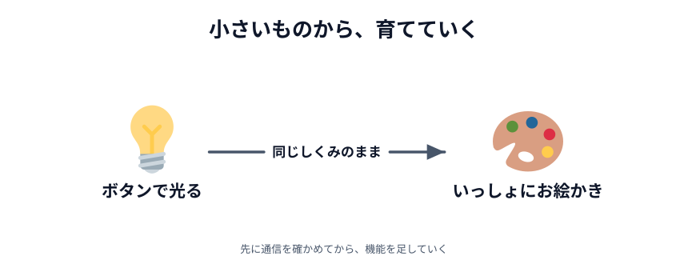
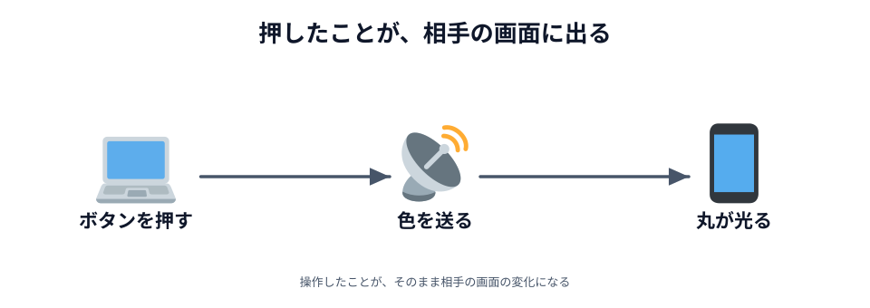
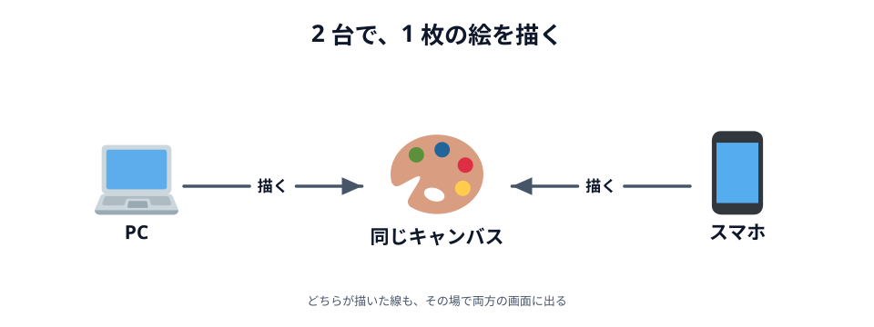
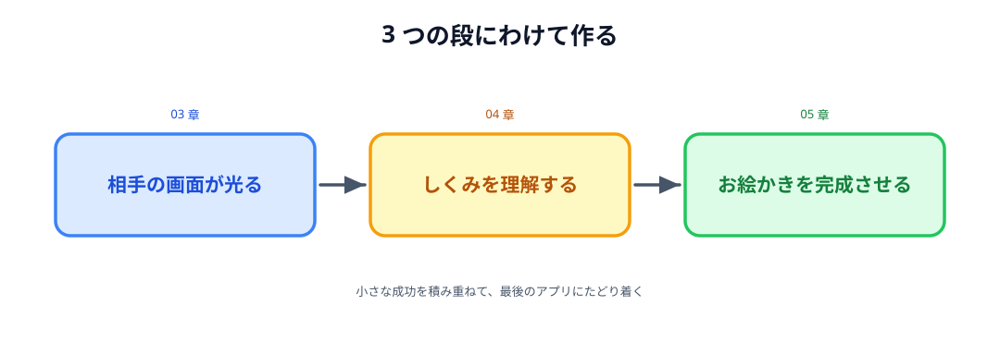

# 03 設計 — 何をどの順番で作る？

使う技術は決まりました。残っているのは、**何を作るか**と**どの順番で作るか**です。

この節で決めたことが、そのまま 03 章から 05 章の中身になります。

## まずはクリックを相手に伝えてみよう

今回の中心はリアルタイム通信です。
なので最初に、**ブラウザで起きた操作を別のブラウザに伝える、いちばんシンプルな例**を考えました。

決めたのは、**ボタンをクリックすると、相手の画面の丸が光る**アプリです。

_図: 操作 → データを送る → 相手の画面が変わる。通信の最小形。_

押した結果が画面に出るので、**通信が成功したことが目で見て分かります**。
届いたかどうかを確かめるために、わざわざログを読む必要がありません。

まず小さなアプリで通信を確かめてから、機能を足していく。この順番にします。

## 完成したら人に見せたくなるものを作ろう

簡単な通信ができたら、次は**勉強会の看板になるアプリ**です。

勉強会のタイトルを見たときに、
「少し難しそうだけれど、作ってみたい」と思えるものにしたいと考えました。

候補にはチャットアプリもありました。リアルタイム通信らしい題材ですし、実際に作れます。
ただ今回は、**完成したものを人に見せたくなる**という体験を重視しました。

そこで、**複数の端末から一緒に絵を描けるアプリ**を作ることにしました。

_図: どちらが描いた線も、その場で両方の画面に出る。_

以前お絵描きを扱った勉強会では、初めて参加してくれた方もいました。
今回も、完成したアプリや描いた絵を SNS などで共有してもらえたらうれしいです。

## 小さく作って、少しずつ完成させよう

最初からお絵描きアプリのすべての機能を作ろうとはしません。
**3 つの段**に分けます。

_図: この教材そのものが、この 3 段でできている。_

1. **ボタンを押すと、相手の画面が光る**ところまで作る（[03 章](../../03-connect/01-light/LECTURE.md)）
2. その通信が**どういう仕組みで動いているのか**を知る（[04 章](../../04-how-it-works/01-compare/LECTURE.md)）
3. 同じ通信の仕組みのまま、**スタンプ・線・色・消しゴム**を足していく（[05 章](../../05-drawing/01-canvas/LECTURE.md)）

機能を足す順番も同じ考え方です。章の中では**簡単なものから**足して、そのたびに動かします。
こうしておくと、動かなくなったときに「いま足したものが原因だ」と分かります。

小さな成功を積み重ねながら、最終的なお絵描きアプリにたどり着く。これが今回の進め方です。

:::notice
**今日はやらないこと**も決めました。**保存**・**ログイン**・**3 人以上でつなぐ**の 3 つです。
どれも難しすぎるからではなく、サーバーのプログラムを書かない今回の方針だと、
データの置き場所や別の設計が必要になるからです。あとから足せる形にはしておきます。
:::

:::questions

- 最初に作るのは、通信を確かめるためのいちばん小さいアプリ [o]
- チャットアプリはつまらないので候補から外した [x]
- 作るものは、完成したときに人に見せたくなるかどうかでも選んでいる [o]
- お絵描きアプリは、全機能をまとめて作ってから動かす [x]
- 章の中では、簡単な機能から順に足していく [o]

:::

設計はここまでです。次の章から、いよいよ手を動かします。
