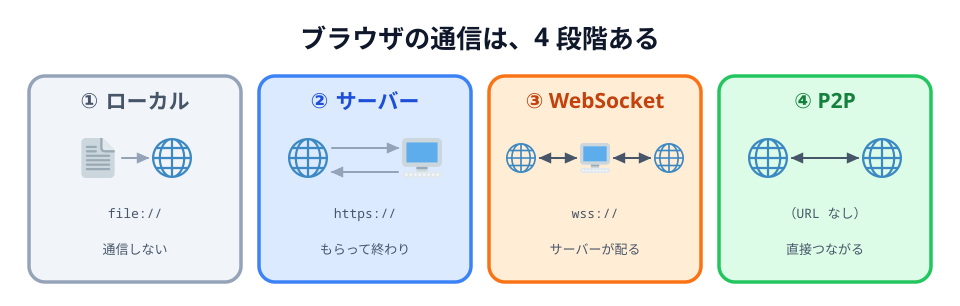
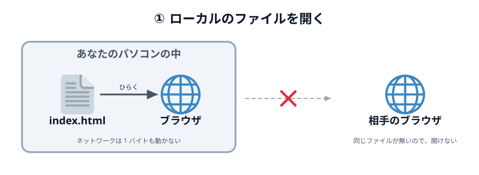
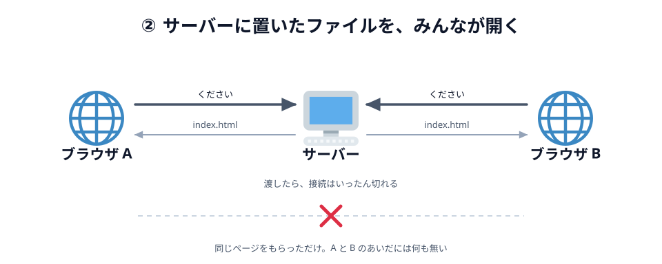
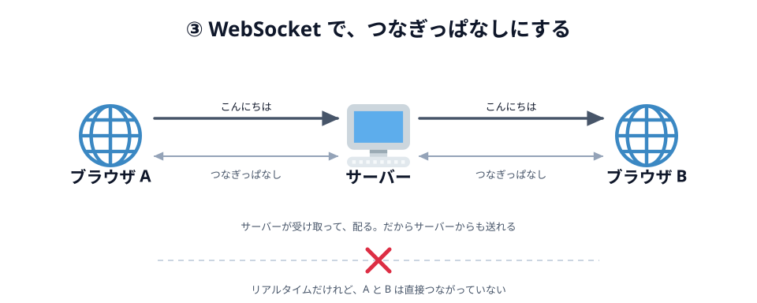
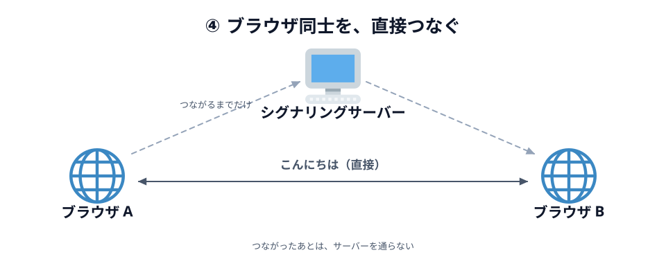
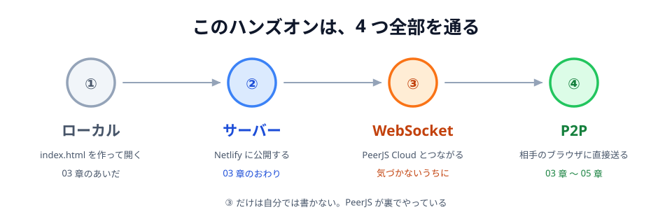

# 00 ファイルを開くところから、直接つなぐまで



「ブラウザが通信する」と一口に言っても、やり方はいくつもあります。
このハンズオンで作るのは、そのうち**いちばん端っこ**にあるものです。
どこが端っこなのかを見るために、4 つ並べてみます。

## 4 つのつなぎ方

| 段階 | やること                           | ひとことで     |
| ---- | ---------------------------------- | -------------- |
| ①    | ブラウザでローカルのファイルを開く | 通信していない |
| ②    | サーバーに公開したファイルを開く   | もらって終わり |
| ③    | WebSocket でリアルタイム通信する   | サーバーが配る |
| ④    | P2P でブラウザ同士が通信する       | 直接つながる   |

下に行くほど「通信が濃く」なりますが、増えているものはそれぞれ違います。

- ①→② で、**他の人にも同じものを見せられる**ようになります
- ②→③ で、**聞かなくても届く**ようになります
- ③→④ で、**真ん中を通らなくなる**ようになります

順番に見ていきます。

## ① ブラウザでローカルのファイルを開く



_図: ひらいているだけ。ネットワークは動いていない。_

[03 章](../../03-connect/01-light/LECTURE.md) で `index.html` を作ってダブルクリックすると、
アドレス欄はこうなります。

```
file:///Users/you/app/index.html
```

`https://` ではなく `file://` です。これは「インターネットのどこか」ではなく
「**このパソコンの、このフォルダの、このファイル**」を指す書き方です。

だからこの状態では、通信は起きていません。Wi-Fi を切っても、機内モードでも、
まったく同じように動きます。

そして、このアドレスを相手に送っても意味がありません。
`file:///Users/you/app/index.html` は**相手のパソコンの中を探しにいく**ので、
相手のパソコンに同じファイルが無ければ開けません。

:::notice
厳密には、`index.html` の中に「PeerJS を CDN から読み込む」1 行を書いた時点で、
**その 1 行のためだけ**に通信します。ページを開いた瞬間にライブラリを取りに行くからです。
それ以外の部分、つまりあなたが書いたコードは、外と何もやりとりしていません。
:::

## ② サーバーに公開したファイルを開く



_図: 同じページをもらっただけ。A と B はまだ他人同士。_

[03 章の最後](../../03-connect/06-deploy/LECTURE.md) で `app/` フォルダを
[Netlify](../../01-introduction/04-netlify/LECTURE.md) に置くと、アドレスがこうなります。

```
https://your-app.netlify.app/
```

ここで起きているのは、とても素朴なやりとりです。

1. ブラウザがサーバーに「`index.html` をください」と言う
2. サーバーが「はい」とファイルを返す
3. **接続は切れる**

以上です。サーバーは、置いてあるものを渡しただけで、何も覚えていません。
`style.css` や `main.js` も同じように 1 つずつ取りに行って、それで終わりです。

この段階で手に入るものは大きいです。**他の人も同じページを開けるようになりました。**
自分のスマホからも、友達の PC からも開けます。

でも、開いた人どうしは**まだ何の関係もありません**。
100 人が開いても、100 個のバラバラなページが動いているだけです。
あなたのブラウザで何かを押しても、相手の画面は 1 ミリも変わりません。

ここまでが「**配る**」で、次からが「**つなぐ**」です。

:::notice
「`fetch()` を使えばページを開いたあとも通信できるのでは？」と思った人は正解です。
ただし `fetch()` は**こちらから聞いたときだけ**返事が来ます。
「相手が何か書いた」ことをサーバーの側から教えてもらう手段が無いので、
知りたければ何秒かおきに聞き続けること（ポーリング）になります。
③ は、その「聞き続ける」をやめるための仕組みです。
:::

## ③ WebSocket でリアルタイム通信をする



_図: 速いけれど、通り道はサーバー。_

**WebSocket** は、最初に 1 回だけ挨拶を交わしたあと、
サーバーとの線を**つないだままにしておく**仕組みです。アドレスは `wss://` で始まります。

```js
// このハンズオンでは書きませんが、雰囲気だけ
const ws = new WebSocket('wss://example.com/room');
ws.addEventListener('message', function (event) {
  console.log(event.data); // サーバーから届いた
});
ws.send('こんにちは'); // サーバーへ送る
```

② との一番の違いは、**サーバーの側から送り出せる**ことです。
だからチャットの新着は、こちらが更新ボタンを押さなくても勝手に出てきます。

Google ドキュメントの同時編集も、Figma で他人のカーソルが動くのも、
Slack や LINE のメッセージが飛んでくるのも、だいたいこの形です。
「リアルタイムに見えるもの」の大半は、実はこれです。

ただし、通り道は**サーバーのまま**です。
A が送った「こんにちは」は、いったんサーバーに預けられ、そこから B に配られます。
同じ言葉が 2 回運ばれているわけです。

それでも困りません。国内のサーバーなら往復は数十ミリ秒で、
文字やカーソルを運ぶくらいなら誰も遅いとは思わないからです。

## ④ P2P でブラウザ間で通信する



_図: 通り道からサーバーが消える。_

そして、このハンズオンで作るのがこれです。
サーバーに預けず、**相手のブラウザに直接**送ります。

```js
// このハンズオンで書くのは、こちら
const conn = peer.connect('あいことば');
conn.on('data', function (data) {
  console.log(data); // 相手から直接届いた
});
conn.send('こんにちは'); // 相手へ直接送る
```

③ のコードと見比べてください。**書き方はほとんど同じ**です。
`send` して、届いたら受け取る。違うのは、その `send` が**誰に届くか**だけです。

サーバーを通らないので速く、サーバーにデータが残らず、通信量の料金もかかりません。
そのかわり「相手がどこにいるのか」を知る手段が要ります。
これが P2P の難所で、[03 節](../03-signaling/LECTURE.md) のテーマです。

## 動かして見くらべる

4 つを、それぞれ別のページにしてあります。ボタンを押すと、
**玉がどこを通るか**が見えます。③ と ④ の違いに注目してください。

::preview[① 押しても、パソコンの中で終わる]{demo="01-local" height="250"}

::preview[② サーバーから 1 往復もらって、それで終わり]{demo="02-http" height="270"}

::preview[③ つないだまま、サーバー経由で届ける]{demo="03-websocket" height="240"}

::preview[④ 最初だけサーバー、そのあとは直接届く]{demo="04-p2p" height="270"}

③ は玉がかならず真ん中のサーバーを踏みます。④ は踏みません。
そして ④ でも、**つなぎ始めるときだけ**はサーバーを踏んでいます。

## 表にして並べる

|                    | ① ローカル | ② サーバー | ③ WebSocket  | ④ P2P          |
| ------------------ | ---------- | ---------- | ------------ | -------------- |
| アドレス           | `file://`  | `https://` | `wss://`     | 無い           |
| 話す相手           | いない     | サーバー   | サーバー     | 相手のブラウザ |
| 通信するとき       | しない     | 開いたとき | ずっと       | ずっと         |
| サーバーから送れる | —          | できない   | できる       | —              |
| 相手に届く         | 届かない   | 届かない   | サーバー経由 | 直接           |
| 記録を残せる       | —          | —          | 残せる       | 残らない       |
| 人数が増えたとき   | —          | 平気       | 平気         | つらい         |

④ にアドレスが無いのは、相手を URL ではなく「あいことば」で呼ぶからです。
④ で人数がつらくなるのは、3 人なら 3 本、5 人なら 10 本と、線の数が増えていくからです。

「④ がいちばん偉い」わけではありません。
記録を残したいなら ③ のほうが素直ですし、ただ読ませたいだけなら ② で十分です。
今回は「その場にいる 2 人が、いま同時に描く」ものを作るので ④ を選びます。
このあたりは [01 節](../01-server-vs-p2p/LECTURE.md) でもう一度扱います。

## このハンズオンは、4 つ全部を通る

ここまで別々のものとして並べてきましたが、
実はこの教材を進めるだけで、**4 つとも自分で踏むことになります**。



_図: ③ だけは自分では書かない。それでも確かに使っている。_

- **①** — 03 章で `index.html` を作り、ダブルクリックして確かめます
- **②** — 03 章の最後で Netlify に公開し、スマホから開きます
- **③** — `new Peer(...)` を呼んだ瞬間、PeerJS が PeerJS Cloud との
  WebSocket をこっそり張ります。自分では 1 行も書きません
- **④** — `conn.send(...)` で相手のブラウザに直接届きます

:::notice
③ が「気づかないうちに」なのは、PeerJS が包んでくれているからです。
[02 節](../02-webrtc/LECTURE.md) で見るように、PeerJS は面倒な部分を全部引き受けます。
その「面倒な部分」の入口が、まさにこの WebSocket 接続です。
:::

:::questions

- `file://` で開いたページは、Wi-Fi を切っても表示できる [o]
- サーバーに公開すれば、開いた人どうしが自動的につながる [x]
- WebSocket では、サーバーの側から送り出すことができる [o]
- WebSocket でつないだ 2 つのブラウザは、直接つながっている [x]
- 「リアルタイムに見えるサービス」は、たいてい WebSocket で作られている [o]
- P2P でも、つなぎ始めるときはサーバーの助けが要る [o]

:::

## 次の節へ

4 つのうち、③ と ④ の違いがこの章の本題です。
次の節では、④ を選ぶと何が得で何が損なのかを、もう少し詳しく見ます。

[01 サーバー経由と、直接つなぐこと](../01-server-vs-p2p/LECTURE.md)
