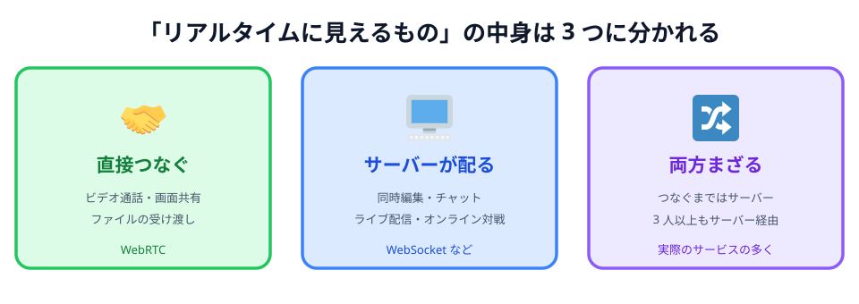

# 01 サーバー経由と、直接つなぐこと

コードを書く前に、これから作るものが**いつもの Web と何が違うのか**を見ておきます。

## いつもの Web は、必ず真ん中を通る

ブラウザで何かをするとき、相手はいつもサーバーでした。
チャットアプリで「こんにちは」と送ると、こう流れます。

_図: 話しているのは人。ただし言葉は、いったんサーバーに預けられてから相手に配られる。_

真ん中を通ることには、ちゃんと理由があります。

- **相手の居場所を知らなくていい。** サーバーの住所さえ知っていれば話せます
- **記録が残せる。** あとから来た人に過去のログを見せられます
- **人数が増えても同じ。** 100 人いても、各自がサーバーと 1 本つなぐだけです

## 今回作るのは、真ん中を通らないもの

一方、これから作るのはこちらです。

_図: あなたの言葉が相手に直接届く。あいだに誰もいない。_

この形を **P2P（ピア・ツー・ピア）** と呼びます。
サーバーが「配る人」ではなく、お互いが対等な相手（ピア）になります。

いいところは:

- **速い。** 遠くのサーバーを往復しないぶん、反応が返ってきます。
  お絵かきのように「線が指についてくる」感じが要るものに向いています
- **サーバー代がかからない。** データが通らないので、通信量の料金が発生しません
- **中身がサーバーに残らない。** 描いた絵はサーバーに保存されません

つらいところも同じだけあります:

- **相手の居場所を知る必要がある。** ここが一番の難所です（次の節と次々の節で扱います）
- **記録が残らない。** ブラウザを閉じたら消えます。あとから来た人は何も見られません
- **人数が増えるとつらい。** 3 人なら 3 本、5 人なら 10 本と、線の数が急に増えます

:::notice
「P2P のほうが偉い」わけではありません。**向き不向き**です。
今回のお絵かきのように「その場にいる 2 人が、いま同時に触る」ものは P2P の得意分野です。
逆に「あとから見返したい」「大人数で共有したい」ならサーバーを置くほうが素直です。
:::

## ブラウザ同士をつなぐのは、じつは珍しい

ここまでで形は見えたと思いますが、たぶんこんな引っかかりが残っています。

> そもそも、ブラウザとブラウザをつなぐことなんてある？

ほとんどありません。
Web アプリを作るとき、話す相手はまずサーバーです。ブラウザ同士を直接つなぐのは、
Web 全体で見ればかなりの少数派で、普段さわっているサービスの大半はサーバー経由のほうです。

では、Google ドキュメントや Discord のような「同時に動いて見える」サービスはどちらなのか。
中を開けると、3 つに分かれます。

_図: 「リアルタイム」と「ブラウザ同士」は、別の話。_

### 1. WebRTC で直接つないでいるもの

今回作るものの仲間です。**遅れると使いものにならないもの**が並びます。

| サービス                                      | WebRTC で運んでいるもの                |
| --------------------------------------------- | -------------------------------------- |
| Google Meet / Microsoft Teams                 | 通話の映像と音声                       |
| Discord の通話                                | 音声（文字のチャットは別の仕組み）     |
| Slack のハドル                                | 音声と画面共有                         |
| Chrome リモートデスクトップ                   | 相手の画面と、こちらのマウス・キー操作 |
| クラウドゲーミング（GeForce NOW など）        | ゲーム画面と、コントローラーの入力     |
| ブラウザだけで動くファイル送信（PairDrop 等） | ファイルそのもの                       |

映像・音声・操作。どれも「0.5 秒遅れたら成立しない」ものばかりです。
最後のファイル送信だけは理由が違って、**サーバーに置きたくない**からこの形をとっています。

### 2. リアルタイムに見えるけれど、WebRTC ではないもの

数としてはこちらが圧倒的です。**サーバーとの接続をつなぎっぱなしにしておく**（WebSocket）だけで、
十分リアルタイムに見えます。

| サービス                                         | 実際にやっていること                               |
| ------------------------------------------------ | -------------------------------------------------- |
| Google ドキュメント / スプレッドシートの同時編集 | 編集をサーバーに送り、サーバーが全員に配る         |
| Figma で他人のカーソルが動くやつ                 | 同じ。自前のサーバーが配っている                   |
| Slack / LINE / Discord の**文字**のチャット      | サーバー経由。だから履歴が残る                     |
| Notion / Miro / Canva の共同編集                 | 同じ                                               |
| YouTube Live / Twitch のライブ配信               | 細切れの動画をサーバーから配る。数秒〜十数秒遅れる |
| オンライン対戦ゲームの多く                       | ゲームサーバーが全員の状態をそろえる               |

国内のサーバーなら往復は数十ミリ秒です。文字やカーソルを送るくらいなら、これで誰も遅いと思いません。
**「リアルタイムに見える ＝ ブラウザ同士がつながっている」ではない**わけです。

### 3. 実際には、たいてい混ざっている

そして現実のサービスは、きれいにどちらか一方には寄りません。

| 混ざり方                     | 中身                                                                                                           |
| ---------------------------- | -------------------------------------------------------------------------------------------------------------- |
| つながるまではサーバー       | 相手を見つける最初のやりとりだけサーバーに頼む。**今回作るものもこれ**（[次の節](../03-signaling/LECTURE.md)） |
| 直接つなげないときはサーバー | 会社や学校の回線で直行できないとき、サーバーが中継する（[04 章](../../04-data/02-trouble/LECTURE.md)）         |
| 3 人以上の通話               | WebRTC だけど映像はいったんサーバーに集める。全員と直接つなぐと線が増えすぎるため                              |
| Discord                      | 通話は WebRTC、チャットはサーバー経由。1 つのアプリの中に両方ある                                              |
| 動画配信の一部               | サーバーから配りつつ、視聴者どうしも WebRTC で動画の断片を配り合う                                             |

いちばんよく出てくるのは 1 行目の形です。
**つながるまではサーバー、つながったあとは直接。**
このハンズオンで作るものも、まさにこれになります。

## 5 章で作るお絵かきも、記録は残りません

このあと作るお絵かきツールでは、描いた線は相手のブラウザに送られるだけで、
どこにも保存されません。ページを再読み込みすれば白紙に戻ります。

ただし [05 章の最後](../../05-drawing/07-deploy/LECTURE.md) では、
**自分が描いたものを覚えておいて、あとから入ってきた相手に送り直す**ようにします。
「記録が残らない」を、自分のブラウザの中だけで小さく埋め合わせる工夫です。

:::questions

- いつもの Web（サーバー経由）は、相手のブラウザの居場所を知らなくても話せる [o]
- P2P はサーバーを一切使わずにつながれる [x]
- P2P はサーバー経由より必ず速い [x]
- P2P で送ったデータは、サーバーに保存されない [o]
- リアルタイムに見えるサービスは、だいたい WebRTC で作られている [x]

:::

2 問目に「✕」が付く理由が次の節と次々の節のテーマです。
**つながったあとは**サーバーを通りませんが、**つながるまで**は誰かに手伝ってもらう必要があります。
