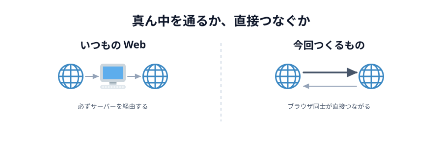
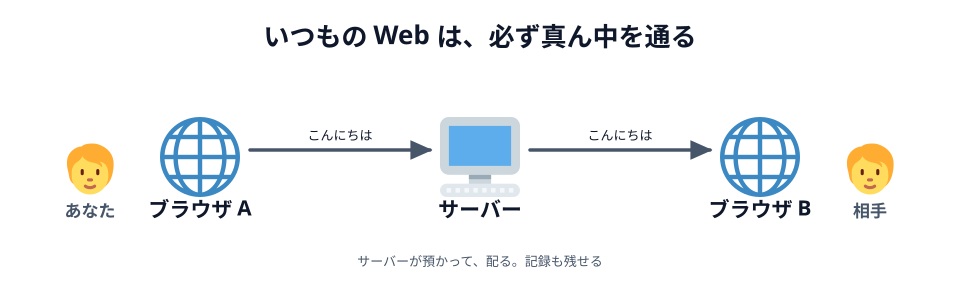

# 01 サーバー経由と、直接つなぐこと

コードを書く前に、これから作るものが**いつもの Web と何が違うのか**を見ておきます。

## いつもの Web は、必ず真ん中を通る

ブラウザで何かをするとき、相手はいつもサーバーでした。
チャットアプリで「こんにちは」と送ると、こう流れます。

_図: A の言葉は、いったんサーバーに預けられてから B に配られる。_

真ん中を通ることには、ちゃんと理由があります。

- **相手の居場所を知らなくていい。** サーバーの住所さえ知っていれば話せます
- **記録が残せる。** あとから来た人に過去のログを見せられます
- **人数が増えても同じ。** 100 人いても、各自がサーバーと 1 本つなぐだけです

## 今回作るのは、真ん中を通らないもの

一方、これから作るのはこちらです。

_図: A の言葉が B に直接届く。あいだに誰もいない。_

この形を **P2P（ピア・ツー・ピア）** と呼びます。
サーバーが「配る人」ではなく、お互いが対等な相手（ピア）になります。

いいところは:

- **速い。** 遠くのサーバーを往復しないぶん、反応が返ってきます。
  お絵かきのように「線が指についてくる」感じが要るものに向いています
- **サーバー代がかからない。** データが通らないので、通信量の料金が発生しません
- **中身がサーバーに残らない。** 描いた絵はサーバーに保存されません

つらいところも同じだけあります:

- **相手の居場所を知る必要がある。** ここが一番の難所です（次の節と次々の節で扱います）
- **記録が残らない。** ブラウザを閉じたら消えます。あとから来た人は何も見られません
- **人数が増えるとつらい。** 3 人なら 3 本、5 人なら 10 本と、線の数が急に増えます

:::notice
「P2P のほうが偉い」わけではありません。**向き不向き**です。
今回のお絵かきのように「その場にいる 2 人が、いま同時に触る」ものは P2P の得意分野です。
逆に「あとから見返したい」「大人数で共有したい」ならサーバーを置くほうが素直です。
:::

## 5 章で作るお絵かきも、記録は残りません

このあと作るお絵かきツールでは、描いた線は相手のブラウザに送られるだけで、
どこにも保存されません。ページを再読み込みすれば白紙に戻ります。

ただし [05 章の最後](../../05-drawing/06-deploy/LECTURE.md) では、
**自分が描いたものを覚えておいて、あとから入ってきた相手に送り直す**ようにします。
「記録が残らない」を、自分のブラウザの中だけで小さく埋め合わせる工夫です。

:::questions

- いつもの Web（サーバー経由）は、相手のブラウザの居場所を知らなくても話せる [o]
- P2P はサーバーを一切使わずにつながれる [x]
- P2P はサーバー経由より必ず速い [x]
- P2P で送ったデータは、サーバーに保存されない [o]

:::

2 問目に「✕」が付く理由が次の節と次々の節のテーマです。
**つながったあとは**サーバーを通りませんが、**つながるまで**は誰かに手伝ってもらう必要があります。

## 次の節へ

[02 WebRTC とデータチャネル](../02-webrtc/LECTURE.md)
