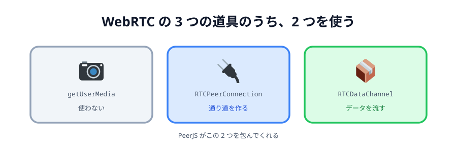
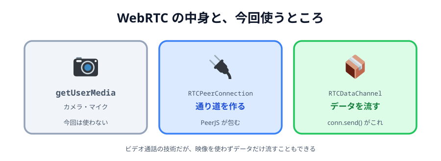

# 02 WebRTC とデータチャネル



ブラウザ同士を直接つなぐ仕組みが **WebRTC**（Web Real-Time Communication）です。
プラグインもインストールも要りません。**ブラウザに最初から入っています**。

## WebRTC が持っている 3 つの道具

WebRTC という名前でひとまとめにされていますが、中身は 3 つに分かれています。

| 道具                | 何をするもの                         | 今回使う |
| ------------------- | ------------------------------------ | -------- |
| `getUserMedia`      | カメラ・マイクから映像と音を取り出す | 使わない |
| `RTCPeerConnection` | 相手のブラウザとの通り道を作る       | 使う     |
| `RTCDataChannel`    | その通り道に、**好きなデータ**を流す | 使う     |

WebRTC はビデオ通話のために生まれた技術なので、`getUserMedia` の印象が強いかもしれません。
でも今回作るのはお絵かきです。カメラは要りません。

使うのは **`RTCDataChannel`**、つまり「作った通り道に、自分で決めた形のデータを流す」部分だけです。
文字列でも、JSON でも、画像のバイト列でも流せます。



_図: カメラの部分は今回まったく触らない。_

## 生の WebRTC はけっこう大変

`RTCPeerConnection` を直接使うと、こういうことを自分で書くことになります。

```js
// 生の WebRTC（今回は書きません）
const pc = new RTCPeerConnection({ iceServers: [...] });
const channel = pc.createDataChannel('draw');
const offer = await pc.createOffer();
await pc.setLocalDescription(offer);
// ↑ この offer を、どうにかして相手に届ける（← 自分で用意する必要がある）
pc.onicecandidate = (e) => { /* 見つけた経路候補も相手に届ける */ };
// 相手から answer が返ってきたら…
await pc.setRemoteDescription(answer);
```

「`offer` を相手に届ける」ところに注目してください。
**相手とまだつながっていないのに、相手に何かを届けなければいけない**のです。
これが P2P の一番の難所で、次の節のテーマです。

## PeerJS が包んでくれる

**PeerJS** は、この面倒をまるごと包んだライブラリです。
上のコードは PeerJS だとこうなります。

```js
const peer = new Peer('あいことば'); // 名乗る
peer.on('connection', function (conn) {
  // 誰かが来た
  conn.on('data', function (data) {
    console.log(data); // 届いたデータ
  });
});
```

```js
const peer = new Peer(); // 名乗らない
const conn = peer.connect('あいことば'); // 呼び出す
conn.on('open', function () {
  conn.send({ hello: 'world' }); // 送る
});
```

`offer` も `answer` も `icecandidate` も出てきません。
**名乗る・呼び出す・送る・受け取る**の 4 つだけになります。
このハンズオンで書くのは、ほぼこの形です。

:::notice
PeerJS は WebRTC を**隠している**わけではありません。
つながったあとに `conn.peerConnection` と書けば、中の `RTCPeerConnection` を触れます。
[04 章](../../04-data/02-trouble/LECTURE.md) では、これを使って
「実際にどの経路でつながったか」を覗きます。
:::

## データチャネルで送れるもの

`conn.send(...)` には、だいたい何でも渡せます。

```js
conn.send('こんにちは'); // 文字列
conn.send({ type: 'line', x: 10, y: 20 }); // オブジェクト
conn.send(new Uint8Array([1, 2, 3])); // バイト列
```

オブジェクトを渡すと、PeerJS が自動で詰めて送り、相手側で元の形に戻してくれます。
受け取る側は `conn.on('data', (data) => ...)` で、**送ったときと同じ形**を受け取ります。

このハンズオンでは、ずっとオブジェクトを送ります。

```js
{ type: 'line', x1: 100, y1: 100, x2: 120, y2: 130, color: '#333333', width: 4 }
```

「線を、ここからここまで、この色・この太さで引いて」という**指示**を送っているわけです。
画像そのものを送っているのではありません。

:::questions

- WebRTC を使うには、ブラウザに拡張機能を入れる必要がある [x]
- 今回のお絵かきでは、カメラを扱う `getUserMedia` は使わない [o]
- PeerJS を使うと `offer` / `answer` を自分で書かなくてよくなる [o]
- `conn.send()` には文字列しか渡せない [x]

:::
