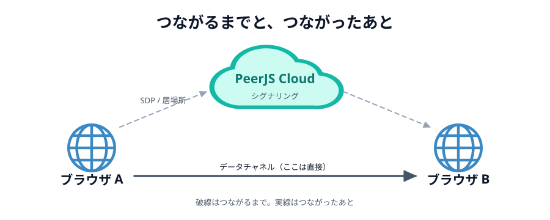

# 03 最初のひと声だけ、誰かに頼む

前の節の最後に出た難所をもう一度書きます。

> **相手とまだつながっていないのに、相手に何かを届けなければいけない**

直接つなぐには、お互いの「居場所」と「話し方の取り決め」を交換する必要があります。
でもそれを渡す手段が、まだ無いのです。にわとりとたまごです。

## 待ち合わせにたとえる

はじめて会う人と待ち合わせるところを想像してください。
会ってしまえば直接話せますが、**会うまで**は無理です。
だから電話やメッセージアプリで「渋谷のハチ公前に 14 時」と決めます。

このときの電話が **シグナリングサーバー** です。
会ったあとの会話は電話を通しません。同じように、
ブラウザ同士がつながったあとは、そのサーバーを通りません。

_図: 破線がシグナリング（つながるまで）、太い実線がデータチャネル（つながったあと）。_

## 交換しているもの

シグナリングで渡し合うのは、ざっくり 2 種類です。

- **SDP**（`offer` / `answer`）… 「私はこういう形式でやりとりできます」という自己紹介
- **ICE candidate** … 「私にはこの住所で届きます」という**居場所の候補**。
  自宅の LAN 内の住所、プロバイダから見た住所…と、複数の候補を出し合って、
  実際に通るものを探します

PeerJS を使うかぎり、この 2 つを自分で扱うことはありません。
`new Peer(...)` と `peer.connect(...)` の裏で、全部やってくれます。

## PeerJS Cloud がその役をやっている

[01 章](../../01-introduction/03-peerjs-cloud/LECTURE.md) で名前をもらったサーバーが、
まさにこのシグナリングサーバーです。

- `new Peer('あいことば')` … 「私は『あいことば』です」と名簿に載せてもらう
- `peer.connect('あいことば')` … 名簿を引いて、その相手と居場所を交換してもらう
- つながったら、**もう用済み**

## 実際に順番を見てみる

下のボタンを押すと、このページの中で 2 つの `Peer` を作ってつなぎ、
何がいつ起きたかを並べます。**通り道**の列に注目してください。

::preview[押すと、つながるまでの順番が表示されます]{demo="handshake" height="380"}

オレンジ（サーバー経由）が先に並び、途中から緑（直接）に切り替わるはずです。
切り替わったあとは、PeerJS Cloud を落としても通信は続きます。

::codeview[このデモの中身]{path="demos/handshake"}

## 「あいことば」は世界共有の名簿に載る

ここで大事な注意です。PeerJS Cloud の名簿は**世界中で 1 つ**です。
`test` と名乗ろうとすると、すでに世界の誰かが使っていて弾かれます。

弾かれると `unavailable-id` というエラーになります。
このハンズオンでは、`webrtc-handson-` という長い前置きを付けてぶつかりにくくし、
それでもぶつかったときは日本語のメッセージを出すようにします。

:::warning
あいことばは**秘密ではありません**。同じあいことばを知っている人は、
同じ「へや」に入れてしまいます。当日は、他の人とかぶらない文字列にしてください。
:::

:::questions

- シグナリングサーバーは、つながったあともデータを中継しつづける [x]
- `peer.connect()` を呼ぶと、PeerJS が SDP と ICE candidate の交換をやってくれる [o]
- PeerJS Cloud の名簿は、自分のチームの中だけで共有されている [x]
- シグナリングサーバーが落ちても、すでにつながっている通信は続く [o]

:::

## 次の章へ

仕組みが分かったので、次の章から手を動かします。
まずは「ボタンを押すと相手の丸が光る」だけの、いちばん小さいものを作ります。

[01 2 つの丸を並べる](../../03-connect/01-page/LECTURE.md)
