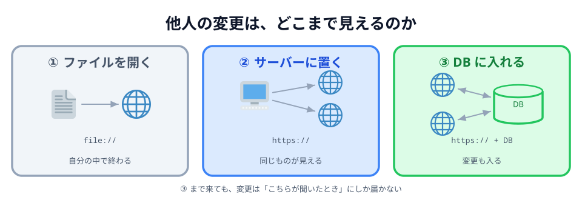
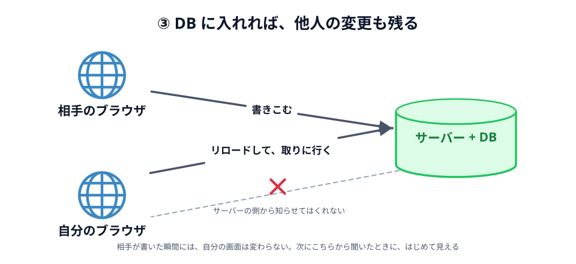

# 01 他人の変更は、どこまで見えるのか



このハンズオンで作るのは「自分が描いた線が、**相手の画面にその場で出る**」ものです。
ずいぶん当たり前のことに聞こえますが、Web でこれをやるのは実はいちばん難しい部類に入ります。

いきなり作り方に入る前に、**手前の段階**を 3 つ踏んでおきます。
「他人の変更が見える」を、いちばん見えないところから順に上げていきます。

## ① ブラウザでローカルのファイルを開く


_図: ひらいているだけ。ネットワークは動いていない。_

[03 章](../../03-connect/01-light/LECTURE.md) で `index.html` を作ってダブルクリックすると、
アドレス欄はこうなります。

```
file:///Users/you/app/index.html
```

`https://` ではなく `file://` です。これは「インターネットのどこか」ではなく
「**このパソコンの、このフォルダの、このファイル**」を指す書き方です。

だからこの状態では、通信は起きていません。Wi-Fi を切っても、機内モードでも、
まったく同じように動きます。

そして、このアドレスを相手に送っても意味がありません。
`file:///Users/you/app/index.html` は**相手のパソコンの中を探しにいく**ので、
相手のパソコンに同じファイルが無ければ開けません。

**他人の変更が見えるか**: そもそも他人がいません。

:::notice
厳密には、`index.html` の中に「PeerJS を CDN から読み込む」1 行を書いた時点で、
**その 1 行のためだけ**に通信します。ページを開いた瞬間にライブラリを取りに行くからです。
それ以外の部分、つまりあなたが書いたコードは、外と何もやりとりしていません。
:::

## ② サーバーに公開したファイルを開く


_図: 同じページをもらっただけ。A と B はまだ他人同士。_

[03 章の最後](../../03-connect/06-deploy/LECTURE.md) で `app/` フォルダを
[Netlify](../../01-introduction/04-netlify/LECTURE.md) に置くと、アドレスがこうなります。

```
https://your-app.netlify.app/
```

ここで起きているのは、とても素朴なやりとりです。

1. ブラウザがサーバーに「`index.html` をください」と言う
2. サーバーが「はい」とファイルを返す
3. **接続は切れる**

以上です。サーバーは、置いてあるものを渡しただけで、何も覚えていません。
`style.css` や `main.js` も同じように 1 つずつ取りに行って、それで終わりです。

この段階で手に入るものは大きいです。**他の人も同じページを開けるようになりました。**
自分のスマホからも、友達の PC からも開けます。

でも、開いた人どうしは**まだ何の関係もありません**。
100 人が開いても、100 個のバラバラなページが動いているだけです。
あなたのブラウザで何かを押しても、相手の画面は 1 ミリも変わりません。

**他人の変更が見えるか**: 見えません。そもそも他人の変更を置く場所がありません。

## ③ サーバーに DB を置いて、書きこんでもらう

②で足りないのは「置き場所」です。サーバーにデータベースを付けて、
**書いた内容をサーバー側にためてもらう**ようにすると、話が変わります。
掲示板でも、日報でも、社内の申請システムでも、形はこれです。



_図: 保存はされている。それでも自分の画面は、こちらから聞くまで変わらない。_

これで**他人の変更が、はじめて自分にも見えるようになりました**。
相手が書いた内容はサーバーに残っているので、自分がページを開けば読めます。

ただし、見えるのは「**開いたとき**」です。
ページを表示したあとに相手が書きこんでも、自分の画面は何も変わりません。
リロードして、もう一度サーバーに聞きに行って、はじめて出てきます。

理由は①〜③でずっと同じです。**通信を始めるのは、いつもブラウザの側だから**です。
サーバーは聞かれたことに答えるだけで、自分から声をかけてはくれません。

**他人の変更が見えるか**: 見えます。ただし**自分が聞きにいったときだけ**。

## 3 つを並べる

|                        | ① ローカル | ② サーバー | ③ DB        |
| ---------------------- | ---------- | ---------- | ----------- |
| アドレス               | `file://`  | `https://` | `https://`  |
| 他の人が開ける         | 開けない   | 開ける     | 開ける      |
| 他人の変更が残る       | —          | 残らない   | 残る        |
| 他人の変更が**届く**   | —          | 届かない   | 聞けば届く  |
| 相手が書いた瞬間       | —          | —          | 何も起きない |

①→② で「**他の人にも見せられる**」ようになり、
②→③ で「**他人の変更が残る**」ようになりました。

残っているのは最後の 1 つ、「**聞かなくても届く**」です。

## 動かして見くらべる

3 つを、それぞれ別のページにしてあります。ボタンを押すと、
**玉がどこを通るか**が見えます。

::preview[① 押しても、パソコンの中で終わる]{demo="01-local" height="250"}

::preview[② サーバーから 1 往復もらって、それで終わり]{demo="02-http" height="270"}

::preview[③ 保存はされる。それでも自分から聞くまで届かない]{demo="03-database" height="330"}

③ では、「B が書きこむ」を何回押しても A の表示は古いままです。
「A がリロードする」を押した瞬間に、まとめて追いつきます。

3 つとも、**玉を出しているのはいつもブラウザ**です。
サーバーの側から玉が飛び出す場面が 1 度もありません。

:::questions

- `file://` で開いたページは、Wi-Fi を切っても表示できる [o]
- サーバーに公開すれば、開いた人どうしが自動的につながる [x]
- DB を置けば、相手が書いた瞬間に自分の画面も変わる [x]
- ①〜③ では、通信を始めるのはいつもブラウザの側である [o]

:::

## 次の節へ

「聞かなくても届く」をどうやって作るか。それが次の節です。

[02 リアルタイム通信](../02-realtime/LECTURE.md)
