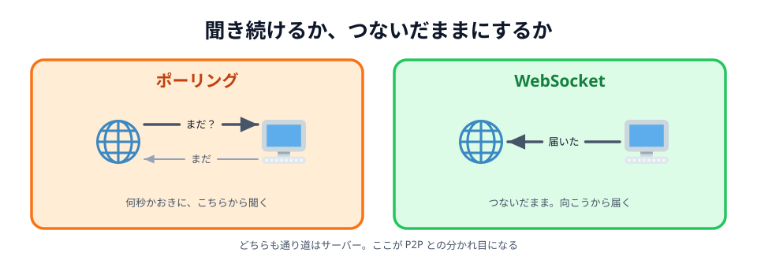
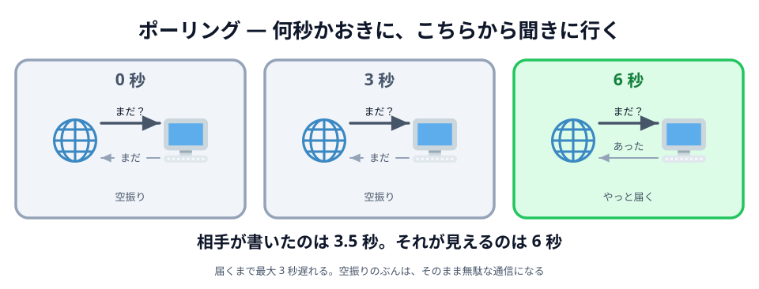
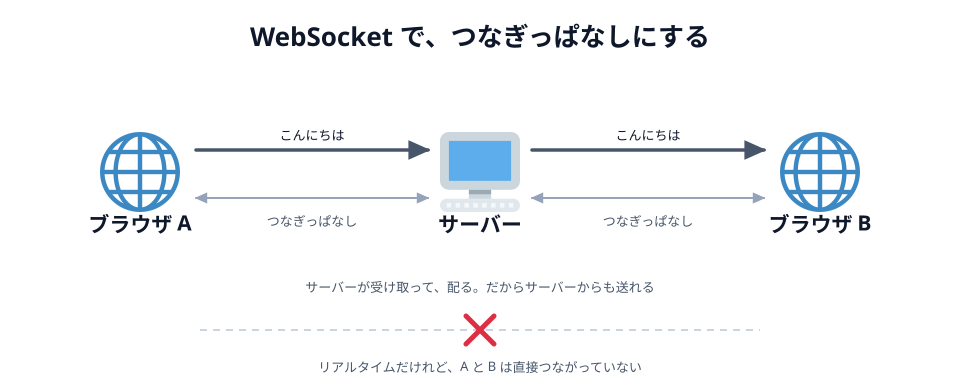

# 02 リアルタイム通信



前の節の最後に残ったのはこれでした。

> 相手が書いた瞬間には、自分の画面は変わらない

「聞かなくても届く」をどう作るか。やり方は大きく 2 つあります。
**しつこく聞き続ける**か、**線をつないだままにしておく**かです。

## ポーリング — 何秒かおきに聞きに行く

いちばん素直なのは、**何秒かおきにリロードし続ける**ことです。
人間がリロードボタンを押す代わりに、JavaScript が定期的にサーバーへ聞きに行きます。

```js
// このハンズオンでは書きませんが、雰囲気だけ
setInterval(async function () {
  const res = await fetch('/messages');
  const messages = await res.json();
  render(messages); // 届いていれば画面を書き換える
}, 2000);
```

これを **ポーリング**（polling）と呼びます。
2 秒おきに聞けば、遅くとも 2 秒後には気づけます。それらしく動きます。



_図: 相手が書いたのは 3.5 秒。それが見えるのは 6 秒。_

ただし、うれしくないことが 2 つあります。

- **遅れる。** 間隔を 2 秒にすれば、最大 2 秒遅れます。
  お絵かきで線が 2 秒遅れて出てきたら、もう一緒に描いている感じはしません
- **空振りが多い。** ほとんどの回は「まだ何もありません」と返ってくるだけです。
  それでも 1 往復ぶんの通信は発生します

間隔を 0.1 秒に縮めれば遅れは減りますが、空振りが 20 倍になります。
**遅れと無駄が、まっすぐ引き換え**になっているのがポーリングの弱点です。

::preview[「2 秒おきに聞く」を押してから、「B が書きこむ」を押してください]{demo="01-polling" height="330"}

しばらく動かしたままにすると、空振りの回数だけが増えていきます。
1 人ならこれで済みますが、100 人が同時に開けば、その 100 倍をサーバーが受けることになります。

## WebSocket — つないだままにしておく

もう 1 つのやり方は、**線をつないだままにしておく**ことです。

**WebSocket** は、最初に 1 回だけ挨拶を交わしたあと、
サーバーとの接続を閉じずに保ち続ける仕組みです。アドレスは `wss://` で始まります。

```js
// このハンズオンでは書きませんが、雰囲気だけ
const ws = new WebSocket('wss://example.com/room');
ws.addEventListener('message', function (event) {
  console.log(event.data); // 聞いていないのに届いた
});
ws.send('こんにちは'); // サーバーへ送る
```

ポーリングとの一番の違いは、**サーバーの側から送り出せる**ことです。
線がつながったままなので、サーバーは届いたものをその場で流し込めます。
こちらから聞く必要がありません。



_図: 速いけれど、通り道はサーバー。_

Google ドキュメントの同時編集も、Figma で他人のカーソルが動くのも、
Slack や LINE のメッセージが飛んでくるのも、だいたいこの形です。
「リアルタイムに見えるもの」の大半は、実はこれです。

::preview[つないだまま、サーバー経由で届ける]{demo="02-websocket" height="240"}

「サーバーから配る」を押してみてください。
**こちらが何も押していないのに玉が飛んでくる**のが、①〜③ には無かったところです。

## 通り道は、やっぱりサーバー

これで「聞かなくても届く」は手に入りました。ただし、**通り道は変わっていません**。

A が送った「こんにちは」は、いったんサーバーに預けられ、そこから B に配られます。
**同じ言葉が 2 回運ばれている**わけです。

文字やカーソルを運ぶだけなら、これで誰も困りません。
国内のサーバーなら往復は数十ミリ秒で、十分に速いからです。

気になってくるのは、運ぶものが重くなったときと、人が増えたときです。

- **サーバーが全部のデータを受けて、全部を配り直す。** 2 人が描いた線は、
  すべてサーバーを 1 往復します。100 組が同時に描けば、その全部がサーバーを通ります
- **つなぎっぱなしの線を、人数ぶん抱える。** 1 万人が開いていれば、
  1 万本の接続をサーバーが持ち続けることになります
- **通信量には、そのままお金がかかる。** 映像や音声を配ると、すぐに現実的な金額になります

そして、今回作るお絵かきに限って言えば、**そもそもサーバーに預ける理由がありません**。
描いた線を残しておきたいわけでもなく、あいだで加工したいわけでもない。
となりにいる相手に届けばいいだけです。

真ん中を通らずに、**相手のブラウザへ直接**送れないのか。
それが次の節の話です。

:::questions

- ポーリングは、間隔を短くするほど遅れも通信の無駄も減る [x]
- WebSocket では、サーバーの側から送り出すことができる [o]
- WebSocket でつないだ 2 つのブラウザは、直接つながっている [x]
- 「リアルタイムに見えるサービス」は、たいてい WebSocket で作られている [o]

:::

## 次の節へ

[03 だから、直接つなぐ](../03-p2p/LECTURE.md)
