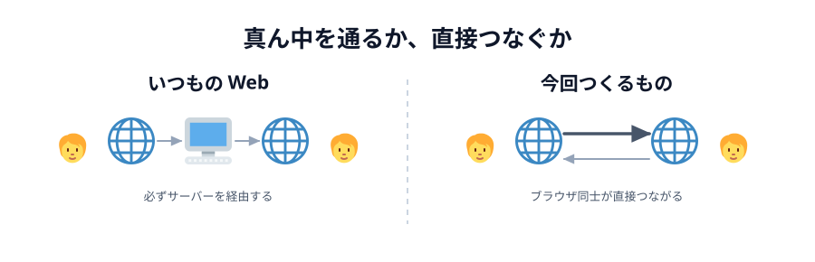
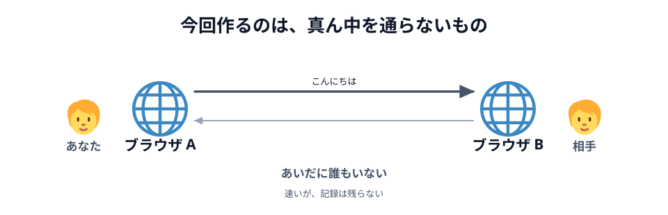
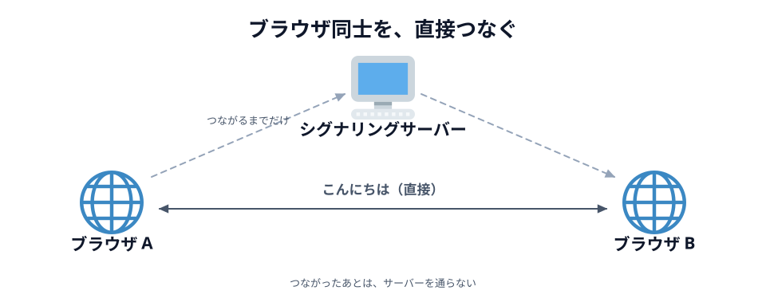

# 03 だから、直接つなぐ



前の節までで分かったのは、この 2 つでした。

- 他人の変更を届けるには、リアルタイム通信（WebSocket）が要る
- ただし、その通り道は**やっぱりサーバー**

この節では、その真ん中を外します。

## いつもの Web は、必ず真ん中を通る

ブラウザで何かをするとき、相手はいつもサーバーでした。
チャットアプリで「こんにちは」と送ると、こう流れます。


_図: 話しているのは人。ただし言葉は、いったんサーバーに預けられてから相手に配られる。_

真ん中を通ることには、ちゃんと理由があります。

- **相手の居場所を知らなくていい。** サーバーの住所さえ知っていれば話せます
- **記録が残せる。** あとから来た人に過去のログを見せられます
- **人数が増えても同じ。** 100 人いても、各自がサーバーと 1 本つなぐだけです

## 今回作るのは、真ん中を通らないもの

一方、これから作るのはこちらです。



_図: あなたの言葉が相手に直接届く。あいだに誰もいない。_

この形を **P2P（ピア・ツー・ピア）** と呼びます。
サーバーが「配る人」ではなく、お互いが対等な相手（ピア）になります。

コードの見た目は、WebSocket とほとんど変わりません。

```js
// このハンズオンで書くのは、こちら
const conn = peer.connect('あいことば');
conn.on('data', function (data) {
  console.log(data); // 相手から直接届いた
});
conn.send('こんにちは'); // 相手へ直接送る
```

前の節の `ws.send(...)` と見比べてください。**書き方はほとんど同じ**です。
`send` して、届いたら受け取る。違うのは、その `send` が**誰に届くか**だけです。

::preview[最初だけサーバー、そのあとは直接届く]{demo="01-p2p" height="270"}

玉が真ん中を踏まないことを確かめてください。
そして、**つなぎ始めるときだけ**はサーバーを踏んでいることにも気づくはずです。



_図: 通り道からサーバーが消える。ただし「つながるまで」は別。_

## 得と損

いいところは、そのまま前の節の裏返しです。

- **速い。** 遠くのサーバーを往復しないぶん、反応が返ってきます。
  お絵かきのように「線が指についてくる」感じが要るものに向いています
- **サーバー代がかからない。** データが通らないので、通信量の料金が発生しません
- **中身がサーバーに残らない。** 描いた絵はサーバーに保存されません

つらいところも同じだけあります。

- **相手の居場所を知る必要がある。** ここが一番の難所です（[04 章](../../04-how-it-works/01-network/LECTURE.md)で扱います）
- **記録が残らない。** ブラウザを閉じたら消えます。あとから来た人は何も見られません
- **人数が増えるとつらい。** 3 人なら 3 本、5 人なら 10 本と、線の数が急に増えます

## 4 つを並べ直す

この章で出てきたものを、まとめて並べます。

|                      | サーバーに置く | ＋ DB      | WebSocket    | P2P            |
| -------------------- | -------------- | ---------- | ------------ | -------------- |
| アドレス             | `https://`     | `https://` | `wss://`     | 無い           |
| 話す相手             | サーバー       | サーバー   | サーバー     | 相手のブラウザ |
| 通信するとき         | 開いたとき     | 聞いたとき | ずっと       | ずっと         |
| 聞かなくても届く     | 届かない       | 届かない   | 届く         | 届く           |
| 相手に届く道         | —              | サーバー   | サーバー経由 | 直接           |
| 記録を残せる         | —              | 残せる     | 残せる       | 残らない       |
| 人数が増えたとき     | 平気           | 平気       | 平気         | つらい         |

P2P にアドレスが無いのは、相手を URL ではなく「あいことば」で呼ぶからです。

「P2P がいちばん偉い」わけではありません。
記録を残したいなら DB のほうが素直ですし、ただ読ませたいだけならサーバーに置くだけで十分です。
今回は「その場にいる 2 人が、いま同時に描く」ものを作るので P2P を選びます。

## このハンズオンは、4 つ全部を通る

ここまで別々のものとして並べてきましたが、
実はこの教材を進めるだけで、**4 つとも自分で踏むことになります**。


_図: WebSocket だけは自分では書かない。それでも確かに使っている。_

- **ローカル** — 03 章で `index.html` を作り、ダブルクリックして確かめます
- **サーバー** — 03 章の最後で Netlify に公開し、スマホから開きます
- **WebSocket** — `new Peer(...)` を呼んだ瞬間、PeerJS がシグナリングサーバーとの
  WebSocket をこっそり張ります。自分では 1 行も書きません
- **P2P** — `conn.send(...)` で相手のブラウザに直接届きます

DB だけは出てきません。今回のお絵かきは、どこにも保存しないからです。

:::notice
[05 章の最後](../../05-drawing/07-deploy/LECTURE.md) では、**自分が描いたものを覚えておいて、
あとから入ってきた相手に送り直す**ようにします。「記録が残らない」を、
自分のブラウザの中だけで小さく埋め合わせる工夫です。
:::

:::questions

- いつもの Web（サーバー経由）は、相手のブラウザの居場所を知らなくても話せる [o]
- P2P はサーバーを一切使わずにつながれる [x]
- P2P はサーバー経由より必ず速い [x]
- P2P で送ったデータは、サーバーに保存されない [o]

:::

## 次の章へ

2 問目に「✕」が付く理由が、このあとの宿題です。
**つながったあとは**サーバーを通りませんが、**つながるまで**は誰かに手伝ってもらう必要があります。
その話は、2 台でつないだあとの [04 章](../../04-how-it-works/01-network/LECTURE.md) で扱います。

[03 章 01 ライトを作る](../../03-connect/01-light/LECTURE.md)
