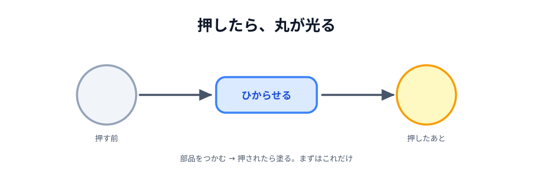

# 01 ライトを 1 つ作る



ここから手を動かします。最初に作るのは、**丸 1 つとボタン 1 つ**だけの画面です。
ボタンを押すと、灰色の丸が黄色く光る。それだけです。

PeerJS はまだ出てきません。相手もいません。
この節で覚えるのは「**部品をつかむ → 押されたら塗る**」という型です。
このあと相手とつないでも、お絵かきに育てても、やっていることはずっとこの型のままです。

> **今回さわる `app/`:** `index.html`・`style.css`・`main.js` を新しく作る

## ファイルを 3 つ作る

[02 エディタを用意する](../../01-introduction/02-editor/LECTURE.md) で開いた `app/` フォルダの中に、
次の 3 つのファイルを作ります。

```text
app/
├── index.html   画面の骨組み
├── style.css    見た目
└── main.js      動き
```

分けなければいけない決まりはありませんが、
「何があるか（HTML）」「どう見えるか（CSS）」「どう動くか（JS）」で分けておくと、
このあと部品が増えたときに迷いません。

## index.html — 画面の骨組み

:::code[`app/index.html`（全文）]{filepath=index.html offset=1}

```html
<!doctype html>
<html lang="ja">
  <head>
    <meta charset="utf-8" />
    <meta name="viewport" content="width=device-width, initial-scale=1" />
    <title>ライトをつくる</title>
    <link rel="stylesheet" href="style.css" />
    <script src="main.js" defer></script>
  </head>
  <body>
    <main>
      <div class="circle" id="my-circle"></div>
    </main>

    <button id="light">ひからせる</button>
  </body>
</html>
```

:::

- `id="my-circle"` … あとから JavaScript でつかむための名札です。
  `id` はページの中で 1 つだけ付けられる名前で、`document.querySelector('#my-circle')` で取り出せます
- `class="circle"` … 見た目をまとめて当てるための分類名です。`id` と違って何個あっても構いません。
  丸はこのあと増えるので、最初から `class` にしておきます
- `defer` … 「HTML を全部読み終わってから `main.js` を動かして」という指定です。
  これが無いと、`main.js` が動く時点でまだ丸が存在せず、`querySelector` が `null` を返します

## style.css — 見た目

:::code[`app/style.css`（全文）]{filepath=style.css offset=1}

```css
body {
  box-sizing: border-box;
  /* 画面（iframe やスマホ）の高さぴったりに収めて、ページごと縦スクロールしないようにする */
  height: 100dvh;
  display: flex;
  flex-direction: column;
  /* 中身を縦のまんなかに置く。すきまは残りの高さから自動で取る */
  justify-content: center;
  /* 横は中身の大きさのまま、まんなかに並べる */
  align-items: center;
  gap: 24px;
  margin: 0;
  padding: 24px;
  font-family: sans-serif;
  background: #222;
  color: #fff;
  text-align: center;
}

main {
  display: flex;
  justify-content: center;
  gap: 48px;
}

.circle {
  width: 120px;
  height: 120px;
  border-radius: 50%;
  background: #555;
  /* 色が切り替わるときに、ぱっと変わらず少しなめらかに見えるようにする */
  transition: background 0.2s;
}

#light {
  font-size: 20px;
  padding: 16px 32px;
}
```

:::

- `body` の `height: 100dvh` と `display: flex` … 画面の高さぴったりの縦並びにしています。
  `justify-content: center` で中身を縦のまんなかに置き、すきまは `gap` と残りの高さで取るので、
  **どんな画面の大きさでもページが縦スクロールしません**（`dvh` はスマホのアドレスバーを除いた実際の高さです）
- `border-radius: 50%` … 正方形の角を半分まで丸めると、円になります
- `background: #555` … 光る前の色です。これが「消えている」状態にあたります
- `transition: background 0.2s` … 色が変わるとき、0.2 秒かけてじわっと変わります。
  無くても動きますが、あると「光った」感じが出ます
- `main` の `display: flex` … いまは丸が 1 つなので効果が見えませんが、
  [03 節](../03-two-lights/LECTURE.md) で丸を横に並べるときに効いてきます

## main.js — 動き

:::code[`app/main.js`（全文）]{filepath=main.js offset=1}

```js
// 画面の部品を取っておく
const myCircle = document.querySelector('#my-circle');
const lightButton = document.querySelector('#light');

lightButton.addEventListener('click', function () {
  myCircle.style.background = '#ffd60a';
});
```

:::

「部品を取っておく」「押されたら塗る」の 2 つだけです。この形がこのハンズオンの土台になります。

- `document.querySelector('#my-circle')` … `id` が `my-circle` の要素を 1 つ取ってきます。
  毎回書くと長いので、最初に変数に入れておきます
- `addEventListener('click', ...)` … 「クリックされたら、この関数を呼んでください」という**予約**です。
  書いた瞬間には何も起きません。ボタンが押されて初めて中身が動きます
- `element.style.background = '#ffd60a'` … その要素の背景色を書き換えます。
  CSS で書いた `background: #555` を、あとから JavaScript が上書きしている形です

## 動かす

`index.html` をブラウザで開きます。エディタで右クリック →「Open with Live Server」でも、
ファイルをダブルクリックでも構いません。

「ひからせる」を押すと、灰色の丸が黄色に変わります。

::preview[このステップの完成イメージ（実際に触って動かせます）]{height="320"}

## もう一度押しても、何も起きない

2 回目からは、押しても変化がありません。すでに黄色だからです。
ボタンは毎回ちゃんと動いていて、毎回同じ色を塗り直しているだけです。

次の節で、**押すたびに違う色**になるようにします。

::codeview{defaultFile="index.html"}
