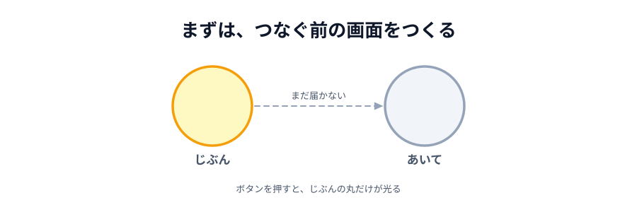

# 01 2 つの丸を並べる



ここから手を動かします。まずは**つなぐ前**の画面を作ります。
「じぶん」と「あいて」の丸を並べて、ボタンを押すと**じぶんの丸だけ**が光るところまでです。

つなぐのは次の節です。この節では PeerJS はまだ出てきません。

> **今回さわる `app/`:** `index.html`・`style.css`・`main.js` を新しく作る

## ファイルを 3 つ作る

[02 エディタを用意する](../../01-introduction/02-editor/LECTURE.md) で開いた `app/` フォルダの中に、
次の 3 つのファイルを作ります。

```text
app/
├── index.html   画面の骨組み
├── style.css    見た目
└── main.js      動き
```

## index.html — 画面の骨組み

:::code[`app/index.html`（全文）]{filepath=index.html offset=1}

```html
<!doctype html>
<html lang="ja">
  <head>
    <meta charset="utf-8" />
    <meta name="viewport" content="width=device-width, initial-scale=1" />
    <title>ボタンで光る</title>
    <link rel="stylesheet" href="style.css" />
    <script src="main.js" defer></script>
  </head>
  <body>
    <main>
      <div>
        <div class="circle" id="my-circle"></div>
        <p>じぶん</p>
      </div>
      <div>
        <div class="circle" id="peer-circle"></div>
        <p>あいて</p>
      </div>
    </main>

    <button id="light">ひからせる</button>
  </body>
</html>
```

:::

- `id="my-circle"` / `id="peer-circle"` … あとから JavaScript でつかむための名札です。
  `id` はページの中で 1 つだけ付けられる名前で、`document.querySelector('#my-circle')` で取り出せます
- `class="circle"` … 見た目をまとめて当てるための分類名です。`id` と違って何個あっても構いません
- `defer` … 「HTML を全部読み終わってから `main.js` を動かして」という指定です。
  これが無いと、`main.js` が動く時点でまだ丸が存在せず、`querySelector` が `null` を返します

## style.css — 見た目

:::code[`app/style.css`（全文）]{filepath=style.css offset=1}

```css
body {
  margin: 0;
  padding: 24px;
  font-family: sans-serif;
  background: #222;
  color: #fff;
  text-align: center;
}

main {
  display: flex;
  justify-content: center;
  gap: 48px;
  margin: 48px 0;
}

.circle {
  width: 120px;
  height: 120px;
  border-radius: 50%;
  background: #555;
  /* 色が切り替わるときに、ぱっと変わらず少しなめらかに見えるようにする */
  transition: background 0.2s;
}

#light {
  font-size: 20px;
  padding: 16px 32px;
}
```

:::

- `border-radius: 50%` … 正方形の角を半分まで丸めると、円になります
- `transition: background 0.2s` … 色が変わるとき、0.2 秒かけてじわっと変わります。
  無くても動きますが、あると「光った」感じが出ます

## main.js — 動き

:::code[`app/main.js`（全文）]{filepath=main.js offset=1}

```js
// 画面の部品を取っておく
const myCircle = document.querySelector('#my-circle');
const peerCircle = document.querySelector('#peer-circle');
const lightButton = document.querySelector('#light');

lightButton.addEventListener('click', function () {
  // 0〜359 のどれかの色相。押すたびに違う色になる。
  const color = 'hsl(' + Math.floor(Math.random() * 360) + ', 90%, 60%)';

  myCircle.style.background = color;
});
```

:::

- `document.querySelector('#my-circle')` … `id` が `my-circle` の要素を 1 つ取ってきます。
  毎回書くと長いので、最初に変数に入れておきます
- `addEventListener('click', ...)` … 「クリックされたら、この関数を呼んでください」という**予約**です。
  書いた瞬間には何も起きません
- `hsl(色相, 彩度, 明度)` … 色の指定のしかたの 1 つです。色相を 0〜359 の乱数にすると、
  押すたびに違う色になります。`#ff0000` のような書き方だと「ランダムだけど鮮やか」が作りにくいので、
  ここでは `hsl` を使っています

## 動かす

`index.html` をブラウザで開きます。エディタで右クリック →「Open with Live Server」でも、
ファイルをダブルクリックでも構いません。

「ひからせる」を押すと、**左の丸だけ**が毎回違う色に変わります。
右の「あいて」の丸は灰色のままです。**まだ相手がいない**ので当然です。

::preview[このステップの完成イメージ（実際に触って動かせます）]{height="360"}

次の節で、この「あいて」の丸に色を届けます。

::codeview{defaultFile="index.html"}

## 次の節へ

[02 PeerJS でつなぐ](../02-peer/LECTURE.md)
