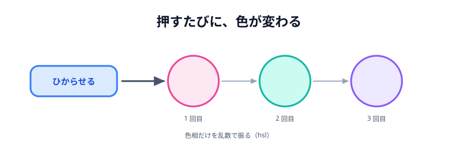

# 02 押すたびに色を変える



前の節のライトは、1 回光ったらそれきりでした。
この節では、**押すたびに色がころころ変わる**ようにします。

さわるのは `main.js` の 1 か所だけです。`index.html` と `style.css` はそのままです。

> **今回さわる `app/`:** `main.js` のクリック処理だけ

## 色を毎回作る

いままでは `'#ffd60a'` という**決まった色**を直接書いていました。
これを、押されるたびに**その場で作る**形に変えます。

:::code[`main.js` の `lightButton.addEventListener` の中]{filepath=main.js offset=5 newOffset=5}

```diff
  lightButton.addEventListener('click', function () {
-   myCircle.style.background = '#ffd60a';
+   // 0〜359 のどれかの色相。押すたびに違う色になる。
+   const color = 'hsl(' + Math.floor(Math.random() * 360) + ', 90%, 60%)';
+
+   myCircle.style.background = color;
  });
```

:::

`const color = ...` をいったん変数に入れているのは、
このあと**同じ色を相手にも送る**からです（[05 節](../05-send/LECTURE.md)）。
いま直接書いてしまうと、そのとき 2 回作ることになって、自分と相手で違う色になります。

## `hsl` という色の書き方

```js
'hsl(' + Math.floor(Math.random() * 360) + ', 90%, 60%)';
```

- `Math.random()` … 0 以上 1 未満の小数をランダムに返します
- `Math.random() * 360` … 0 以上 360 未満の小数になります
- `Math.floor(...)` … 小数を切り捨てて整数にします。結果は 0〜359 のどれか
- `hsl(色相, 彩度, 明度)` … 色の指定のしかたの 1 つです。
  **色相**が 0〜359 の角度（0=赤、120=緑、240=青）、**彩度**が鮮やかさ、**明度**が明るさ

`#ff0000` のような書き方でもランダムな色は作れますが、
`#` の 6 桁をランダムにすると、くすんだ色や真っ黒に近い色も混ざります。
`hsl` なら**彩度と明度は固定したまま、色味だけ**を振れるので、
どの色になっても「光っている」ように見えます。

:::notice[毎回きれいに違う色になるわけではない]
乱数なので、たまたま近い色が続くことがあります。壊れているわけではありません。
気になるときは何度か押してみてください。
:::

## 動かす

`index.html` を開いて「ひからせる」を何度か押します。押すたびに色が変わります。

::preview[このステップの完成イメージ（押すたびに色が変わります）]{height="320"}

丸 1 つとボタン 1 つで、やりたいことはひととおりできました。
次の節で、**ライトをもう 1 つ**増やします。

::codeview{defaultFile="main.js"}
