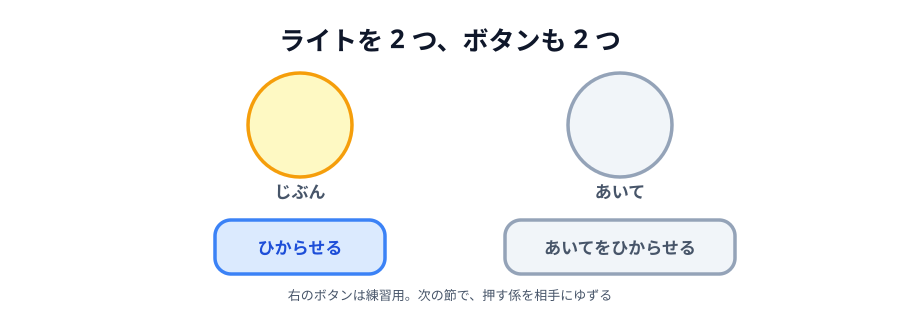

# 03 ライトをもう 1 つ増やす



ライトを **2 つ**に増やします。左が「じぶん」、右が「あいて」です。
それぞれに専用のボタンを付けて、押した方の丸が光るようにします。

右の丸は、これから作る「**あいての画面で起きたこと**」を映す場所です。
でも相手はまだいないので、この節では**練習用のボタン**で自分で光らせてみます。
つなぐのは次の節からです。

> **今回さわる `app/`:** `index.html` に丸とボタンを追加、`main.js` に処理を追加

## 丸を 2 つに増やす

丸をそれぞれ `<div>` で包んで、下に名前を付けます。ボタンも 1 つ足します。

:::code[`index.html` の `<body>` の中]{filepath=index.html offset=11 newOffset=11}

```diff
  <main>
-   <div class="circle" id="my-circle"></div>
+   <div>
+     <div class="circle" id="my-circle"></div>
+     <p>じぶん</p>
+   </div>
+   <div>
+     <div class="circle" id="peer-circle"></div>
+     <p>あいて</p>
+   </div>
  </main>

  <button id="light">ひからせる</button>
+ <button id="peer-light">あいてをひからせる</button>
```

:::

- `class="circle"` は**両方に付けます**。`.circle` に書いた見た目（大きさ・丸さ・灰色）が
  そのまま 2 つ目にも当たります。CSS は 1 行も足しません
- `id` は `my-circle` / `peer-circle` と**別々**にします。`id` はページに 1 つだけの名札なので、
  同じ名前を 2 回使うことはできません
- `<div>` で包んだのは、丸と名前をひとかたまりにして横に並べるためです。
  `main` に書いた `display: flex` と `gap: 48px` が、このかたまりを 48px 空けて並べます

## それぞれのボタンで光らせる

`main.js` の部品を 2 つ足します。

:::code[`main.js` の先頭]{filepath=main.js offset=1 newOffset=1}

```diff
  // 画面の部品を取っておく
  const myCircle = document.querySelector('#my-circle');
+ const peerCircle = document.querySelector('#peer-circle');
  const lightButton = document.querySelector('#light');
+ const peerLightButton = document.querySelector('#peer-light');
```

:::

そして、ファイルのいちばん下に、2 つ目のボタンの処理を足します。

:::code[`main.js` の末尾]{filepath=main.js offset=14}

```js
// 「あいて」の丸を光らせる練習用のボタン。次の節で、この係は相手にゆずる。
peerLightButton.addEventListener('click', function () {
  const color = 'hsl(' + Math.floor(Math.random() * 360) + ', 90%, 60%)';

  peerCircle.style.background = color;
});
```

:::

前の節で書いた処理と、**丸の変数が違うだけ**です。
`myCircle` を `peerCircle` に、`lightButton` を `peerLightButton` に置き換えただけで、
形はまったく同じです。

:::notice[同じ行が 2 か所に出てくるけれど]
`const color = 'hsl(...` の行は、いま 2 か所に同じものが並んでいます。
ふつうなら関数にまとめたくなるところですが、
**次の節でこの練習用ボタンごと消える**ので、ここではそのままにしておきます。
:::

## 動かす

`index.html` を開くと、灰色の丸が 2 つ並んでいます。

- 「ひからせる」 → **左（じぶん）**だけが光る
- 「あいてをひからせる」 → **右（あいて）**だけが光る

::preview[このステップの完成イメージ（2 つのボタンを押し分けてみてください）]{height="380"}

## 「あいて」の丸を、誰が光らせるのか

ここまでのコードには、**相手も通信も出てきません**。
やっているのは「ボタンが押されたら、指定した丸を塗る」だけです。

このあとやるのは、じつは 1 つだけです。
**右の丸を光らせる合図を、自分のボタンではなく、相手のブラウザから受け取る**。
それだけで、これは 2 人で遊べるアプリになります。

だから練習用のボタンは、次の節でお役御免になります。
押す係が、あなたから相手に移るからです。

::codeview{defaultFile="index.html"}
