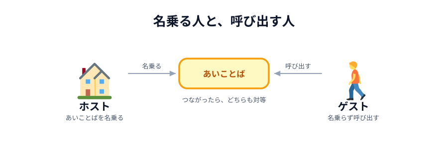
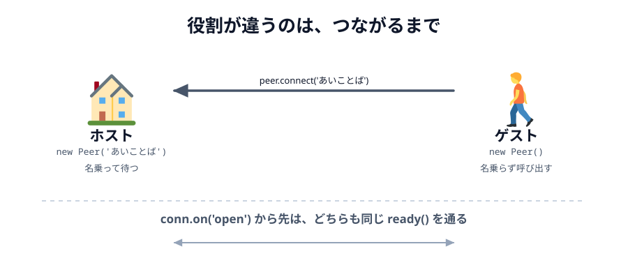

# 04 PeerJS でつなぐ



ライトが 2 つ並びました。ここからが**通信**です。
この節で、**2 つのブラウザをつなぎます**。
まだデータは送りません。「つながりました」と表示されるところまでです。

つなぐ役は 2 つに分かれます。

- **ホスト**（へやをつくる）… あいことばを**名乗って**、誰かが来るのを待つ
- **ゲスト**（へやにはいる）… 名乗らずに、そのあいことばを**呼び出す**

> **今回さわる `app/`:** `index.html` にボタンを追加、`style.css` を少し追加、`main.js` を書き足し、
> 練習用のボタンを 2 つのファイルから削除

## PeerJS を読み込む

`index.html` の `<head>` に、PeerJS 本体を読み込む行を足します。
`main.js` より**先**に書いてください。`main.js` の中で `Peer` を使うからです。

:::code[`index.html` の `<head>`（`main.js` の行のすぐ上）]{filepath=index.html offset=8}

```html
<script src="https://cdnjs.cloudflare.com/ajax/libs/peerjs/1.5.5/peerjs.min.js"></script>
```

:::

インストールは要りません。CDN（配布サーバー）から直接読み込みます。
これで、どのファイルからでも `Peer` という名前が使えるようになります。

## ボタンと状態表示を足す

`<body>` の先頭、`<main>` の上にヘッダーを足します。

:::code[`index.html` の `<body>` の先頭（`<main>` の上）]{filepath=index.html offset=12}

```html
<header>
  <button id="host">へやをつくる</button>
  <button id="guest">へやにはいる</button>
  <p id="status">まだつながっていません</p>
</header>
```

:::

`style.css` にも、ボタンを少し大きくする指定を足しておきます。

:::code[`style.css`（`body { ... }` の下）]{filepath=style.css offset=20}

```css
input,
button {
  font-size: 16px;
  padding: 8px 12px;
}

/* 状態表示の上下の余白を消して、せまい画面でもはみ出さないようにする */
#status {
  margin: 0;
}
```

:::

`input` は次の節ではまだ出てきませんが、[06 節](../06-deploy/LECTURE.md) で足すので先に書いておきます。
`#status` は `<p>` なので上下に余白が付きます。これを消しておくと、せまい画面でも画面に収まります。

## 部品を取り出す

`main.js` のいちばん上、部品をつかんでいるところに 3 つ足します。
練習用のボタンはこのあと消すので、`peerLightButton` もここで外しておきます。

:::code[`main.js` の先頭]{filepath=main.js offset=1 newOffset=1}

```diff
  // 画面の部品を取っておく
+ const hostButton = document.querySelector('#host');
+ const guestButton = document.querySelector('#guest');
+ const statusText = document.querySelector('#status');
  const myCircle = document.querySelector('#my-circle');
  const peerCircle = document.querySelector('#peer-circle');
  const lightButton = document.querySelector('#light');
- const peerLightButton = document.querySelector('#peer-light');
```

:::

## つなぐコードを書く

部品の下、`lightButton.addEventListener(...)` の**上**に、まとめて書き足します。
少し長いので、順に見ていきます。

:::code[`main.js`（部品の下、`lightButton.addEventListener` の上）]{filepath=main.js offset=9}

```js
// つながった相手との通り道。まだつながっていないので null。
let conn = null;

// PeerJS Cloud で名乗る名前。いまは決め打ちにしておく。
// PeerJS Cloud は世界中の人と共有しているので、'test' のままだと
// 同じことをしている人とぶつかる。自分の名前などに書き換えて使うこと。
const ROOM = 'webrtc-handson-test';

// へやをつくる側（ホスト）。ROOM を自分の名前として名乗り、誰かが来るのを待つ。
hostButton.addEventListener('click', function () {
  const peer = new Peer(ROOM);

  peer.on('open', function () {
    statusText.textContent = 'あいてを待っています…';
  });

  peer.on('connection', function (newConn) {
    conn = newConn;
    conn.on('open', ready);
  });

  peer.on('error', showError);
});

// へやにはいる側（ゲスト）。名前は名乗らず、ROOM の相手に向かってつなぎに行く。
guestButton.addEventListener('click', function () {
  const peer = new Peer();

  peer.on('open', function () {
    conn = peer.connect(ROOM);
    conn.on('open', ready);
  });

  peer.on('error', showError);
});

// PeerJS から届くエラーを、日本語のことばにして出す。
// err.type にどんなエラーかが入っている。
function showError(err) {
  if (err.type === 'unavailable-id') {
    statusText.textContent =
      'そのあいことばは使われています。別のあいことばにするか「へやにはいる」を押してください';
  } else if (err.type === 'peer-unavailable') {
    statusText.textContent =
      'そのあいことばのへやが見つかりません。相手が「へやをつくる」を押したか確かめてください';
  } else {
    statusText.textContent = 'つながりませんでした（' + err.type + '）';
  }
}

// ホストでもゲストでも、つながったあとにやることは同じ。
function ready() {
  statusText.textContent = 'つながりました';

  conn.on('close', function () {
    statusText.textContent = 'せつだんされました';
  });
}
```

:::

:::danger[必ず書き換えてください]
`ROOM` の `test` の部分を、**自分の名前など、他の人とかぶらない文字列**に書き換えてください。
`webrtc-handson-yamada` のようにします。
そのままだと、同じ会場の他の人や世界中の誰かとぶつかって `unavailable-id` になります。
:::

## 練習用のボタンを外す

つなぐ準備ができました。前の節の**練習用のボタン**は、ここでお役御免です。
「あいて」の丸を光らせる係は、次の節から**相手のブラウザ**が引き継ぎます。

まず `index.html` からボタンを消します。

:::code[`index.html` の `<body>` の中（`<button id="light">` の下）]{filepath=index.html offset=22 newOffset=29}

```diff
  <button id="light">ひからせる</button>
- <button id="peer-light">あいてをひからせる</button>
```

:::

`main.js` の方も、いちばん下の練習用の処理をまるごと消します。

:::code[`main.js` の末尾]{filepath=main.js offset=7 newOffset=68}

```diff
  lightButton.addEventListener('click', function () {
    // 0〜359 のどれかの色相。押すたびに違う色になる。
    const color = 'hsl(' + Math.floor(Math.random() * 360) + ', 90%, 60%)';

    myCircle.style.background = color;
  });
-
- // 「あいて」の丸を光らせる練習用のボタン。次の節で、この係は相手にゆずる。
- peerLightButton.addEventListener('click', function () {
-   const color = 'hsl(' + Math.floor(Math.random() * 360) + ', 90%, 60%)';
-
-   peerCircle.style.background = color;
- });
```

:::

これで「あいて」の丸を光らせるものは、自分の画面から無くなりました。
残ったボタンは「ひからせる」だけです。

## 1 行ずつ読む

### `new Peer(ROOM)` と `new Peer()`

```js
const peer = new Peer(ROOM); // ホスト: この名前で名簿に載せて
const peer = new Peer(); // ゲスト: 名前は何でもいいので配って
```

ホストは**自分から名乗ります**。ゲストは名乗る必要がありません。
呼び出す側なので、名簿に載っていなくてもいいのです。
名乗らない場合、PeerJS Cloud が `8f3a1c9e-...` のような名前を勝手に配ってくれます
（[01 章のデモ](../../01-introduction/03-peerjs-cloud/LECTURE.md) で見たあれです）。

### `peer.on('open', ...)`

PeerJS Cloud に**名前が受理された**ときに呼ばれます。
`new Peer(...)` を書いた瞬間にはまだつながっていません。少し待つ必要があります。

ゲスト側で `peer.connect(ROOM)` を `open` の**中**に書いているのはこのためです。
自分の名前がまだ決まっていないうちに呼び出そうとしても失敗します。

### `peer.on('connection', ...)` — ホストだけ

**誰かが自分を呼び出してきた**ときに呼ばれます。引数に、その相手との通り道
（`DataConnection`）が渡ってきます。

### `peer.connect(ROOM)` — ゲストだけ

**その名前の相手を呼び出します**。戻り値が通り道です。

### `conn.on('open', ready)`

通り道が**実際に使えるようになった**ときに呼ばれます。
`peer.on('connection')` や `peer.connect()` の直後は、まだ通り道の準備中です。
ここで送ろうとしても届きません。

ホストもゲストも、この `open` から先は完全に対等です。だから同じ `ready` 関数を渡しています。



_図: 役割が違うのは最初だけ。つながったあとは、どちらも同じことができる。_

### `conn.on('close', ...)`

相手がタブを閉じたときなどに呼ばれます。無くても動きますが、
これが無いと「反応しないけど何が起きたか分からない」状態になります。

## 動かす

**2 つのタブ**で `index.html` を開いてください。同じブラウザの別タブで構いません。

1. 1 つ目のタブで「へやをつくる」を押す → `あいてを待っています…`
2. 2 つ目のタブで「へやにはいる」を押す → **両方**が `つながりました` になる

::preview[こちらで「へやをつくる」を押す]{height="360"}

::preview[こちらで「へやにはいる」を押す]{height="360"}

この 2 つは、それぞれ別のブラウザだと思ってください。
上で「へやをつくる」、下で「へやにはいる」を押すと、両方が `つながりました` になります。

:::warning
このページのプレビューは、あいことばが `webrtc-handson-test` に固定されています。
同時に同じページを見ている人がいるとぶつかります。
自分の手元のファイルでは、必ず `ROOM` を書き換えてください。
:::

## つながったのに、まだ何も起きない

「ひからせる」を押しても、相手の丸は灰色のままです。
通り道はできましたが、**まだ何も流していない**からです。次の節でデータを流します。

::codeview{defaultFile="main.js"}
