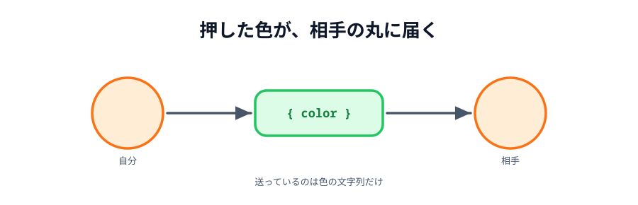
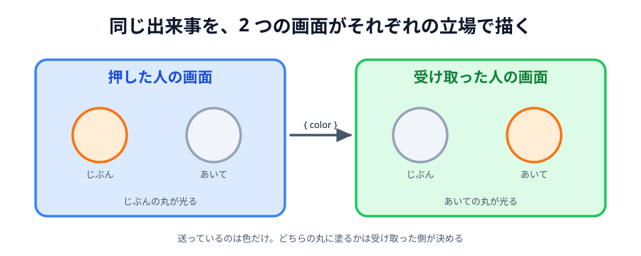

# 05 ボタンで色を送る



通り道はできました。この節でやることは 2 つだけです。

- **送る** … ボタンを押したとき、色を相手にも渡す
- **受け取る** … 相手から色が届いたら、「あいて」の丸に塗る

> **今回さわる `app/`:** `main.js` を 2 か所書き足し

## 受け取る

`ready()` の中に、届いたときの処理を足します。

:::code[`main.js` の `ready`]{filepath=main.js offset=59 newOffset=59}

```diff
  // ホストでもゲストでも、つながったあとにやることは同じ。
  function ready() {
    statusText.textContent = 'つながりました';

    conn.on('close', function () {
      statusText.textContent = 'せつだんされました';
    });
+
+   // 相手から届いた色を、「あいて」の丸に塗る。
+   conn.on('data', function (data) {
+     peerCircle.style.background = data.color;
+   });
  }
```

:::

`conn.on('data', ...)` は、`addEventListener('click', ...)` と同じ形です。
「データが届いたら、この関数を呼んでください」という予約です。

引数の `data` には、**相手が `conn.send(...)` に渡したものがそのまま**入ってきます。
文字列を送れば文字列が、オブジェクトを送ればオブジェクトが届きます。

## 送る

「ひからせる」の中に、送る処理を足します。

:::code[`main.js` の `lightButton.addEventListener` の中]{filepath=main.js offset=68 newOffset=73}

```diff
  lightButton.addEventListener('click', function () {
    // 0〜359 のどれかの色相。押すたびに違う色になる。
    const color = 'hsl(' + Math.floor(Math.random() * 360) + ', 90%, 60%)';

    myCircle.style.background = color;
+
+   // つながっていれば、同じ色を相手にも送る
+   if (conn) {
+     conn.send({ color: color });
+   }
  });
```

:::

- `conn.send({ color: color })` … オブジェクトをそのまま渡せます。
  PeerJS が送れる形に詰めて、相手側で元のオブジェクトに戻してくれます
- `if (conn)` … まだつないでいないときは `conn` が `null` なので、
  そのまま `conn.send(...)` を呼ぶとエラーになります。**つないでいなくても
  1 人で遊べる**ようにするための守りです



_図: 送っているのは「色」という文字列だけ。丸そのものを送っているわけではない。_

## 「自分の丸」と「あいての丸」が入れ替わる

ここが少しややこしいところです。
A が押したとき、**A の画面**では「じぶん」の丸が、**B の画面**では「あいて」の丸が変わります。

同じ 1 つのできごとを、2 つの画面がそれぞれの立場から表示しているわけです。
送るデータには「じぶん」も「あいて」も入っていません。ただの色です。
どちらの丸に塗るかは、**受け取った側が決めています**。

この考え方は 05 章のお絵かきでも同じです。
送るのは「線を引いて」という指示だけで、誰が引いたかは送りません。

## 動かす

2 つのタブでつないでから、どちらかの「ひからせる」を押してください。

- 押したタブ … **じぶん**の丸が光る
- もう片方のタブ … **あいて**の丸が同じ色に光る

もう片方で押せば、逆向きにも届きます。どちらから押しても構いません。

::preview[こちらで「へやをつくる」]{height="360"}

::preview[こちらで「へやにはいる」]{height="360"}

## これで「つなぐ」はできました

たった 2 か所の書き足しで、2 つのブラウザが直接データをやりとりするようになりました。
**このあとのお絵かきも、原理はまったく同じ**です。
送るものが「色」から「線の座標」に変わるだけです。

ただ、いまはまだ同じ PC の中の 2 タブです。次の節で本当に 2 台の端末でつなぎます。

::codeview{defaultFile="main.js"}
