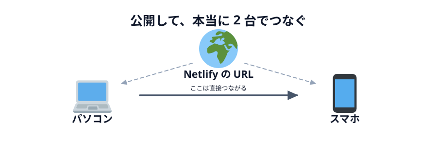
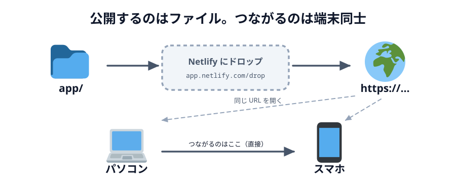

# 06 Netlify に公開して 2 台で動かす



ここまでは同じ PC の中の 2 タブでした。この節で**本当に 2 台の端末**をつなぎます。

そのために 2 つやります。

1. あいことばを**決め打ちから入力欄に変える**（人ごとに違うへやを使えるようにする）
2. `app/` フォルダを **Netlify に公開する**

> **今回さわる `app/`:** `index.html` に入力欄を追加、`main.js` の `ROOM` を関数に変える

## なぜ入力欄が必要か

いまは `const ROOM = 'webrtc-handson-...'` と決め打ちです。
自分ひとりで 2 タブを開くぶんには困りません。

でも公開した URL を会場のみんなが開くと、**全員が同じ名前を名乗ろうとします**。
PeerJS Cloud の名簿は世界で 1 つなので、最初のひとり以外は `unavailable-id` で弾かれます。

そこで、あいことばを画面から入れられるようにします。

## 入力欄を足す

:::code[`index.html` の `<header>` の中（ボタンの上）]{filepath=index.html offset=13}

```html
<input id="word" placeholder="あいことば" value="test" />
```

:::

## 決め打ちを関数に変える

まず、部品に入力欄を足します。

:::code[`main.js` の先頭]{filepath=main.js offset=1 newOffset=1}

```diff
  // 画面の部品を取っておく
+ const wordInput = document.querySelector('#word');
  const hostButton = document.querySelector('#host');
  const guestButton = document.querySelector('#guest');
```

:::

次に `const ROOM = ...` を消して、関数に置き換えます。

:::code[`main.js`（`let conn = null;` の下）]{filepath=main.js offset=12 newOffset=13}

```diff
- // PeerJS Cloud で名乗る名前。いまは決め打ちにしておく。
- // PeerJS Cloud は世界中の人と共有しているので、'test' のままだと
- // 同じことをしている人とぶつかる。自分の名前などに書き換えて使うこと。
- const ROOM = 'webrtc-handson-test';
+ // あいことばから、PeerJS Cloud で名乗る名前を作る。
+ // PeerJS Cloud は世界中の人と共有しているので「test」のような短い名前は
+ // すでに誰かに使われている。長めの前置きを付けてぶつかりにくくする。
+ function roomId(word) {
+   return 'webrtc-handson-' + word;
+ }
```

:::

最後に、`ROOM` を使っていた 2 か所を書き換えます。

:::code[`main.js` の `hostButton`]{filepath=main.js offset=18 newOffset=21}

```diff
  hostButton.addEventListener('click', function () {
-   const peer = new Peer(ROOM);
+   const peer = new Peer(roomId(wordInput.value));

    peer.on('open', function () {
      statusText.textContent = 'あいてを待っています…';
    });

    peer.on('connection', function (newConn) {
      conn = newConn;
      conn.on('open', ready);
    });

    peer.on('error', showError);
  });
```

:::

:::code[`main.js` の `guestButton`]{filepath=main.js offset=34 newOffset=37}

```diff
  guestButton.addEventListener('click', function () {
    const peer = new Peer();

    peer.on('open', function () {
-     conn = peer.connect(ROOM);
+     conn = peer.connect(roomId(wordInput.value));
      conn.on('open', ready);
    });

    peer.on('error', showError);
  });
```

:::

`wordInput.value` を**ボタンが押された瞬間に**読んでいるのがポイントです。
ページを開いた時点で読んでしまうと、あとから入力欄を書き換えても反映されません。

`webrtc-handson-` という前置きを外から見えないところで付けているので、
利用者は短いあいことば（`neko` など）を入れるだけで済みます。

## Netlify に公開する

いよいよ公開します。手順は [01 章](../../01-introduction/03-netlify/LECTURE.md) でおためししたときと
まったく同じです。ターミナルは使いません。

1. https://app.netlify.com/drop を開きます（おためしのときと同じページです。ログインは要りません）
2. 点線の四角に、**`app` フォルダをまるごと**ドラッグ&ドロップします
3. 数秒で `https://<でたらめな名前>.netlify.app` が出てきます



_図: 落とすのはフォルダそのもの。中の `index.html` を選ぶのではない。_

:::warning
`index.html` が URL の直下に来る必要があります。
`app` フォルダの中身（3 ファイル）ではなく、**`app` フォルダ自体**を落としてください。
うまくいかないときは、公開された URL をそのまま開いて画面が出るか確かめてください。
:::

出てきた URL は `curious-otter-3f1a2b.netlify.app` のようにでたらめな名前です。
スマホで手入力するのは大変なので、**自分あてにメッセージアプリで送っておく**のが一番早いです。

## 2 台でつなぐ

1. **PC** でその URL を開き、あいことばを入れて「へやをつくる」
2. **スマホ**で同じ URL を開き、**同じあいことば**を入れて「へやにはいる」
3. 両方が `つながりました` になったら、どちらかの「ひからせる」を押す

相手の画面の「あいて」の丸が光れば成功です。

## つながらないときは

| 画面に出ているもの                     | 何が起きているか                                       |
| -------------------------------------- | ------------------------------------------------------ |
| `そのあいことばは使われています`       | 他の人が同じあいことばで先にへやを作っています         |
| `そのあいことばのへやが見つかりません` | 相手がまだ「へやをつくる」を押していません             |
| `あいてを待っています…` のまま         | 相手側で別のあいことばを入れている可能性があります     |
| 何も変わらない                         | 両方が「へやをつくる」を押していないか確認してください |

それでも駄目なとき（会社のネットワークなど）は、スマホのテザリングに切り替えると通ることが多いです。
なぜ会社のネットワークだとつながらないことがあるのかは、
[04 章 03 節](../../04-how-it-works/03-signaling/LECTURE.md) で見ます。

## 上げ直すとき

このあと 05 章でコードを増やしたら、また公開し直します。
やることは**さっきとまったく同じ**です。https://app.netlify.com/drop に
`app` フォルダを落とすだけ。

ただし、**落とすたびに URL が変わります**。落とすと毎回あたらしいサイトが作られるからです。
上げ直したら、新しい URL をスマホにもう一度送ってください。

同じ URL のまま差し替える方法もありますが、ダッシュボードからプロジェクトを探す手順が増えます。
このハンズオンでは「落とす → 新しい URL」だけで通します。

::preview[こちらで「へやをつくる」]{height="420"}

::preview[こちらで「へやにはいる」]{height="420"}

## つなぐところは、これで全部です

たった 3 ファイルで、2 台の端末が直接つながりました。

次の章では、**いま動いているこれの裏側**を見ます。
`new Peer(...)` と書いた 1 行が、実際には何をしていたのか。
つながらなかった人は、その原因もそこで見つかります。

::codeview{defaultFile="main.js"}
