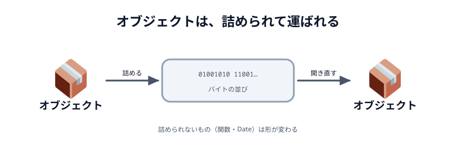

# 01 送ったデータはどう届くのか



前の章で `conn.send({ color: color })` と書きました。
オブジェクトをそのまま渡しただけで、相手側では同じオブジェクトが届きました。

あいだで何が起きているのか、実際に確かめます。

## 何を送ると、何が届くか

下のボタンを押すと、このページの中で 2 つの `Peer` をつなぎ、
いろいろな値を送って**届いたものを並べます**。

::preview[押すと、送ったものと届いたものを並べて比べます]{demo="what-arrives" height="380"}

結果はこうなります。

| 送ったもの                 | 届くもの                   |
| -------------------------- | -------------------------- |
| 文字列                     | そのまま                   |
| 数値・真偽値・`null`       | そのまま                   |
| 配列                       | そのまま                   |
| オブジェクト（入れ子も可） | そのまま                   |
| `Date`                     | **文字列に変わる**         |
| `undefined`                | **`null` に変わる**        |
| `Uint8Array`               | **`ArrayBuffer` に変わる** |
| 関数                       | **送れない（例外になる）** |

::codeview[このデモの中身]{path="demos/what-arrives"}

## なぜ形が変わるのか

`conn.send(...)` に渡したオブジェクトは、そのままの姿では線を流れません。
通信路を流れるのは**バイトの並び**だけです。

そこで PeerJS は、オブジェクトを一度バイトの並びに**詰め**（シリアライズ）、
受け取った側で**開き直し**（デシリアライズ）ています。


_図: 通り道を流れているのはバイトの並び。オブジェクトが飛んでいるわけではない。_

詰められるのは「データとして表せるもの」だけです。
`Date` は「1970 年から数えた時刻」という**意味**を持った特別なオブジェクトですが、
詰めた先ではその意味を保てず、文字列として運ばれます。
関数にいたっては、そもそもデータではないので運べません。

:::notice
JSON でも同じことが起きます（`JSON.parse(JSON.stringify(obj))` を思い出してください）。
「ネットワークの向こうに送れるのは、データとして表せるものだけ」というのは
WebRTC に限った話ではなく、通信全般に共通する制約です。
:::

## だから「指示」を送る

この制約があるので、このハンズオンでは**キャンバスの絵そのもの**ではなく、
**描く指示**を送ります。

```js
// 送るのはこれ（ただの数値と文字列）
{ type: 'line', x1: 100, y1: 100, x2: 120, y2: 130, color: '#333333', width: 4 }
```

受け取った側は、この指示のとおりに自分のキャンバスへ線を引きます。
結果として、2 つの画面に同じ絵ができあがります。

絵を画像として送る方法（`canvas.toDataURL()` など）もありますが、
線 1 本ごとに画像全体を送ることになるので、指先の動きには追いつきません。

## 届く順番は入れ替わらない

お絵かきで気になるのは「順番」です。
線を A → B → C の順で引いたのに、C → A → B の順に届いたら絵が壊れます。

WebRTC のデータチャネルは、**既定で順番どおり・取りこぼしなし**（ordered / reliable）です。
`conn.send()` を呼んだ順に、そのまま相手へ届きます。

だから、このハンズオンでは順番の心配をしなくて済みます。

:::notice
この既定を**あえて外す**こともできます。
ゲームで「最新の位置だけ届けばよく、古いものは捨ててよい」ような場合は、
順序保証を切って遅延を減らす、という設計があります。
PeerJS の `peer.connect(id, { reliable: false })` がそれにあたります。
:::

## 大きいデータも送れる

1 回に送れる大きさには上限がありますが、PeerJS が自動で分割して送り、
受け取り側で組み立て直してくれます。画像 1 枚くらいなら `conn.send()` に渡すだけで届きます。

ただし、線を引くたびに大きなデータを送ると、当然もたつきます。
**送るものは小さく保つ**のが、リアルタイム性を出すコツです。

:::questions

- `conn.send()` に渡したオブジェクトは、そのままの形で線を流れている [x]
- `Date` を送ると、相手側でも `Date` として受け取れる [x]
- データチャネルは、既定で送った順に届く [o]
- お絵かきでは、絵の画像そのものより「描く指示」を送るほうが軽い [o]

:::
