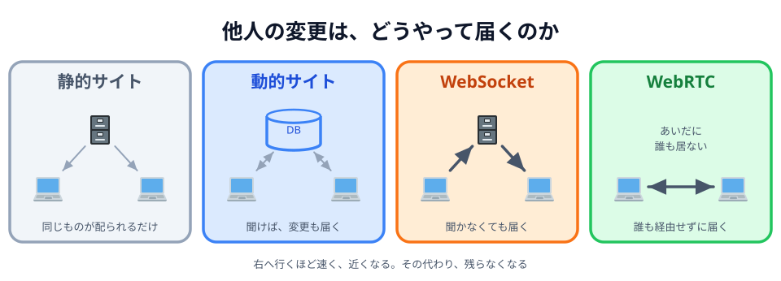
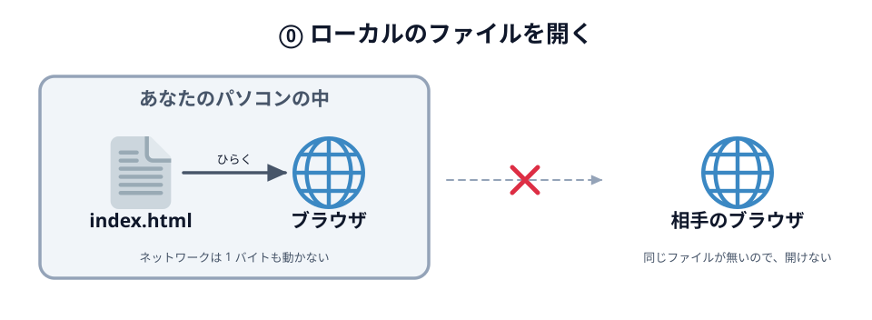
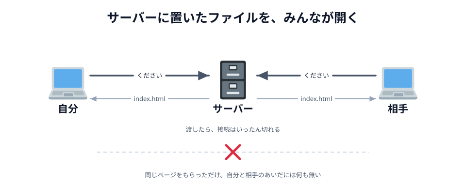
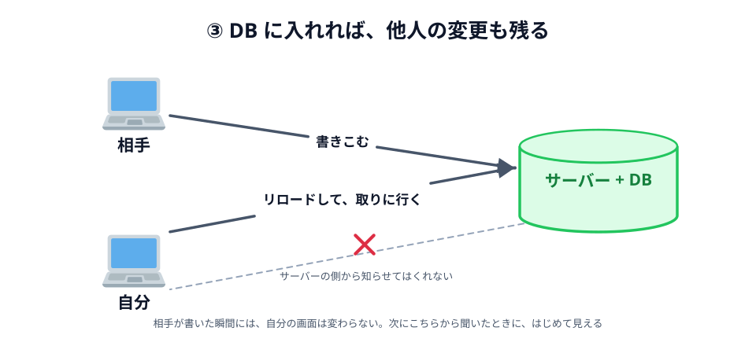
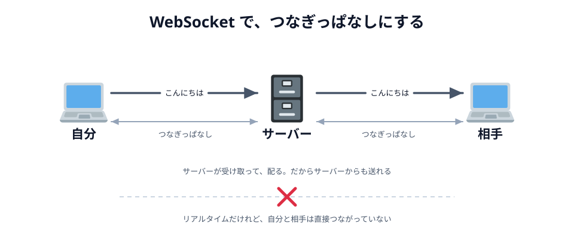
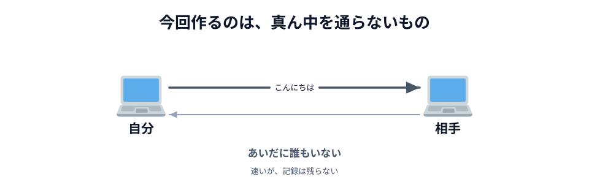

# 01 他人の変更は、どうやって届くのか



前の章で、2 台の端末がつながりました。自分が押したボタンで、相手の丸が光っています。

この章では、**いま動いているものを分解して見ます**。コードは書きません。
手元の `app/` を開いたまま、3 つの節を読んでください。

1. Web で「他人の変更が届く」やり方を **4 つ並べて**、自分が使ったのがどれかを確かめる（この節）
2. その 4 つ目、**WebRTC が何を解決している技術なのか**を見る
3. `あいてを待っています…` のあいだに、**実際に何が起きていたのか**を見る

「自分が押したことが、**相手の画面にその場で出る**」——ずいぶん当たり前のことに聞こえますが、
Web でこれをやるのはいちばん難しい部類に入ります。
いちばん届かないところから順に、4 段階で上げていきます。

## ⓪ その前に — ダブルクリックで開いていたとき



_図: ひらいているだけ。ネットワークは動いていない。_

[03 章 01 節](../../03-connect/01-light/LECTURE.md) で `index.html` を作ってダブルクリックしたとき、
アドレス欄はこうなっていました。

```
file:///Users/you/app/index.html
```

`https://` ではなく `file://` です。これは「インターネットのどこか」ではなく
「**このパソコンの、このフォルダの、このファイル**」を指す書き方です。

だからこの状態では、通信は起きていません。Wi-Fi を切っても、機内モードでも同じように動きます。
このアドレスを相手に送っても、**相手のパソコンの中を探しにいく**ので意味がありません。

::preview[押しても、パソコンの中で終わる]{demo="01-local" height="250"}

**他人の変更が見えるか**: そもそも他人がいません。

:::notice
厳密には、`index.html` の中に「PeerJS を CDN から読み込む」1 行が書いてあるので、
**その 1 行のためだけ**に通信しています。それ以外、つまりあなたが書いたコードは、
外と何もやりとりしていません。
:::

## ① 静的サイト — 置いてあるファイルを配るだけ



_図: 同じページをもらっただけ。自分と相手はまだ他人同士。_

[03 章の最後](../../03-connect/06-deploy/LECTURE.md) で `app/` フォルダを
[Netlify](../../01-introduction/03-netlify/LECTURE.md) に置いたとき、アドレスはこうなりました。

```
https://your-app.netlify.app/
```

ここで起きているのは、とても素朴なやりとりです。

1. ブラウザがサーバーに「`index.html` をください」と言う
2. サーバーが「はい」とファイルを返す
3. **接続は切れる**

以上です。サーバーは、置いてあるものを渡しただけで、何も覚えていません。
置いてあるファイルをそのまま配るので、これを **静的サイト** と呼びます。

::preview[サーバーから 1 往復もらって、それで終わり]{demo="02-http" height="270"}

「A からアクセスする」「B からアクセスする」は、どちらから押してもかまいません。
押した側だけが 1 往復してページをもらい、もらい終わると線は消えます。**接続が切れた**からです。
2 台そろったところで、A と B のあいだに ✕ が出ます。

この段階で手に入るものは大きいです。**他の人も同じページを開けるようになりました。**
でも、開いた人どうしは**まだ何の関係もありません**。
100 人が開いても、100 個のバラバラなページが動いているだけです。

**他人の変更が見えるか**: 見えません。そもそも他人の変更を置く場所がありません。

## ② 動的サイト — サーバーが中身を覚える

①で足りないのは「置き場所」です。サーバーにデータベースを付けて、
**書いた内容をサーバー側にためてもらう**ようにすると、話が変わります。
同じ URL でも、聞くたびに中身が変わるので **動的サイト** です。
掲示板でも、日報でも、社内の申請システムでも、形はこれです。



_図: 保存はされている。それでも自分の画面は、こちらから聞くまで変わらない。_

::preview[保存はされる。それでも自分から聞くまで届かない]{demo="03-database" height="330"}

「B が書きこむ」を何回押しても A の表示は古いままです。
「A がリロードする」を押した瞬間に、まとめて追いつきます。
A から書いても同じで、今度は B が聞きにいくまで気づきません。

これで**他人の変更が、はじめて自分にも見えるようになりました**。
ただし、見えるのは「**開いたとき**」だけです。

理由は⓪〜②でずっと同じです。**通信を始めるのは、いつもブラウザの側だから**です。
サーバーは聞かれたことに答えるだけで、自分から声をかけてはくれません。

**他人の変更が見えるか**: 見えます。ただし**自分が聞きにいったときだけ**。

お絵かきで、相手の線がリロードするまで出てこないのでは、もう一緒に描いている感じはしません。

## ③ WebSocket — 線をつないだままにする

この「ブラウザの側からしか始まらない」をひっくり返すのが、
**最初に 1 回だけ挨拶を交わして、そのあと接続を閉じない**やり方です。
それが **WebSocket** で、アドレスは `wss://` で始まります。

```js
// このハンズオンでは書きませんが、雰囲気だけ
const ws = new WebSocket('wss://example.com/room');
ws.addEventListener('message', function (event) {
  console.log(event.data); // 聞いていないのに届いた
});
ws.send('こんにちは'); // サーバーへ送る
```



_図: 速いけれど、通り道はサーバー。_

::preview[つないだまま、サーバー経由で届ける]{demo="04-websocket" height="240"}

「つなぐ」を押してから、「サーバーから配る」を押してみてください。
**こちらが何も押していないのに玉が飛んでくる**のが、⓪〜② には無かったところです。
一番の違いは、**送り出すのをサーバーの側から始められる**ことです。

Google ドキュメントの同時編集も、Figma で他人のカーソルが動くのも、
Slack や LINE のメッセージが飛んでくるのも、だいたいこの形です。
「リアルタイムに見えるもの」の大半は、実はこれです。

**他人の変更が見えるか**: 届きます。ただし**通り道はサーバー**です。
A が送った「こんにちは」は、いったんサーバーに預けられ、そこから B に配られます。
**同じ言葉が 2 回運ばれている**わけです。デモの「A から送る」「B から送る」で、その 2 回ぶんが見えます。

## ④ WebRTC — 相手のブラウザへ直接

最後の 1 つが、**真ん中を外す**やり方です。



_図: 自分の言葉が相手に直接届く。あいだに誰もいない。_

この形を **P2P（ピア・ツー・ピア）** と呼び、
それをブラウザでやるための技術が **WebRTC** です。
サーバーが「配る人」ではなく、お互いが対等な相手（ピア）になります。

コードの見た目は、WebSocket とほとんど変わりません。

```js
// あなたが 03 章 04〜05 節で書いたのは、こちら
const conn = peer.connect('あいことば');
conn.on('data', function (data) {
  console.log(data); // 相手から直接届いた
});
conn.send('こんにちは'); // 相手へ直接送る
```

`send` して、届いたら受け取る。前の `ws.send(...)` と**書き方はほとんど同じ**です。
違うのは、その `send` が**誰に届くか**だけです。
手元の `main.js` の「へやにはいる」のところと見くらべてみてください。
名前は違っても、この 3 つがそのまま入っているはずです。

::preview[最初だけサーバー、そのあとは直接届く]{demo="05-p2p" height="270"}

「つなぐ」を押すと、「A から送る」「B から送る」が押せるようになります。
玉が真ん中を踏まないことを確かめてください。
そして、**つなぎ始めるときだけ**はサーバーを踏んでいることにも気づくはずです。
そこが次の節と、その次の節のテーマになります。

**他人の変更が見えるか**: 届きます。しかも**誰も経由せずに**。

## 4 つを並べる

|                  | ① 静的サイト | ② 動的サイト | ③ WebSocket  | ④ WebRTC       |
| ---------------- | ------------ | ------------ | ------------ | -------------- |
| アドレス         | `https://`   | `https://`   | `wss://`     | 無い           |
| 話す相手         | サーバー     | サーバー     | サーバー     | 相手のブラウザ |
| 通信するとき     | 開いたとき   | 聞いたとき   | ずっと       | ずっと         |
| 聞かなくても届く | 届かない     | 届かない     | 届く         | 届く           |
| 相手に届く道     | —            | サーバー     | サーバー経由 | 直接           |
| 記録を残せる     | —            | 残せる       | 残せる       | 残らない       |
| 人数が増えたとき | 平気         | 平気         | 平気         | つらい         |

④ にアドレスが無いのは、相手を URL ではなく「あいことば」で呼ぶからです。

**右へ行くほど偉いわけではありません。**
記録を残したいなら ②、ただ読ませたいだけなら ① で十分です。
今回は「その場にいる 2 人が、いま同時に描く」ものだったので、
[02 章 02 節](../../02-design/02-plan/LECTURE.md) で ④ を選びました。

:::notice
[05 章の最後](../../05-drawing/08-deploy/LECTURE.md) では、**自分が描いたものを覚えておいて、
あとから入ってきた相手に送り直す**ようにします。「記録が残らない」を、
自分のブラウザの中だけで小さく埋め合わせる工夫です。
:::

:::questions

- `file://` で開いたページは、Wi-Fi を切っても表示できる [o]
- 静的サイトに公開すれば、開いた人どうしが自動的につながる [x]
- DB を置けば、相手が書いた瞬間に自分の画面も変わる [x]
- WebSocket では、サーバーの側から送り出すことができる [o]
- WebSocket でつないだ 2 つのブラウザは、直接つながっている [x]
- WebRTC で送ったデータは、サーバーに保存されない [o]

:::

4 つのうち、④ だけが仕組みからして違います。
**その WebRTC とは、そもそも何をするための技術なのか。**
次の節で、中身を見ます。
