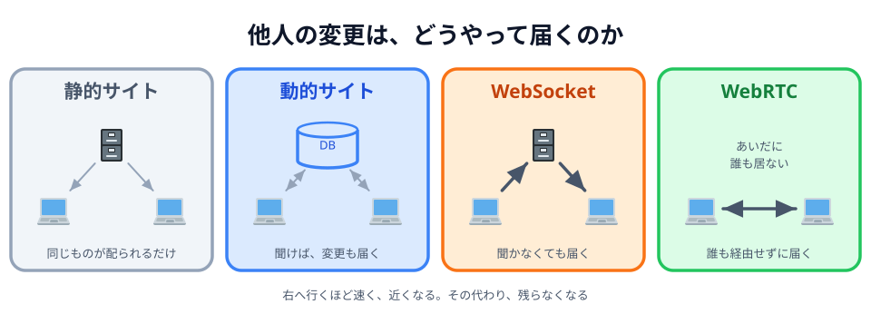
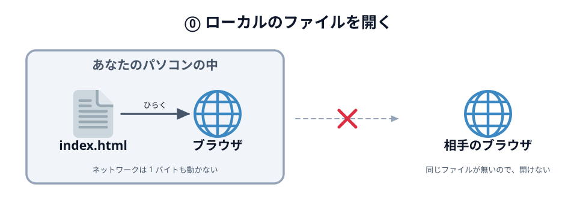
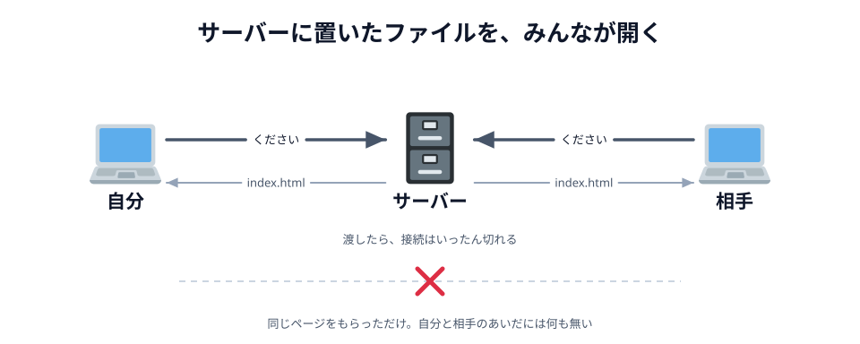
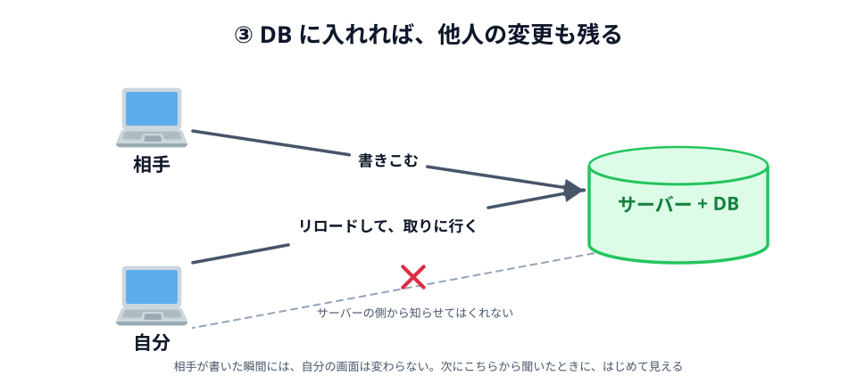
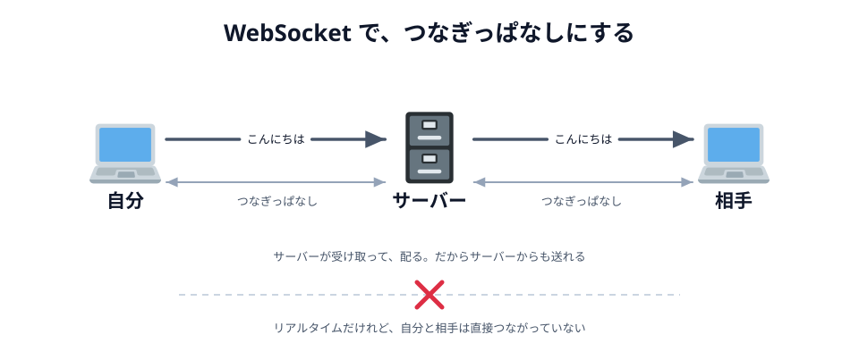
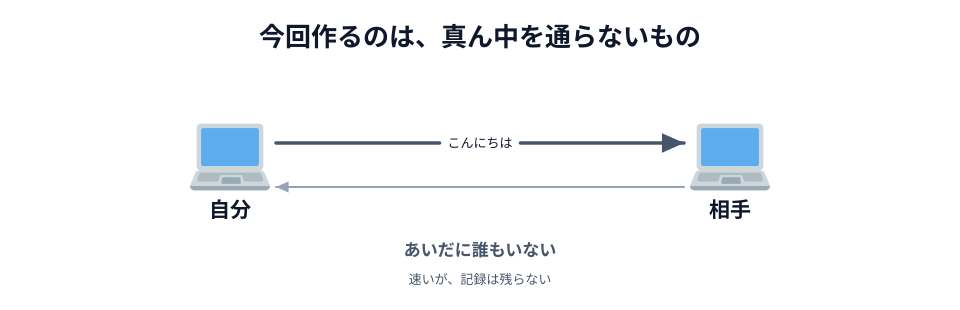

# 01 他人の変更は、どうやって届くのか

前の章で、2 台の端末がつながりました。自分が押したボタンで、相手の丸が光っています。

この章では、**いま動いているものを分解して見ます**。コードは書きません。
手元の `app/` を開いたまま、3 つの節を読んでください。

1. Web で「他人の変更が届く」やり方を **4 つ並べて**、自分が使ったのがどれかを確かめる（この節）
2. **WebRTC が何を解決している技術なのか**を見る
3. `つながりました` と出るまでに、**実際に何が起きていたのか**を見る

「自分が押したことが、**相手の画面にその場で出る**」——ずいぶん当たり前のことに聞こえますが、
Web でこれをやるのはいちばん難しい部類に入ります。
いちばん届かないところから順に、4 段階で上げていきます。

## その前に — ダブルクリックで開いていたとき

[03 章 01 節](../../03-connect/01-light/LECTURE.md) で `index.html` をダブルクリックしたとき、
アドレスは `file:///Users/you/app/index.html` でした。これは「**このパソコンの、このファイル**」を
指す書き方で、通信は起きていません。Wi-Fi を切っても動きますが、**そもそも他人がいません**。

_図: ひらいているだけ。ネットワークは動いていない。_

::preview[押しても、パソコンの中で終わる]{demo="01-local" height="250"}

## 静的サイト

[Netlify](../../01-introduction/03-netlify/LECTURE.md) に置いたファイルを、`https://` で開く形です。
ブラウザが「ください」と言い、サーバーがファイルを返して、**接続は切れます**。
他の人も同じページを開けるようになりますが、**開いた人どうしはまだ何の関係もありません**。

_図: 同じページをもらっただけ。自分と相手はまだ他人同士。_

::preview[サーバーから 1 往復もらって、それで終わり]{demo="02-http" height="270"}

## 動的サイト

サーバーにデータベースを付けて、**書いた内容をためておける**ようにした形です。掲示板や社内の申請システムがこれです。
他人の変更も見えるようになりますが、**見えるのは自分が聞きにいったときだけ**です。
通信を始めるのは、いつもブラウザの側だからです。

_図: 保存はされている。それでも自分の画面は、こちらから聞くまで変わらない。_

::preview[保存はされる。それでも自分から聞くまで届かない]{demo="03-database" height="330"}

## WebSocket

最初に 1 回だけ挨拶して、**そのあと接続を閉じない**形です。アドレスは `wss://` で始まります。
**サーバーの側から送り出せる**ので、聞かなくても届きます。ただし通り道はサーバーで、
相手の言葉はいったんサーバーに預けられてから配られます。チャットや共同編集の大半はこれです。

_図: 速いけれど、通り道はサーバー。_

::preview[つないだまま、サーバー経由で届ける]{demo="04-websocket" height="240"}

## WebRTC

**真ん中のサーバーを外して**、ブラウザ同士を直接つなぐ形（P2P）です。03 章で PeerJS を使って書いたのがこれです。
データは**誰も経由せずに**相手へ届きます。ただし、**つなぎ始めるときだけ**はサーバーを使います。

_図: 自分の言葉が相手に直接届く。あいだに誰もいない。_

::preview[最初だけサーバー、そのあとは直接届く]{demo="05-p2p" height="270"}

## 4 つを並べる

|                  | 静的サイト | 動的サイト | WebSocket    | WebRTC         |
| ---------------- | ---------- | ---------- | ------------ | -------------- |
| アドレス         | `https://` | `https://` | `wss://`     | 無い           |
| 話す相手         | サーバー   | サーバー   | サーバー     | 相手のブラウザ |
| 通信するとき     | 開いたとき | 聞いたとき | ずっと       | ずっと         |
| 聞かなくても届く | 届かない   | 届かない   | 届く         | 届く           |
| 相手に届く道     | —          | サーバー   | サーバー経由 | 直接           |
| 記録を残せる     | —          | 残せる     | 残せる       | 残らない       |
| 人数が増えたとき | 平気       | 平気       | 平気         | つらい         |

WebRTC にアドレスが無いのは、相手を URL ではなく「ピア ID」で呼ぶからです。

**右へ行くほど偉いわけではありません。**
記録を残したいなら動的サイト、ただ読ませたいだけなら静的サイトで十分です。
今回は「その場にいる 2 人が、いま同時に描く」ものだったので、
[02 章 02 節](../../02-design/02-plan/LECTURE.md) で WebRTC を選びました。

:::notice
[05 章の最後](../../05-drawing/08-deploy/LECTURE.md) では、**自分が描いたものを覚えておいて、
あとから入ってきた相手に送り直す**ようにします。「記録が残らない」を、
自分のブラウザの中だけで小さく埋め合わせる工夫です。
:::

:::questions

- `file://` で開いたページは、Wi-Fi を切っても表示できる [o]
- 静的サイトに公開すれば、開いた人どうしが自動的につながる [x]
- DB を置けば、相手が書いた瞬間に自分の画面も変わる [x]
- WebSocket では、サーバーの側から送り出すことができる [o]
- WebSocket でつないだ 2 つのブラウザは、直接つながっている [x]
- WebRTC で送ったデータは、サーバーに保存されない [o]

:::

4 つのうち、WebRTC だけが仕組みからして違います。
**その WebRTC とは、そもそも何をするための技術なのか。**
次の節で、中身を見ます。

:::faq

### 静的サイトと動的サイトの違いは、サーバーでプログラムが動くかどうかですか

ほぼそのとおりです。静的サイトは、置いてあるファイルを**そのまま**返します。
動的サイトは、聞かれるたびにサーバーのプログラムが中身を組み立てて返します。
だから同じ URL でも、見る人や時間によって内容が変わります。
今回 Netlify Drop に置いたものは、前者です。

### 動的サイトでも、数秒ごとに聞きに行けばリアルタイムになりませんか

なります。**ポーリング**と呼ばれて、実際に使われている手です。
ただ、間隔を短くするほど問い合わせの回数が増え、**そのほとんどが「変化なし」の空振り**になります。
逆に長くすると、そのあいだの変化は遅れて届きます。
お絵かきのように 1 秒に何十回も届いてほしいものには向きません。

### WebSocket と WebRTC、実務ではどちらをよく使いますか

**WebSocket のほうが圧倒的に多いです。**
サーバーを通るので記録を残せますし、人数が増えても配り役は 1 か所で済みます。
会社や学校のネットワークでもだいたい通ります。
WebRTC が選ばれるのは、通話や画面共有のように**遅れが致命的で、量が多い**ものです。

### 3 人以上を WebRTC でつなぐと、どうなりますか

全員が全員と線を張ります。3 人で 3 本、4 人で 6 本、10 人で 45 本。
送る回数も、自分以外の人数ぶんに増えます。これが表の「人数が増えたときつらい」です。
実際の会議サービスでは **SFU** と呼ばれる中継役のサーバーを置いて、
各自は 1 本だけ張る形にしています。P2P をやめて、真ん中を戻しているわけです。

### 表にある 4 つ以外のやり方もありますか

あります。よく出てくるのが **Server-Sent Events**（SSE）で、
サーバーからブラウザへ**一方向だけ**流しっぱなしにする仕組みです。
通知や進捗の表示に向いていて、WebSocket より簡単に始められます。
こちらから送る必要があるものには使えません。
MDN に日本語の解説があります。

- サーバー送信イベント（入口）: https://developer.mozilla.org/ja/docs/Web/API/Server-sent_events
- サーバー送信イベントの使用（書き方とサンプル）: https://developer.mozilla.org/ja/docs/Web/API/Server-sent_events/Using_server-sent_events
- `EventSource`（ブラウザ側の受け口）: https://developer.mozilla.org/ja/docs/Web/API/EventSource

### WebRTC にアドレスが無いなら、相手はどうやって決まるのですか

**ピア ID** です。`new Peer('ねこ')` で名簿に名前を登録し、
`peer.connect('いぬ')` でその名前を呼びます。名簿を持っているのがシグナリングサーバーで、
URL のかわりに名前で引いている、と考えると近いです。
その名前の相手にどこへ送れば届くのかは、[この章の 03 節](../03-signaling/LECTURE.md) の
ICE candidate が決めます。

:::
