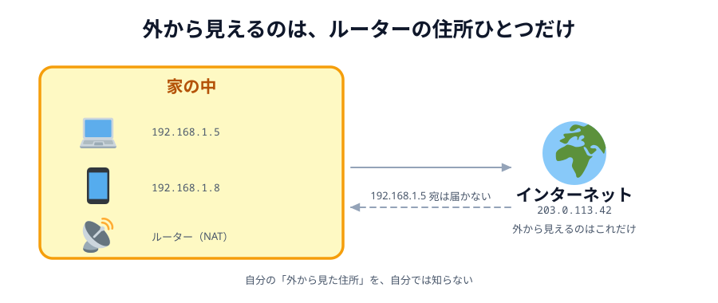

# 01 ブラウザからサーバー、サーバーからブラウザへ

前の章の最後で、2 台の端末をつなぎました。すんなりつながった人もいれば、
`あいてを待っています…` のまま止まった人もいるはずです。

この章では、あの 1 行の裏で何が起きているのかを見ます。
まずは「そもそもブラウザは、どうやって相手に届いているのか」からです。

## URL は人間用の名前で、届け先は番号

`https://example.com/` をブラウザに入れると、いきなりそこへ届くわけではありません。
その名前がどの**番号**を指すのかを、先に調べます。

_図: URL は人間用の名前。実際の届け先は IP アドレスとポート番号。_

- **IP アドレス** … インターネット上の住所。`93.184.216.34` のような番号です
- **ポート番号** … その住所の中の「何番窓口か」。`https` なら 443 番
- **DNS** … 名前と番号の対応表。「`example.com` は？」と聞くと番号を返してくれます

つまりブラウザがやっているのは、`example.com` → `93.184.216.34` と引き直してから、
その **`93.184.216.34` の 443 番窓口**へ届ける、という手順です。

ここで大事なのは、**サーバーには住所がある**ということです。
住所が決まっていて、窓口を開けて待っている。だから世界中の誰からでも呼べます。

## 家の中の番号と、外から見える番号

では、あなたのパソコンの住所は何番でしょうか。

家の Wi-Fi につないだ PC のアドレスは、たいてい `192.168.1.5` のような番号です。
これは **プライベート IP アドレス**といって、**家の中でだけ通じる番号**です。
となりの家にも `192.168.1.5` がいます。同じ番号があちこちに存在します。

家の中のネットワークを **LAN**、その外に広がるインターネットを **WAN** と呼びます。
LAN の中では `192.168.1.5` で通じますが、WAN に出た瞬間に意味を失います。

外から見えているのは、契約しているプロバイダが割り当てた住所**1 つだけ**。
その 1 つを、家の中の全部の機器で分け合っています。

## その分け合いをしているのが NAT

_図: 外から「192.168.1.5 に届けて」と言われても、どの家の話か分からない。_

家の中から外へ出ていく通信を、ルーターが自分の住所に**書き換えて**送り出し、
返ってきたものを元の機器へ**書き戻す**。この仕組みを **NAT** と呼びます。

NAT があるおかげで、家じゅうの機器が 1 つのグローバル IP を共有できています。
ただし、これには向きがあります。

- **中から外へ**: 出ていける。返事も、ルーターが覚えているので戻ってこられる
- **外から中へ**: **届かない**。ルーターは「誰宛か」を知らないので捨てるしかない

## だから、ブラウザには外から呼びかけられない

ここまでをまとめると、サーバーとブラウザは対称ではありません。

|                        | サーバー           | ブラウザ                 |
| ---------------------- | ------------------ | ------------------------ |
| 住所                   | 固定で、外から見える | NAT の内側。外からは見えない |
| 窓口                   | 開けて待っている   | 開けていない             |
| できること             | 呼ばれる           | 呼ぶ                     |

いつもの Web が「必ずサーバーを真ん中に置く」のは、これが理由です。
**呼べるのはサーバーだけ**だから、2 人が同じサーバーに集まるしかなかったわけです。

P2P はここを外そうとしています。つまり、

> 住所を持たない者どうしが、直接呼び合う

ということをやろうとしている。当然、簡単ではありません。

さらに厄介なことに、**自分の「外から見た住所」は自分でも知りません**。
ルーターが書き換えているので、PC 自身が知っているのは `192.168.1.5` だけです。
相手に教えようにも、教えるべき番号を持っていないのです。

## にわとりとたまご

直接つなぐには、お互いの住所を交換する必要があります。
でも、住所を交換するための通り道が、まだありません。

> **相手とまだつながっていないのに、相手に何かを届けなければいけない**

これが P2P の一番の難所です。次の節のテーマになります。

:::questions

- `192.168.1.5` のような番号は、インターネット全体で 1 つしかない [x]
- サーバーが誰からでも呼ばれるのは、住所が固定で外から見えているから [o]
- NAT の内側にある PC へ、外から直接届けることができる [x]
- 自分の PC は、外から見た自分の住所を知っている [x]

:::

## 次の節へ

[02 つながるまでに、何をしているか](../02-signaling/LECTURE.md)
