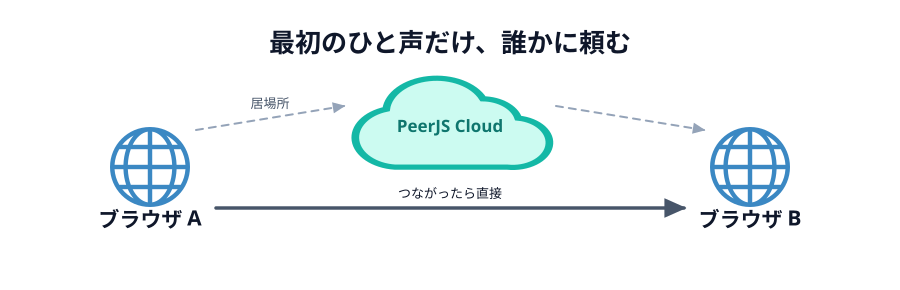
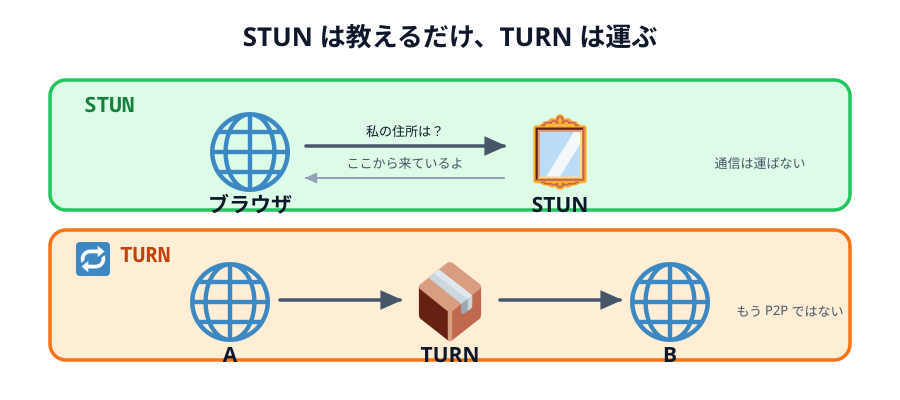

# 02 つながるまでに、何をしているか

前の節の最後に出た難所をもう一度書きます。

> **相手とまだつながっていないのに、相手に何かを届けなければいけない**

直接つなぐには、お互いの「居場所」と「話し方の取り決め」を交換する必要があります。
でもそれを渡す手段が、まだ無いのです。にわとりとたまごです。

## 待ち合わせにたとえる

はじめて会う人と待ち合わせるところを想像してください。
会ってしまえば直接話せますが、**会うまで**は無理です。
だから電話やメッセージアプリで「渋谷のハチ公前に 14 時」と決めます。

このときの電話が **シグナリングサーバー** です。
会ったあとの会話は電話を通しません。同じように、
ブラウザ同士がつながったあとは、そのサーバーを通りません。

_図: 破線がシグナリング（つながるまで）、太い実線がデータチャネル（つながったあと）。_

## 交換しているもの

シグナリングで渡し合うのは、ざっくり 2 種類です。

- **SDP**（`offer` / `answer`）… 「私はこういう形式でやりとりできます」という自己紹介
- **ICE candidate** … 「私にはこの住所で届きます」という**居場所の候補**

前の節で見たとおり、自分の住所は 1 つに決まりません。
だから 1 つに絞らず、**思いつく候補を全部出し合って、片っ端から試します**。
候補は 3 種類あります。

| 種類    | 何の住所か                     | 通じる相手                   |
| ------- | ------------------------------ | ---------------------------- |
| `host`  | LAN の中の番号（`192.168.…`）  | 同じ Wi-Fi にいる相手だけ    |
| `srflx` | 外から見た自分（NAT の外側）   | だいたいの相手               |
| `relay` | 中継サーバーの住所             | ほぼ誰とでも。ただし直接ではない |

どれを使うかを決めているのは人間ではありません。
**候補を出し合って、片っ端から試して、通ったものを使う**という手続きが決めています。

## STUN と TURN — 候補を用意する係

`host` は自分で分かります。残りの 2 つには、外の助けが要ります。

_図: 名前は似ているが、やることはまったく違う。_

**STUN サーバー**がやることは 1 つだけです。

> 「私の住所を教えて」と聞きに行くと、「あなたはここから来ているよ」と返してくれる

鏡のようなものです。返ってきた住所が `srflx` 候補になります。
STUN は**通信を運びません**。教えるだけです。

**TURN サーバー**は、そのものずばり**中継**します。
A が TURN に送り、TURN が B に渡す。これが `relay` 候補です。

TURN を通ったときは、もはや直接つながっていません。
速さの利点も、サーバー代がかからない利点も失われます。
それでも「つながらない」よりはマシ、という位置づけです。

:::notice
NAT にはいくつか種類があり、意地悪なもの（**Symmetric NAT** と呼ばれます）だと、
STUN で分かった住所に相手が送っても届きません。
会社のネットワークや、一部の公衆 Wi-Fi がこれにあたります。
TURN はそのための最後の手段です。
:::

PeerJS は既定で Google の STUN サーバー（`stun.l.google.com:19302`）を使うので、
自分では何も書かなくても `srflx` までは手に入ります。
TURN のほうは事情があるので、[次の節](../03-my-route/LECTURE.md)で確かめます。

## PeerJS Cloud がシグナリングの役をやっている

[01 章](../../01-introduction/03-peerjs-cloud/LECTURE.md) で名前をもらったサーバーが、
まさにこのシグナリングサーバーです。

- `new Peer('あいことば')` … 「私は『あいことば』です」と名簿に載せてもらう
- `peer.connect('あいことば')` … 名簿を引いて、その相手と居場所を交換してもらう
- つながったら、**もう用済み**

PeerJS を使うかぎり、SDP も candidate も自分で扱うことはありません。
`new Peer(...)` と `peer.connect(...)` の裏で、全部やってくれます。

## つながるまでに、これだけの手続きを踏んでいる

`peer.connect('あいことば')` は 1 行です。
でもその裏では、**つながる前に**手続きが順番に進んでいます。

> 名乗る → 相談する → 住所を教え合う → 試す → 鍵を決める → 送る

下の図は、その順番を 1 ステップずつ止めて見るものです。
**シークバーを動かせば、途中のどこでも見られます**。
図の下には、そのとき実際に流れているデータが出ます。

::preview[タブで 2 人の位置関係を切り替え、シークバーで途中を見る]{demo="connect-steps" height="930"}

タブは **2 人の位置関係**です。
同じ Wi-Fi にいるのか、別々の家にいるのか、直接は届かないネットワークにいるのか。

| タブ | 2 人の位置関係   | 手続きの数  | 最後に通る道             |
| ---- | ---------------- | ----------- | ------------------------ |
| ①    | 同じ Wi-Fi       | 21 ステップ | 直接（`host` で通った）  |
| ②    | 別々の家         | 26 ステップ | 直接（`srflx` で通った） |
| ③    | 直接つながらない | 30 ステップ | TURN が中継（`relay`）   |

やりたいことは 3 つとも同じ「相手に線を送る」だけです。
それでも、**位置関係が変わると手順の数も、最後に通る道も変わります**。

見てほしいのは 3 つです。

1. **つながる前の手続きが、これだけある**。`conn.on('open')` が呼ばれるのは、いちばん最後
2. **その全部が、いったんサーバーを通っている**。直接の道がまだ無いので、それしかない
3. **道が決まると、サーバーは用済み**（図の上のサーバーが薄くなります）

## 「あいことば」は世界共有の名簿に載る

ここで大事な注意です。PeerJS Cloud の名簿は**世界中で 1 つ**です。
`test` と名乗ろうとすると、すでに世界の誰かが使っていて弾かれます。

弾かれると `unavailable-id` というエラーになります。
このハンズオンでは、`webrtc-handson-` という長い前置きを付けてぶつかりにくくし、
それでもぶつかったときは日本語のメッセージを出すようにしています。

:::warning
あいことばは**秘密ではありません**。同じあいことばを知っている人は、
同じ「へや」に入れてしまいます。当日は、他の人とかぶらない文字列にしてください。
:::

:::questions

- シグナリングサーバーは、つながったあともデータを中継しつづける [x]
- `peer.connect()` を呼ぶと、PeerJS が SDP と ICE candidate の交換をやってくれる [o]
- STUN サーバーは、通信を中継してデータを届けてくれる [x]
- TURN サーバーを経由した通信は、もう P2P とは呼べない [o]
- PeerJS Cloud の名簿は、自分のチームの中だけで共有されている [x]
- `conn.on('open')` は、住所を教え合うより前に呼ばれる [x]

:::

## 次の節へ

ここまでは「一般にはこうなる」という話でした。
次は、**いま自分がいる回線で実際に何が起きたか**を見ます。

[03 自分の回線では、どうつながったのか](../03-my-route/LECTURE.md)
