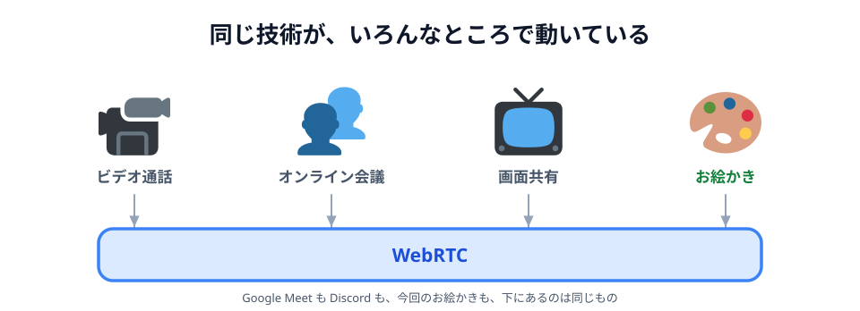
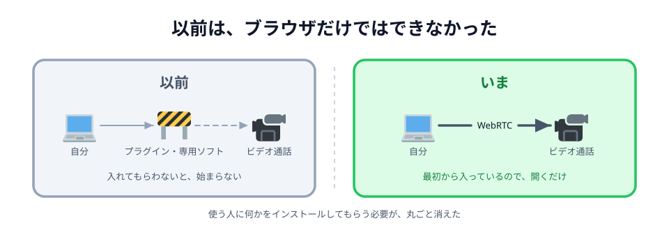
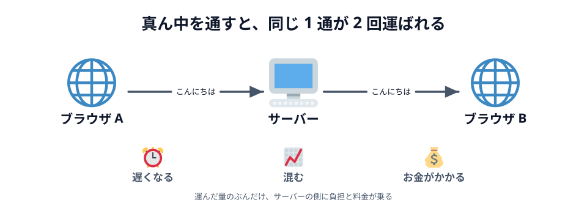
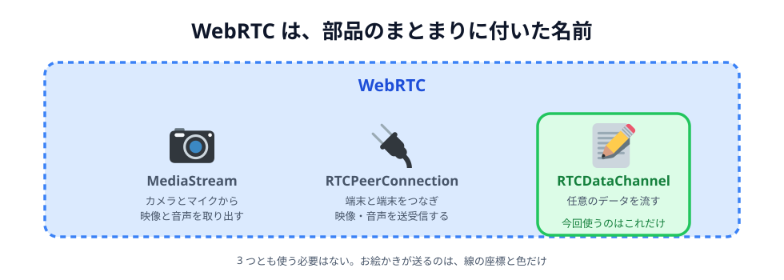
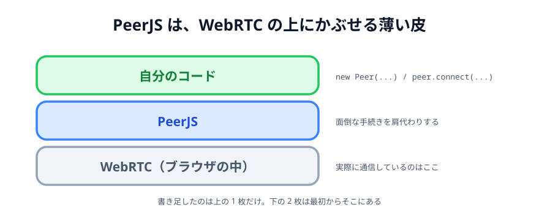
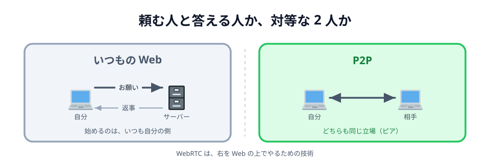
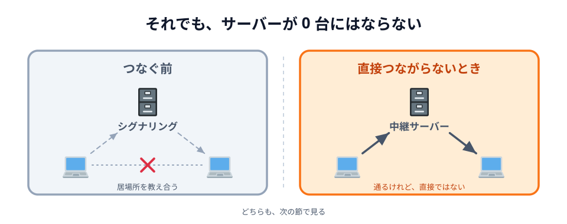

# 02 WebRTC は、何をするための技術か


前の節で 4 つを並べて、自分が使ったのは 4 つ目の **WebRTC** だと確かめました。
この節では、その WebRTC そのものを見ます。コードは書きません。

1. どこで使われているのか
2. 何を解決した技術なのか
3. 中身は何でできているのか
4. よく一緒に出てくる **P2P** とは、どういう関係なのか

## 気づいていないだけで、もう毎日使っている



_図: 見た目はバラバラでも、下で動いているものは同じ。_

ビデオ通話、オンライン会議、ブラウザからの画面共有。
インターネット越しに、**その場で**やりとりするものを私たちは毎日使っています。
**Google Meet** や **Discord** がその代表で、どちらも WebRTC で動いています。

WebRTC を使うと、ブラウザから映像や音声を送受信したり、
離れた相手とデータをやりとりしたりできます。

今回作るお絵かきアプリも、その一例です。
2 台の端末をつないで、片方で描いた線をもう片方にも出す。
運んでいるのが映像ではなく**線の座標**だというだけで、やっていることは同じです。

## 以前は、ブラウザだけではできなかった



_図: 「まずこれを入れてください」というお願いが、丸ごと消えた。_

いまでこそ「会議の URL を開けば通話が始まる」のが当たり前ですが、
少し前まで、ブラウザでビデオ通話をするには **Flash などのプラグイン**や、
**専用ソフト**を入れてもらう必要がありました。

「まずこれをインストールしてください」の一言が、どれだけの人を止めるか。
WebRTC がやったのは、**その機能をブラウザの側に最初から持たせる**ことです。
いまは主要なブラウザすべてに入っていて、使う人に追加で入れてもらうものはありません。

:::notice
WebRTC は W3C と IETF で標準化されていて、特定の会社の持ち物ではありません。
03 章で書いたコードが PC でもスマートフォンでも同じように動いたのは、
「ブラウザに最初から入っている、共通の機能」を使っていたからです。
:::

## サーバーを用意するコスト



_図: 遅くなる・混む・お金がかかる。3 つともサーバーの側で起きる。_

もう 1 つの課題は、**通り道**です。

ブラウザ同士でデータをやりとりするときは、あいだにサーバーを置くのが一般的でした。
前の節の WebSocket がまさにこれです。A の「こんにちは」はいったんサーバーに預けられ、
そこから B へ配られます。**同じ 1 通が 2 回運ばれている**わけです。

真ん中を通ると、こうなります。

- **遅くなる。** 遠くのサーバーを往復するぶん、相手に届くまでに時間がかかります
- **混む。** 人数が増えたぶんだけ、全員の通信をサーバーが受け止めることになります
- **お金がかかる。** 運んだ量に応じて、通信料もサーバー代も増えます

WebRTC は、**端末同士を直接つなぐ**ことでここを外しにいきます。
お絵かきのように「指の動きがそのまま相手に出てほしい」ものだと、この差がそのまま体感になります。

## WebRTC は、1 つの機能の名前ではない



_図: 3 つとも使う必要はない。お絵かきが使うのは右の 1 つだけ。_

ここはつまずきやすいところです。
**WebRTC は、1 本のプロトコルの名前でも、1 つのライブラリの名前でもありません。**
ブラウザなどでリアルタイム通信を実現するための、技術と仕様の**まとまりに付いた名前**です。

代表的なものを 3 つ挙げると、こうなります。

| 名前                  | 何をするもの                               |
| --------------------- | ------------------------------------------ |
| **MediaStream**       | カメラとマイクから、映像と音声を取り出す   |
| **RTCPeerConnection** | 端末と端末をつなぎ、映像・音声を送受信する |
| **RTCDataChannel**    | つないだ道に、**任意のデータ**を流す       |

ビデオ通話はこの 3 つを組み合わせて作ります。
ファイル共有や共同編集なら、映像は要らないので下の 2 つだけで足ります。
今回のお絵かきが使うのは、**RTCDataChannel だけ**です。単に**データチャネル**とも呼びます。
カメラもマイクも触りません。送っているのは、線の座標と色です。

## PeerJS



_図: 自分で書くのは、いちばん上だけ。_

とはいえ、この 3 つを素の WebRTC のまま扱うと、書くことがかなり増えます。
[02 章 02 節](../../02-design/02-plan/LECTURE.md) で「自前で用意すると 3 時間が終わる」と言ったのは、
この部分でした。

そこで使ったのが **PeerJS** です。WebRTC の上にかぶせる薄い皮のようなライブラリで、
つなぐまでの面倒な手続きをまとめて引き受けてくれます。
[03 章 04 節](../../03-connect/04-peer/LECTURE.md) と
[05 節](../../03-connect/05-send/LECTURE.md) で書いたこの 2 行の下には、全部それが入っています。

```js
const peer = new Peer('あいことば'); // 名乗る
const conn = peer.connect('あいことば'); // つなぐ
```

## P2P



_図: サーバーが「配る人」ではなくなり、お互いが相手になる。_

**P2P（ピア・ツー・ピア）** は、端末同士がサーバーを介さずに直接やりとりする仕組みのことです。
WebRTC は、それを**ブラウザの上で**実現するための技術のひとつ、という関係になります。

いつもの Web アプリでは、ブラウザがサーバーにリクエストを送り、サーバーがレスポンスを返します。
役割がはっきり分かれていて、**始めるのはいつもブラウザの側**でした。
P2P には、その区別がありません。どちらも対等な相手——**ピア**です。
あなたが書いた `conn.send()` は、サーバーにではなく、相手のブラウザに届きます。

## それでも、サーバーが 0 台にはならない



_図: 直接つながるのは、つながったあとの話。_

ただし、**サーバーがまったく要らない**わけではありません。例外が 2 つあります。

- **相手を見つけるまで。** 接続相手がどこにいるのか、どうやってつなぐのか。
  それを交換するには、つながる前に相手へ何かを届ける必要があります。
  [02 章 02 節](../../02-design/02-plan/LECTURE.md) で名前だけ出した**シグナリング**がこれです
- **どうしても直接つながらないとき。** ネットワークの環境によっては直接届かず、
  あいだで**中継してくれるサーバー**を通ることがあります

1 つ目が、P2P のいちばんの難所です。

> **相手とまだつながっていないのに、相手に何かを届けなければいけない**

今回これを肩代わりしてくれているのが、PeerJS の「あいことば」の仕組みです。
[03 章 04 節](../../03-connect/04-peer/LECTURE.md) で `あいてを待っています…` と出ていたあいだ、
裏ではまさにこのやりとりが進んでいました。

次の節では、その待ち時間に何が起きていたのかを見ます。

:::questions

- WebRTC は、Google Meet や Discord のような通話サービスでも使われている [o]
- WebRTC を使うには、利用者にプラグインを入れてもらう必要がある [x]
- WebRTC は、1 つの JavaScript ライブラリの名前である [x]
- 今回のお絵かきでは、カメラとマイクを扱う MediaStream も使っている [x]
- PeerJS は、WebRTC を使いやすくするためのライブラリである [o]
- P2P でつながったあとも、データはいったんサーバーを経由して届く [x]
- 相手を見つけるところまで、WebRTC がやってくれる [x]

:::
