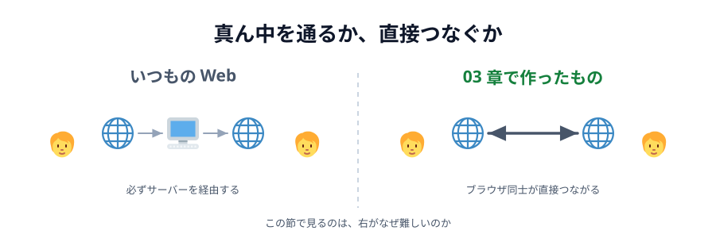
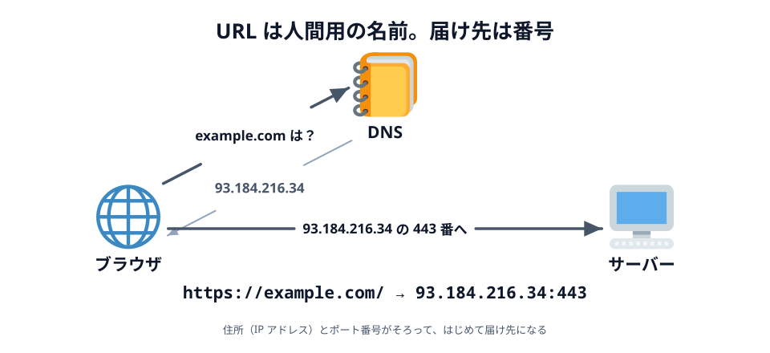
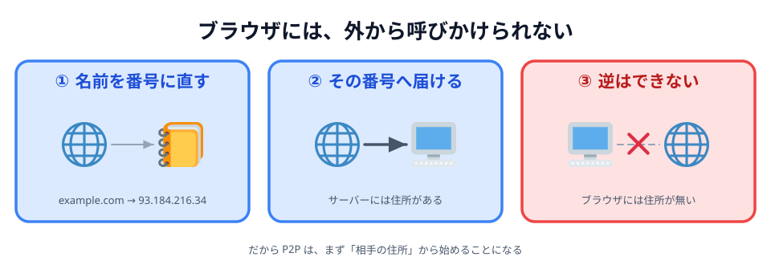

# 02 WebRTC は、何をするための技術か

前の節で 4 つを並べました。いちばん右の **WebRTC** だけ、他の 3 つと仕組みが違います。
この節では、**なぜそれが難しいのか**と、**WebRTC がその何を引き受けてくれるのか**を見ます。

## いつもの Web が、必ず真ん中を通る理由

ブラウザで何かをするとき、相手はいつもサーバーでした。
チャットアプリで「こんにちは」と送ると、こう流れます。

_図: 話しているのは人。ただし言葉は、いったんサーバーに預けられてから相手に配られる。_

真ん中を通ることには、ちゃんと理由があります。

- **相手の居場所を知らなくていい。** サーバーの住所さえ知っていれば話せます
- **記録が残せる。** あとから来た人に過去のログを見せられます
- **人数が増えても同じ。** 100 人いても、各自がサーバーと 1 本つなぐだけです

なかでも大きいのは 1 つ目です。**相手の住所を知らなくていい**——
ここが、直接つなごうとした瞬間に効いてきます。

## 届け先は、URL ではなく番号

`https://example.com/` をブラウザに入れると、いきなりそこへ届くわけではありません。
その名前がどの**番号**を指すのかを、先に調べます。

_図: URL は人間用の名前。実際の届け先は IP アドレスとポート番号。_

- **IP アドレス** … インターネット上の住所。`93.184.216.34` のような番号です
- **ポート番号** … その住所の中の「何番窓口か」。`https` なら 443 番
- **DNS** … 名前と番号の対応表。「`example.com` は？」と聞くと番号を返してくれます

ここで大事なのは、**サーバーには住所がある**ということです。
住所が決まっていて、窓口を開けて待っている。だから世界中の誰からでも呼べます。

## 家の中の番号と、外から見える番号

では、あなたのパソコンの住所は何番でしょうか。

家の Wi-Fi につないだ PC のアドレスは、たいてい `192.168.1.5` のような番号です。
これは **プライベート IP アドレス**といって、**家の中でだけ通じる番号**です。
となりの家にも `192.168.1.5` がいます。同じ番号があちこちに存在します。

家の中のネットワークを **LAN**、その外に広がるインターネットを **WAN** と呼びます。
LAN の中では `192.168.1.5` で通じますが、WAN に出た瞬間に意味を失います。

外から見えているのは、契約しているプロバイダが割り当てた住所**1 つだけ**。
その 1 つを、家の中の全部の機器で分け合っています。

## その分け合いをしているのが NAT

_図: 外から「192.168.1.5 に届けて」と言われても、どの家の話か分からない。_

家の中から外へ出ていく通信を、ルーターが自分の住所に**書き換えて**送り出し、
返ってきたものを元の機器へ**書き戻す**。この仕組みを **NAT** と呼びます。

NAT があるおかげで、家じゅうの機器が 1 つのグローバル IP を共有できています。
ただし、これには向きがあります。

- **中から外へ**: 出ていける。返事も、ルーターが覚えているので戻ってこられる
- **外から中へ**: **届かない**。ルーターは「誰宛か」を知らないので捨てるしかない

:::notice
ルーターが何をどう書き換えて、どうやって帰りの便を元の機器に戻しているのかは、
[06 章 03 節](../../06-extra/03-nat/LECTURE.md) でくわしく見ます。
ここでは「中から外へは出ていける、外から中へは届かない」だけ押さえておけば足ります。
:::

## サーバーとブラウザは、対称ではない

_図: 呼べるのはサーバーだけ。ブラウザは呼ばれる側になれない。_

|            | サーバー             | ブラウザ                     |
| ---------- | -------------------- | ---------------------------- |
| 住所       | 固定で、外から見える | NAT の内側。外からは見えない |
| 窓口       | 開けて待っている     | 開けていない                 |
| できること | 呼ばれる             | 呼ぶ                         |

いつもの Web が「必ずサーバーを真ん中に置く」のは、これが理由です。
**呼べるのはサーバーだけ**だから、2 人が同じサーバーに集まるしかなかったわけです。

さらに厄介なことに、**自分の「外から見た住所」は自分でも知りません**。
ルーターが書き換えているので、PC 自身が知っているのは `192.168.1.5` だけです。
相手に教えようにも、教えるべき番号を持っていないのです。

## WebRTC が引き受けているのは、この 3 つ

WebRTC は、ここを力ずくで越えるための技術です。やっていることは大きく 3 つあります。

- **通る道を探して、選ぶ。** 自分の住所の候補をかき集め、相手の候補と片っ端から突き合わせて、
  通ったものを使います。これが一番大きな仕事です
- **必ず暗号化する。** WebRTC には「暗号化しない」という選択肢がありません。
  真ん中に誰もいないぶん、経路の安全は自分たちで担保します
- **運ぶものを載せる。** 映像・音声・任意のデータの 3 種類を運べます。
  今回のお絵かきが使ったのは 3 つ目（**データチャネル**）だけです

もともとはビデオ通話のための技術です。Google Meet も Discord の通話も、土台はこれです。
「文字や座標を送るだけ」に使うのは、その一番軽い使い方にあたります。

そして **PeerJS** は、この WebRTC に薄い皮をかぶせたライブラリです。
あなたが書いた `new Peer(...)` と `peer.connect(...)` の下には、全部これが入っています。

:::notice
WebRTC を素で書くと、`RTCPeerConnection` を作り、`createOffer()` して、
`setLocalDescription()` して……と数十行かかります。
[02 章 02 節](../../02-design/02-research/LECTURE.md) で「難しそうだ」と言ったのはこの部分で、
PeerJS はそこをまとめて引き受けてくれています。
:::

## その代わりに、あきらめたもの

直接つないだことで得たものは、前の節の裏返しです。

- **速い。** 遠くのサーバーを往復しないぶん、反応が返ってきます。
  「線が指についてくる」感じが要るものに向いています
- **サーバー代がかからない。** データが通らないので、通信量の料金が発生しません
- **中身がサーバーに残らない。** 描いた絵はどこにも保存されません

失ったものも、同じだけあります。

- **相手の居場所を知る必要がある。** ここが一番の難所です
- **記録が残らない。** ブラウザを閉じたら消えます
- **人数が増えるとつらい。** 3 人なら 3 本、5 人なら 10 本と、線の数が急に増えます

## にわとりとたまご

WebRTC が引き受けてくれるのは「道を探して、つなぐ」ところまでです。
**相手を見つけて、最初のひと声を届ける**ところは、仕様にすら入っていません。

直接つなぐには、お互いの住所を交換する必要があります。
でも、住所を交換するための通り道が、まだありません。

> **相手とまだつながっていないのに、相手に何かを届けなければいけない**

これが P2P の一番の難所です。次の節のテーマになります。

:::questions

- `192.168.1.5` のような番号は、インターネット全体で 1 つしかない [x]
- サーバーが誰からでも呼ばれるのは、住所が固定で外から見えているから [o]
- NAT の内側にある PC へ、外から直接届けることができる [x]
- 自分の PC は、外から見た自分の住所を知っている [x]
- WebRTC は、暗号化するかどうかを選べる [x]
- WebRTC には、相手を見つける手順まで含まれている [x]

:::
