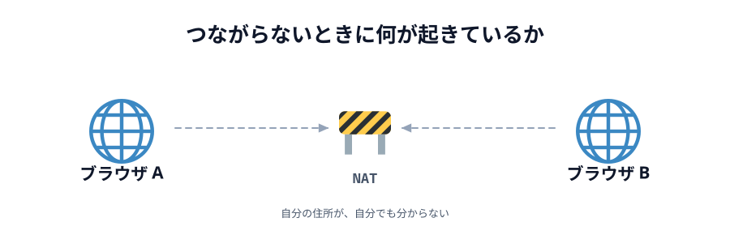

# 03 自分の回線では、どうつながったのか



前の節の図は、実際のやりとりを台本にしたものでした。
この節では**本物**を動かします。いま自分がいる回線で、何がどの順で起き、
どの道が使えるのかを、その場で調べます。

## 本物のブラウザで走らせてみる

下のボタンは本物です。このページの中で 2 つの `Peer` を作ってつなぎ、
何がいつ起きたかを並べます。**通り道**の列に注目してください。

::preview[押すと、つながるまでの順番が表示されます]{demo="01-handshake" height="380"}

オレンジ（サーバー経由）が先に並び、途中から緑（直接）に切り替わるはずです。
切り替わったあとは、PeerJS Cloud を落としても通信は続きます。

前の節で見た「名乗る → 相談する → 住所を教え合う → 試す → 鍵を決める → 送る」が、
そのままの順で流れているのが分かると思います。

## この回線で使える経路を調べる

次は候補のほうです。いま自分がいるネットワークで、
[前の節](../02-signaling/LECTURE.md)の 3 種類の候補がどこまで集まるかを見ます。

::preview[押すと、この回線で集められる経路の候補を調べます]{demo="02-which-route" height="330"}

- `host` … 自分の LAN の中の住所。必ず見つかります
- `srflx` … STUN が教えてくれた「外から見た自分」。**これが見つかれば、たいていつながります**
- `relay` … TURN 経由の経路

## `relay` はおそらく「見つからない」と出ます

そして、ここが**この節でいちばん大事なところ**です。

PeerJS 1.5.5 のソースには、既定の TURN サーバーとして
`turn:eu-0.turn.peerjs.com` と `turn:us-0.turn.peerjs.com` が書かれています。
一見「TURN も用意されている」ように見えます。

ところが、**このホスト名はもう存在しません**。名前解決の時点で失敗します。

```sh
$ dig +short eu-0.turn.peerjs.com
（何も返ってこない）
```

つまり PeerJS の既定では、**実質 STUN しか効いていません**。
`relay` が「見つからない」と出るのはこのためです。

:::danger[ライブラリの既定値は、書いてあっても生きているとは限らない]
設定に書いてあることと、実際に動くことは別です。
「TURN も設定されているから大丈夫」と思い込んでいると、
当日つながらない原因にたどり着けません。
:::

無料で登録不要の TURN サーバーは、2026 年現在ほぼ見当たりません
（かつて広く使われていた Open Relay Project の固定の認証情報も、いまは弾かれます）。
中継は帯域をそのまま消費するので、無料で開放し続けるのが難しいのです。

## どの道でつながったのかを見る

ここまでは、どちらも**自分ひとりぶん**の話でした。
候補は集まった。では、**実際に使われたのはどれ**なのか。

つながったあとの `conn` からは、中の `RTCPeerConnection` を触れます。
そこに `getStats()` と聞くと、**採用された 1 組**を教えてくれます。

```js
const stats = await conn.peerConnection.getStats();
// 採用された組（candidate-pair）と、その両端の候補を引く
```

下のデモがそれをやります。**2 つの画面が要ります。**
同じあいことばを入れて、片方が「へやをつくる」、もう片方が「へやにはいる」を押してください。

::preview[2 つの画面で開いて、同じあいことばでつないでください]{demo="03-how-we-connected" height="640"}

## 3 とおりで試して、見くらべる

同じデモを、**2 人の位置関係を変えて 3 回**やってみてください。

| 試し方                     | どうやるか                                             | 出るはずのもの            |
| -------------------------- | ------------------------------------------------------ | ------------------------- |
| ① 1 台の中で 2 つ          | 同じ端末で、タブかウィンドウを 2 つ開く                | `host` ↔ `host`           |
| ② 同じ Wi-Fi の 2 台       | PC とスマホを同じ Wi-Fi につないで開く                 | `host` ↔ `host`           |
| ③ 別々のネットワークの 2 台 | スマホの Wi-Fi を切って、モバイル回線で開く            | `srflx` ↔ `srflx`         |

③ のとき、**テザリングは使わないでください**。テザリングでつなぐと 2 台が同じ
ネットワークに入ってしまい、② と同じことになります。
スマホ側だけを Wi-Fi から外すのが、いちばん簡単です。

見てほしいのは、この 3 つです。

1. **どれも同じように「つながりました」と出る。** アプリを書いている側から見ると、
   ①②③ の区別はつきません。`conn.send()` の書き方も 1 文字も変わりません
2. **それでも、通った道は違う。** ①② はルーターの外に出ていません。
   ③ ははじめて NAT を越えています。`host` と `srflx` の差がそれです
3. **往復時間が違う。** ① は数ミリ秒、② も数ミリ秒〜十数ミリ秒、
   ③ は回線しだいで数十ミリ秒になります。同じ「直接」でも距離が違う

そして、いちばん大事なのはここです。

> **どれを使うかを、あなたは 1 度も選んでいない。**

`host` を試して、駄目なら `srflx` を試して、通ったものを使う。
その手続きが、あなたの代わりに毎回選び直しています。
だから、Wi-Fi を切り替えても、家から会社へ移動しても、同じコードのまま動きます。

:::notice
① で「住所」の欄が「ブラウザが伏せています」と出るのは、正常です。
Chrome は LAN の中の住所を `….local` という名前に置き換えて、
実物の番号を Web ページに渡さないようにしています（**mDNS** という仕組みです）。
③ の `srflx` は外向けの住所なので、こちらは伏せられません。
:::

## 当日つながらなかったら

現実的な対処はこの順です。

1. **両方が同じあいことばか確認する**（いちばん多い原因です）
2. **片方が「へやをつくる」、もう片方が「へやにはいる」を押しているか確認する**
3. **スマホのテザリングに切り替える**。モバイル回線は通ることが多いです
4. 会社・学校のネットワークなら、まず通らないと思って別回線を用意しておく

上のデモで `srflx` が「見つからない」と出るなら、その回線では望みが薄いです。
`srflx` が出ているのにつながらないなら、あいことばの取り違えを疑ってください。

## コラム: 本番で使うなら

サービスとして公開するなら、TURN は自分で用意します。選択肢は 2 つです。

- **自分で立てる** … [coturn](https://github.com/coturn/coturn) が定番です。VPS 1 台で動きます
- **買う** … Cloudflare Calls、Twilio、Metered などが TURN を提供しています。
  通信量に応じた課金です

どちらにしても、`iceServers` に自分の TURN を渡すだけでコードは変わりません。

```js
const peer = new Peer(roomId(word), {
  config: {
    iceServers: [
      { urls: 'stun:stun.l.google.com:19302' },
      { urls: 'turn:あなたのTURN:3478', username: '...', credential: '...' },
    ],
  },
});
```

実際に手を動かして試すところは [06 章 06 節](../../06-extra/06-turn/LECTURE.md)にあります。

## ここから先、ネットワークを勉強するなら

この節でやったのは、**自分の回線で起きていることを、自分の目で確かめる**ことでした。
おもしろいと思った人へ、近い順に道しるべを置いておきます。

- **IP と NAT の続き** … プライベート／グローバル、ポート、NAT の種類（`full cone` と
  `symmetric` で何が変わるのか）。まずは自分の端末で `ifconfig`（Windows なら `ipconfig`）と
  `traceroute` を叩いて、この節の図と見くらべるところから
- **UDP と TCP の違い** … このデモの「プロトコル」の欄は `UDP` でした。
  ではなぜ、順番が入れ替わらず、取りこぼしもしないのか。答えはその上に乗っている
  **SCTP** です。「速い代わりに何も保証しない土台の上に、必要な保証だけ自分で足す」
  という考え方は、ネットワーク全体で何度も出てきます
- **`chrome://webrtc-internals`** … Chrome に最初から入っています。
  この節で `getStats()` から取り出したものが、全部グラフで見えます。まず開いてみてください
- **仕様書そのもの** … ICE は [RFC 8445](https://datatracker.ietf.org/doc/html/rfc8445)、
  STUN は [RFC 8489](https://datatracker.ietf.org/doc/html/rfc8489)、
  TURN は [RFC 8656](https://datatracker.ietf.org/doc/html/rfc8656)。
  候補の優先度の決め方まで、この節で見たことが全部書いてあります
- **Wireshark** … 実際に線を流れているパケットを見る道具です。
  「玉が通る」を比喩ではなく本物で見られます
- **IPv6** … 住所が足りているので、NAT が要らない世界。
  この節で苦労した話の大半が、そもそも起きません

「つながらない」を自分で切り分けられるようになると、Web の見え方が変わります。
このハンズオンで踏んだのは、その入口のひとつです。

:::questions

- STUN サーバーは、通信を中継してデータを届けてくれる [x]
- TURN サーバーを経由した通信は、もう P2P とは呼べない [o]
- PeerJS の既定設定には TURN サーバーが書かれているが、実際には機能していない [o]
- `srflx` の候補が見つかれば、たいていの相手とはつながる [o]
- 同じ Wi-Fi にいる 2 台は、ルーターの外に出ずに直接つながる [o]
- どの経路を使うかは、アプリを書く人がコードで選んでいる [x]
- シグナリングサーバーが落ちても、すでにつながっている通信は続く [o]

:::

## 次の章へ

仕組みの話はここまでです。次の章から、このつながりを使って
実際に絵を描けるところまで持っていきます。

[05 章 01 キャンバスを置く](../../05-drawing/01-canvas/LECTURE.md)
