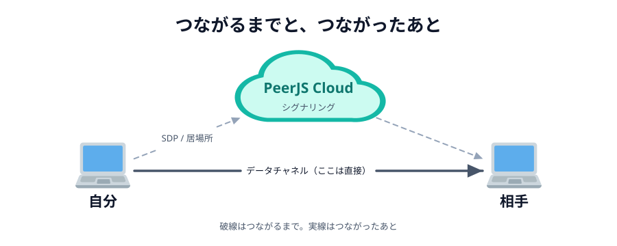

# 03 つながるまでに、何が起きているか


前の節の最後に出た難所をもう一度書きます。

> **相手とまだつながっていないのに、相手に何かを届けなければいけない**

この節では、その解き方を見て、最後に**いま自分がいる回線で実際に何が起きるのか**を測ります。

## 待ち合わせにたとえる

はじめて会う人と待ち合わせるところを想像してください。
会ってしまえば直接話せますが、**会うまで**は無理です。
だから電話やメッセージアプリで「渋谷のハチ公前に 14 時」と決めます。

このときの電話が **シグナリングサーバー** です。
会ったあとの会話は電話を通しません。同じように、
ブラウザ同士がつながったあとは、そのサーバーを通りません。



_図: 破線がシグナリング（つながるまで）、太い実線がデータチャネル（つながったあと）。_

## 交換しているもの

シグナリングで渡し合うのは、ざっくり 2 種類です。

- **SDP**（`offer` / `answer`）… 「私はこういう形式でやりとりできます」という自己紹介
- **ICE candidate** … 「私にはこの住所で届きます」という**居場所の候補**

やっかいなのは、**自分の住所が 1 つに決まらない**ことです。
家の中で名乗っている番号と、外から見えている番号は別のものですし、
どちらが相手に通じるかは、試してみるまで分かりません。
だから 1 つに絞らず、**思いつく候補を全部出し合って、片っ端から試します**。

## 経路の候補は、3 種類ある

| 種類    | 何の住所か                    | 用意する係 | 通じる相手                       |
| ------- | ----------------------------- | ---------- | -------------------------------- |
| `host`  | LAN の中の番号（`192.168.…`） | 自分       | 同じ Wi-Fi にいる相手だけ        |
| `srflx` | 外から見た自分（NAT の外側）  | STUN       | だいたいの相手                   |
| `relay` | 中継サーバーの住所            | TURN       | ほぼ誰とでも。ただし直接ではない |

どれを使うかを決めているのは人間ではありません。
**候補を出し合って、片っ端から試して、通ったものを使う**という手続きが決めています。

## STUN と TURN — 候補を用意する係

`host` は自分で分かります。残りの 2 つには、外の助けが要ります。


_図: 名前は似ているが、やることはまったく違う。_

**STUN サーバー**がやることは 1 つだけです。

> 「私の住所を教えて」と聞きに行くと、「あなたはここから来ているよ」と返してくれる

鏡のようなものです。返ってきた住所が `srflx` 候補になります。
STUN は**通信を運びません**。教えるだけです。

**TURN サーバー**は、そのものずばり**中継**します。
A が TURN に送り、TURN が B に渡す。これが `relay` 候補です。
TURN を通ったときは、もはや直接つながっていません。
速さの利点も、サーバー代がかからない利点も失われます。
それでも「つながらない」よりはマシ、という位置づけです。

:::notice
NAT にはいくつか種類があり、意地悪なもの（**Symmetric NAT** と呼ばれます）だと、
STUN で分かった住所に相手が送っても届きません。
会社のネットワークや、一部の公衆 Wi-Fi がこれにあたります。
TURN はそのための最後の手段です。
:::

## PeerJS Cloud が、シグナリングの役をやっている

[03 章 04 節](../../03-connect/04-peer/LECTURE.md) で名前をもらったサーバーが、
まさにこのシグナリングサーバーです。
あなたの `main.js` にある 2 行が、そのまま名簿への操作でした。

- `new Peer(roomId(...))`（へやをつくる側）… 「私は『あいことば』です」と名簿に載せてもらう
- `peer.connect(roomId(...))`（へやにはいる側）… 名簿を引いて、その相手と居場所を交換してもらう
- つながったら、**もう用済み**

PeerJS を使うかぎり、SDP も candidate も自分で扱うことはありません。
STUN も既定で Google のもの（`stun.l.google.com:19302`）が設定されているので、
`srflx` までは何も書かなくても手に入ります。

名簿は**世界中で 1 つ**です。`test` と名乗ろうとすると、すでに世界の誰かが使っていて
`unavailable-id` で弾かれます。03 章 06 節で書いた `roomId()` が `webrtc-handson-` という
長い前置きを付けていたのは、ぶつかりにくくするためでした。
同じ節の `showError()` は、それでもぶつかったときに日本語で知らせるためのものです。

:::warning
あいことばは**秘密ではありません**。同じあいことばを知っている人は、
同じ「へや」に入れてしまいます。当日は、他の人とかぶらない文字列にしてください。
:::

## 手続きを 1 ステップずつ見る

`peer.connect('あいことば')` は 1 行です。
でもその裏では、**つながる前に**手続きが順番に進んでいます。

> 名乗る → 相談する → 住所を教え合う → 試す → 鍵を決める → 送る

下の図は、その順番を 1 ステップずつ止めて見るものです。
**シークバーを動かせば、途中のどこでも見られます**。
図の下には、そのとき実際に流れているデータが出ます。

::preview[タブで 2 人の位置関係を切り替え、シークバーで途中を見る]{demo="01-connect-steps" height="930"}

タブは **2 人の位置関係**です。やりたいことは 3 つとも同じ「相手に線を送る」だけなのに、
**位置関係が変わると手順の数も、最後に通る道も変わります**。

| タブ | 2 人の位置関係   | 手続きの数  | 最後に通る道             |
| ---- | ---------------- | ----------- | ------------------------ |
| ①    | 同じ Wi-Fi       | 21 ステップ | 直接（`host` で通った）  |
| ②    | 別々の家         | 26 ステップ | 直接（`srflx` で通った） |
| ③    | 直接つながらない | 30 ステップ | TURN が中継（`relay`）   |

見てほしいのは 3 つです。

1. **つながる前の手続きが、これだけある**。`conn.on('open')` が呼ばれるのは、いちばん最後
2. **その全部が、いったんサーバーを通っている**。直接の道がまだ無いので、それしかない
3. **道が決まると、サーバーは用済み**（図の上のサーバーが薄くなります）

## 自分の回線では、どこまで候補が集まるか

ここまでは「一般にはこうなる」という話でした。ここからは**本物**です。
いま自分がいるネットワークで、3 種類の候補がどこまで集まるかを見ます。

::preview[押すと、この回線で集められる経路の候補を調べます]{demo="02-which-route" height="330"}

`host` は必ず見つかります。`srflx` が見つかれば、**たいていの相手とはつながります**。

問題は `relay` で、おそらく「見つからない」と出ます。
そして、ここが**この節でいちばん大事なところ**です。

PeerJS 1.5.5 のソースには、既定の TURN サーバーとして
`turn:eu-0.turn.peerjs.com` と `turn:us-0.turn.peerjs.com` が書かれています。
一見「TURN も用意されている」ように見えます。
ところが、**このホスト名はもう存在しません**。名前解決の時点で失敗します。

```sh
$ dig +short eu-0.turn.peerjs.com
（何も返ってこない）
```

つまり PeerJS の既定では、**実質 STUN しか効いていません**。

:::danger[ライブラリの既定値は、書いてあっても生きているとは限らない]
設定に書いてあることと、実際に動くことは別です。
「TURN も設定されているから大丈夫」と思い込んでいると、
当日つながらない原因にたどり着けません。
:::

無料で登録不要の TURN サーバーは、2026 年現在ほぼ見当たりません。
中継は帯域をそのまま消費するので、無料で開放し続けるのが難しいのです。
本気で使うなら、買う（Cloudflare Calls・Twilio など）か、自分で立てる（coturn）ことになります。

## 実際に使われたのは、どの 1 組か

候補は集まった。では、**実際に使われたのはどれ**なのか。

03 章で書いた `conn`（`ready()` の中で使っている、あの `conn` です）からは、
中の `RTCPeerConnection` を触れます。
そこに `getStats()` と聞くと、**採用された 1 組**を教えてくれます。

```js
const stats = await conn.peerConnection.getStats();
// 採用された組（candidate-pair）と、その両端の候補を引く
```

下のデモがそれをやります。**2 つの画面が要ります。**
同じあいことばを入れて、片方が「へやをつくる」、もう片方が「へやにはいる」を押してください。

::preview[2 つの画面で開いて、同じあいことばでつないでください]{demo="03-how-we-connected" height="640"}

同じデモを、**2 人の位置関係を変えて 3 回**やってみてください。

| 試し方                      | どうやるか                                  | 出るはずのもの    |
| --------------------------- | ------------------------------------------- | ----------------- |
| ① 1 台の中で 2 つ           | 同じ端末で、タブかウィンドウを 2 つ開く     | `host` ↔ `host`   |
| ② 同じ Wi-Fi の 2 台        | PC とスマホを同じ Wi-Fi につないで開く      | `host` ↔ `host`   |
| ③ 別々のネットワークの 2 台 | スマホの Wi-Fi を切って、モバイル回線で開く | `srflx` ↔ `srflx` |

③ のとき、**テザリングは使わないでください**。テザリングでつなぐと 2 台が同じ
ネットワークに入ってしまい、② と同じことになります。

見てほしいのは、この 3 つです。

1. **どれも同じように「つながりました」と出る。** アプリを書いている側から見ると、
   ①②③ の区別はつきません。`conn.send()` の書き方も 1 文字も変わりません
2. **それでも、通った道は違う。** ①② はルーターの外に出ていません。
   ③ ははじめて NAT を越えています。`host` と `srflx` の差がそれです
3. **往復時間が違う。** ① は数ミリ秒、③ は回線しだいで数十ミリ秒。同じ「直接」でも距離が違う

そして、いちばん大事なのはここです。

> **どれを使うかを、あなたは 1 度も選んでいない。**

`host` を試して、駄目なら `srflx` を試して、通ったものを使う。
その手続きが、あなたの代わりに毎回選び直しています。
だから、Wi-Fi を切り替えても、家から会社へ移動しても、同じコードのまま動きます。

:::notice
① で「住所」の欄が「ブラウザが伏せています」と出るのは、正常です。
Chrome は LAN の中の住所を `….local` という名前に置き換えて、
実物の番号を Web ページに渡さないようにしています（**mDNS** という仕組みです）。
③ の `srflx` は外向けの住所なので、こちらは伏せられません。
:::

## 当日つながらなかったら

現実的な対処はこの順です。

1. **両方が同じあいことばか確認する**（いちばん多い原因です）
2. **片方が「へやをつくる」、もう片方が「へやにはいる」を押しているか確認する**
3. **スマホのテザリングに切り替える**。モバイル回線は通ることが多いです
4. 会社・学校のネットワークなら、まず通らないと思って別回線を用意しておく

上のデモで `srflx` が「見つからない」と出るなら、その回線では望みが薄いです。
`srflx` が出ているのにつながらないなら、あいことばの取り違えを疑ってください。

## もっと知りたい人へ

この節でやったのは、**自分の回線で起きていることを、自分の目で確かめる**ことでした。
おもしろいと思った人へ、近い順に道しるべを置いておきます。

- **`chrome://webrtc-internals`** … Chrome に最初から入っています。
  `getStats()` から取り出したものが、全部グラフで見えます。まず開いてみてください
- **自分の端末を調べる** … `ifconfig`（Windows なら `ipconfig`）と `traceroute` を叩いて、
  [06 章 03 節](../../06-extra/03-nat/LECTURE.md) の NAT の図と見くらべるところから
- **仕様書そのもの** … ICE は [RFC 8445](https://datatracker.ietf.org/doc/html/rfc8445)、
  STUN は [RFC 8489](https://datatracker.ietf.org/doc/html/rfc8489)、
  TURN は [RFC 8656](https://datatracker.ietf.org/doc/html/rfc8656)。
  候補の優先度の決め方まで、この節で見たことが全部書いてあります

「つながらない」を自分で切り分けられるようになると、Web の見え方が変わります。

:::questions

- シグナリングサーバーは、つながったあともデータを中継しつづける [x]
- `peer.connect()` を呼ぶと、PeerJS が SDP と ICE candidate の交換をやってくれる [o]
- STUN サーバーは、通信を中継してデータを届けてくれる [x]
- TURN サーバーを経由した通信は、もう P2P とは呼べない [o]
- PeerJS Cloud の名簿は、自分のチームの中だけで共有されている [x]
- PeerJS の既定設定には TURN が書かれているが、実際には機能していない [o]
- 同じ Wi-Fi にいる 2 台は、ルーターの外に出ずに直接つながる [o]
- どの経路を使うかは、アプリを書く人がコードで選んでいる [x]

:::

仕組みの話はここまでです。
次の章から、このつながりを使って、実際に絵を描けるところまで持っていきます。
**つなぐコードは 1 行も変えません。** 送るものを「色」から「線」に変えるだけです。
