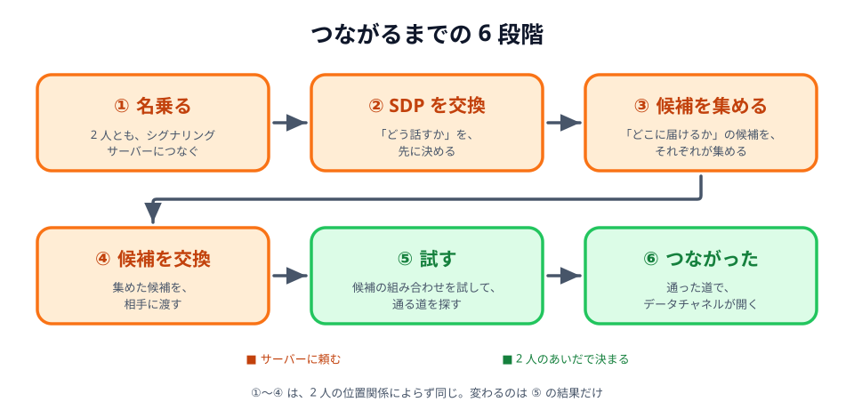
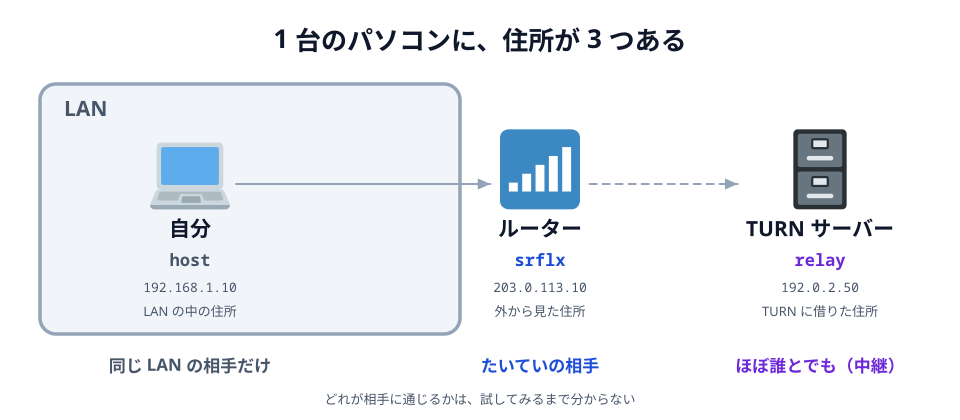
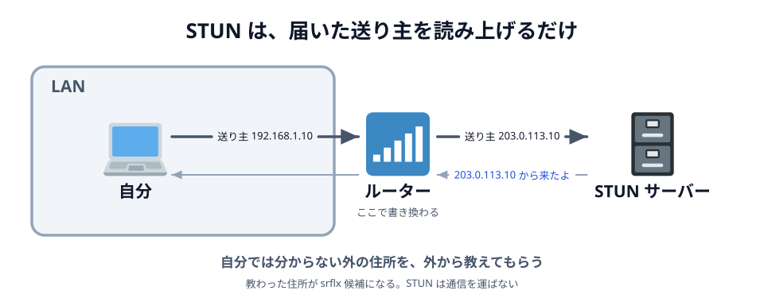

# 03 つながるまでに、何が起きているか


前の節の最後に出た難所をもう一度書きます。

> **相手とまだつながっていないのに、相手に何かを届けなければいけない**

これを引き受けているのが、[03 章 04 節](../../03-connect/04-peer/LECTURE.md) で名前をもらった
**PeerJS Cloud** です。つながる前のやりとりを仲立ちするので、**シグナリングサーバー**と呼びます。

この節では、`あいてを待っています…` のあいだに、そのサーバー越しに何が行き来していたのかを見ます。

1. つながるまでの手順を、**2 人の位置関係ごと**に 1 ステップずつ見る（デモ）
2. 渡し合っているもの その 1 — **SDP**
3. 渡し合っているもの その 2 — **ICE candidate**
4. ICE candidate を集めるのを手伝う — **STUN サーバー**

03 章 04 節の「生の WebRTC」に出てきた `offer`・`answer`・`icecandidate` の正体も、ここで分かります。
PeerJS が、代わりにやりとりしてくれていたものです。

## つながるまでの手順

`peer.connect(roomId(...))` は 1 行です。でもその裏では、6 つの段階が順番に進んでいます。



_図: ①〜④ はサーバーに頼む。2 人のあいだの道が決まるのは ⑤。_

この 6 段階が、**2 人の位置関係**でどう変わるのかを、3 つの場合で見ます。
デモはどれも同じ 6 段階です。「次へ」で 1 ステップずつ進めてみてください。

## 同じ LAN にいるとき

2 人が同じ Wi-Fi につながっている場合です。
最初に試す `host`（LAN の中の住所）どうしの組み合わせがそのまま通り、
データは **LAN の中だけ**で直接届きます。インターネットには出ません。

::preview[「次へ」で 1 ステップずつ。「試す」で host どうしが通る]{demo="01-same-lan" height="460"}

## 別々の LAN にいるとき

自分は家、相手は外——というように、2 人が違う LAN にいる場合です。
`host` どうしは届きません。相手の LAN の中の住所は、こちらの LAN には無いからです。
次に試す `srflx`（外から見た住所）どうしが通り、**インターネット越しに直接**届きます。

::preview[「試す」で host が落ちて、srflx が通る]{demo="02-other-lan" height="460"}

## 直接つながらないとき

会社や学校の LAN のように、**外から入ってくるものを通さない**ネットワークに相手がいる場合です。
`host` も `srflx` も届かず、最後に残る `relay`——**TURN サーバー**に借りた住所——で通ります。

TURN サーバーは、直接つながらない 2 人のあいだでデータを**中継**するサーバーです。
つながりはしますが、送るたびに TURN を通るので、もう直接ではありません。
それでも `conn.on('open')` は前の 2 つと同じように呼ばれ、`conn.send()` の書き方も変わりません。

::preview[host も srflx も落ちて、relay だけが通る]{demo="03-turn" height="460"}

:::warning
PeerJS 1.5.5 には、既定の TURN サーバーとして `eu-0.turn.peerjs.com` と `us-0.turn.peerjs.com` が
書かれています。ところが、このホスト名はもう存在しません。
つまり今回のアプリではこの 3 つめにはならず、**「試す」が全部失敗して、つながらずに終わります**。
会社や学校のネットワークでつながらないときにスマホのテザリングへ切り替えるのは、そのためです。
:::

## 3 つを見比べる

|                  | 同じ LAN        | 別々の LAN               | 直接つながらない    |
| ---------------- | --------------- | ------------------------ | ------------------- |
| 通った組み合わせ | `host` ↔ `host` | `srflx` ↔ `srflx`        | `relay`             |
| 最後に通る道     | LAN の中で直接  | インターネット越しに直接 | TURN サーバーが中継 |

1. **「名乗る」から「候補を交換」までは、3 つとも同じ。** どれもシグナリングサーバーを通っている。
   直接の道がまだ無いので、それしかない
2. **違うのは「試す」の結果だけ。** どの組み合わせが通ったかで、最後に通る道が決まる
3. **つながったら、シグナリングサーバーは用済み**（図のサーバーが薄くなります）

## SDP

デモの「SDP を交換」で行き来していたのが **SDP**（Session Description Protocol）です。
「わたしはこういう形でやりとりできます」という**自己紹介**で、中身はただのテキストです。

- へやにはいる側（B）が `peer.connect()` を呼ぶと、**offer**（こう話したい）を書いて送る
- へやをつくる側（A）が、それに合わせた **answer**（それで話そう）を書いて返す

offer の中身は、たとえばこうなっています。

```text
v=0
o=- 4611731400430051336 2 IN IP4 127.0.0.1
s=-
t=0 0
a=group:BUNDLE 0
m=application 9 UDP/DTLS/SCTP webrtc-datachannel
c=IN IP4 0.0.0.0
a=ice-ufrag:Xk4P
a=ice-pwd:9t1wQ2mV0pLkBz7sR3yEa8Nc
a=fingerprint:sha-256 4A:9C:21:…:E1
a=setup:actpass
a=mid:0
a=sctp-port:5000
a=max-message-size:262144
```

全部を読む必要はありません。見てほしいのは 3 か所です。

| 行                                   | 言っていること                                                     |
| ------------------------------------ | ------------------------------------------------------------------ |
| `m=application … webrtc-datachannel` | データチャネルで話したい。映像や音声の行は無い                     |
| `a=ice-ufrag` / `a=ice-pwd`          | このあと「試す」ときに使う合言葉                                   |
| `a=fingerprint`                      | 暗号化に使う鍵の指紋。途中で誰かにすり替えられていないかを確かめる |

そして、**相手に届く住所は書いてありません**。`c=IN IP4 0.0.0.0` の `0.0.0.0` は
「まだ決まっていない」という意味です。住所は、次の ICE candidate で別に渡します。

## ICE candidate

デモの「候補を集める」「候補を交換」で行き来していたのが **ICE candidate**（候補）です。
「わたしにはこの住所で届くかもしれない」という、**居場所の候補**です。
候補が 1 つで済まないのは、**自分の住所が 1 つに決まらない**からです。



_図: 同じパソコンの住所が 3 つある。どれが通じるかは、相手しだい。_

どれが通じるかは、相手がどこにいるかで変わります。だから**選ばずに、集めた候補を全部相手に渡します**。
相手も同じように全部渡してきて、**組み合わせを片っ端から試し、通ったものを使います**。
この手続きの名前が **ICE**（Interactive Connectivity Establishment）です。
3 つのデモの「試す」で、`host` どうし → `srflx` どうし → `relay` の順に送っていたのがそれです。
どれを使うかを、あなたは 1 度も選んでいません。
だから Wi-Fi でもモバイル回線でも、同じコードのまま動きます。

候補の種類は 3 つです。

| 種類    | 何の住所か                    | どうやって分かるか    | 通じる相手               |
| ------- | ----------------------------- | --------------------- | ------------------------ |
| `host`  | LAN の中の住所（`192.168.…`） | 自分で分かる          | 同じ LAN にいる相手だけ  |
| `srflx` | ルーターの外から見た住所      | STUN サーバーに聞く   | たいていの相手           |
| `relay` | TURN サーバーに借りた住所     | TURN サーバーに借りる | ほぼ誰とでも。ただし中継 |

候補 1 つは、1 行のテキストです。3 種類が集まると、こう並びます。

```text
candidate:1 1 udp 2130706431 192.168.1.10 49500 typ host
candidate:2 1 udp 1686052607 203.0.113.10 50001 typ srflx
candidate:3 1 udp 41885439 192.0.2.50 60002 typ relay
```

1 行のうち、見てほしいのは 4 か所です（2 行目の `srflx` で見ます）。

| 書いてあるもの | 2 行目での値   | 言っていること                        |
| -------------- | -------------- | ------------------------------------- |
| 優先度         | `1686052607`   | 数字の大きい候補から先に試す          |
| 住所           | `203.0.113.10` | どこへ送れば届くか                    |
| 番号（ポート） | `50001`        | その住所の、どの窓口へ送るか          |
| 種類           | `typ srflx`    | 上の表の 3 つのうち、どれで得た住所か |

## STUN サーバー

`host` は自分で分かります。では `srflx`、**ルーターの外から見た自分の住所**は、どうやって知るのでしょうか。

実は、**自分では分かりません**。LAN から外へ出ていくとき、ルーターが送り主の欄を
自分の住所に書き換えるからです。この書き換えを **NAT** と呼びます
（しくみは [06 章 03 節](../../06-extra/03-nat/LECTURE.md) で扱います）。
パソコンは、自分が何に書き換えられたのかを知りません。

そこで、外にいる誰かに聞きます。それが **STUN サーバー**です。



_図: STUN は鏡のようなもの。届いた送り主を、そのまま教えてくれる。_

> 「わたしは、どこから来ていますか」と聞くと、「203.0.113.10 から来ていますよ」と返ってくる

返ってきた住所が、そのまま `srflx` 候補になります。
デモの「候補を集める」で、STUN サーバーまで往復していたのがこれです。

STUN サーバーがやるのは、**教えることだけ**です。データは運びません。
名前の似ている TURN サーバーは**運ぶ**係で、別物です。

PeerJS は、既定で Google の STUN サーバー（`stun.l.google.com:19302`）を使うようになっています。
TURN と違って、こちらは生きています。だから何も書かなくても、`srflx` までは手に入ります。

:::notice
STUN で分かった住所が、いつも使えるとは限りません。会社の LAN などでは、ルーターが
**話す相手ごとに外向けの番号を変える**ことがあります（Symmetric NAT と呼びます）。
STUN サーバーと話したときの番号は STUN サーバー専用なので、相手がそこへ送っても届きません。
3 つめのデモで `srflx` が届かなかったのは、これが理由です。
くわしくは [06 章 03 節](../../06-extra/03-nat/LECTURE.md) で見ます。
:::

:::questions

- シグナリングサーバーは、つながったあともデータを中継しつづける [x]
- 「名乗る」から「候補を交換」までは、2 人の位置関係によらず同じ手順を踏む [o]
- offer は、`peer.connect()` を呼んだ側（へやにはいる側）が書いて送る [o]
- SDP には、相手に届く住所が書いてある [x]
- `host` 候補は、別の LAN にいる相手にもそのまま通じる [x]
- `srflx` 候補は、STUN サーバーに聞いて分かる [o]
- STUN サーバーは、通信を中継してデータを届けてくれる [x]
- どの候補を使うかは、アプリを書く人がコードで選んでいる [x]
- PeerJS の既定設定には TURN が書かれているが、実際には機能していない [o]

:::

仕組みの話はここまでです。
次の章から、このつながりを使って、実際に絵を描けるところまで持っていきます。
**つなぐコードは 1 行も変えません。** 送るものを「色」から「線」に変えるだけです。
