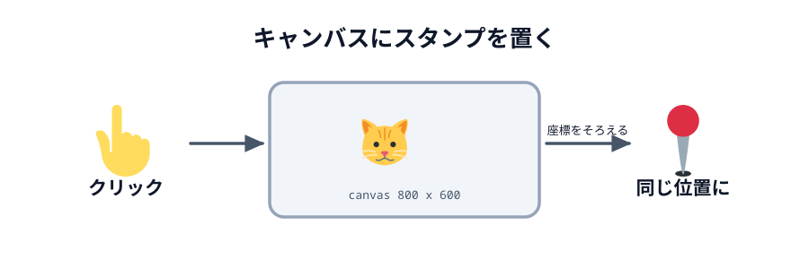
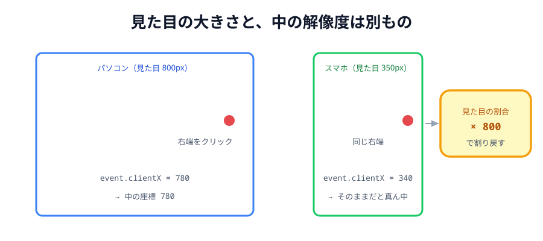

# 01 キャンバスにスタンプを置く



ここからお絵かきツールにしていきます。

うれしいお知らせがあります。**つなぐコードは 1 行も変えません**。
03 章で書いた「名乗る・呼び出す・送る・受け取る」は、そのまま使い回せます。
変わるのは「何を送るか」だけです。

この節では、丸を消してキャンバスに置き換え、**クリックした場所にスタンプを置く**ところまで作ります。
まだ相手には送りません。

> **今回さわる `app/`:** `index.html` の丸をキャンバスに置き換え、`style.css` を書き直し、
> `main.js` の「光る」部分をキャンバスの処理に置き換え

## 丸をキャンバスに置き換える

`index.html` の `<main>` と `<button id="light">` を消して、次に置き換えます。
`<header>` はそのまま残します。

:::code[`index.html` の `<body>` の中（`<header>` の下をまるごと置き換え）]{filepath=index.html offset=19}

```html
<div class="tools">
  <button class="stamp selected" data-stamp="🐱">🐱</button>
  <button class="stamp" data-stamp="🌸">🌸</button>
  <button class="stamp" data-stamp="⭐">⭐</button>
</div>

<div class="stage">
  <canvas id="canvas" width="800" height="600"></canvas>
</div>
```

:::

`<header>` の中の状態表示も、ボタンと同じ行に並ぶように `<span>` へ変えておきます。

:::code[`index.html` の `<header>` の中]{filepath=index.html offset=16 newOffset=16}

```diff
- <p id="status">まだつながっていません</p>
+ <span id="status">まだつながっていません</span>
```

:::

- `data-stamp="🐱"` … `data-` で始まる属性は、自由に付けられる**入れ物**です。
  JavaScript から `button.dataset.stamp` で取り出せます。
  ボタンごとに「このボタンはどのスタンプか」を持たせています
- `width="800" height="600"` … キャンバスの**中の解像度**です。CSS の大きさとは別物で、
  ここがズレの原因になります（後述）
- `<div class="stage">` … キャンバスを置く場所です。
  「ヘッダーと道具バーを引いた残りの高さ」をこの枠が受け持ち、キャンバスはその中に収まります

## style.css を書き直す

丸のスタイルは要らなくなったので、まるごと入れ替えます。

:::code[`app/style.css`（全文を置き換え）]{filepath=style.css offset=1}

```css
body {
  box-sizing: border-box;
  /* 画面（iframe やスマホ）の高さぴったりに収めて、ページごと縦スクロールしないようにする */
  height: 100dvh;
  display: flex;
  flex-direction: column;
  margin: 0;
  padding: 16px;
  font-family: sans-serif;
  background: #222;
  color: #fff;
}

header,
.tools {
  display: flex;
  flex-wrap: wrap;
  align-items: center;
  gap: 8px;
  margin-bottom: 12px;
}

input,
button {
  font-size: 16px;
  padding: 6px 10px;
}

/* いま選んでいる道具・色が分かるようにする */
.selected {
  outline: 3px solid #ffd60a;
}

/* キャンバスを置く場所。ヘッダーと道具バーの残りの高さを、ここが全部使う */
.stage {
  flex: 1;
  /* flex の中身は既定では縮まないので、縮んでよいことを伝える */
  min-height: 0;
}

canvas {
  display: block;
  background: #fff;
  border-radius: 8px;
  /* 実際の解像度は 800x600 のまま、あいている場所に収まる大きさで表示する。
     こうすると、どの端末でも同じ座標で絵を共有できて、画面もスクロールしない。 */
  max-width: 100%;
  max-height: 100%;
}
```

:::

- `body` の `height: 100dvh` と `display: flex` … 画面の高さぴったりの縦並びにします
  （`dvh` はスマホのアドレスバーを除いた実際の高さです）
- `.stage` の `flex: 1` … ヘッダーと道具バーを置いた**残りの高さを全部**もらいます。
  `min-height: 0` は「必要なら縮んでよい」という意味で、これが無いと縮まずにはみ出します
- キャンバスの `max-width` / `max-height` … 縦横の比（`800 x 600`）を保ったまま、
  `.stage` に収まる大きさまで縮んで表示されます。**画面がどんな大きさでもスクロールしません**

## main.js の部品を入れ替える

`myCircle` と `peerCircle` と `lightButton` は要らなくなりました。
代わりにキャンバスを取り出します。

:::code[`main.js` の先頭]{filepath=main.js offset=1 newOffset=1}

```diff
  // 画面の部品を取っておく
  const wordInput = document.querySelector('#word');
  const hostButton = document.querySelector('#host');
  const guestButton = document.querySelector('#guest');
  const statusText = document.querySelector('#status');
- const myCircle = document.querySelector('#my-circle');
- const peerCircle = document.querySelector('#peer-circle');
- const lightButton = document.querySelector('#light');
+ const canvas = document.querySelector('#canvas');
+ const ctx = canvas.getContext('2d');
```

:::

`canvas.getContext('2d')` で取れる `ctx` が、実際に絵を描く道具です。
「キャンバス」が板だとすると、`ctx` は筆にあたります。

いま選んでいるスタンプを覚えておく変数も足します。

:::code[`main.js`（`let conn = null;` の下）]{filepath=main.js offset=12}

```js
// いま選んでいるスタンプ
let stamp = '🐱';
```

:::

## 受け取る処理を、いったん消す

`ready()` の中の `conn.on('data', ...)` は、`peerCircle` を使っていました。
その丸はもう無いので、**いったん消します**。次の節で書き直します。

:::code[`main.js` の `ready` の中]{filepath=main.js offset=63 newOffset=65}

```diff
  function ready() {
    statusText.textContent = 'つながりました';

    conn.on('close', function () {
      statusText.textContent = 'せつだんされました';
    });
-
-   // 相手から届いた色を、「あいて」の丸に塗る。
-   conn.on('data', function (data) {
-     peerCircle.style.background = data.color;
-   });
  }
```

:::

`lightButton.addEventListener(...)` も、まるごと消してください。

## 描く道具を作る

`ready()` の下に、キャンバスまわりのコードを足していきます。

:::code[`main.js`（`ready` の下）]{filepath=main.js offset=73}

```js
function drawStamp(x, y, emoji) {
  ctx.font = '48px sans-serif';
  ctx.textAlign = 'center';
  ctx.textBaseline = 'middle';
  ctx.fillText(emoji, x, y);
}

function clearCanvas() {
  ctx.fillStyle = '#ffffff';
  ctx.fillRect(0, 0, canvas.width, canvas.height);
}
```

:::

- `ctx.fillText(絵文字, x, y)` … 絵文字は「文字」なので、文字を書く命令で置けます
- `textAlign` / `textBaseline` を `center` / `middle` にすると、**指定した座標が絵文字の中心**になります。
  既定のままだと左下が基準になり、クリックした場所からズレます
- `clearCanvas` は白で全面を塗りつぶします。キャンバスは最初は透明なので、
  最後にこれを 1 回呼んで白くしておきます

## 座標のズレを直す

ここがこの節でいちばん大事なところです。

キャンバスの中の解像度は `800 x 600` です。でも CSS で「空いている場所に収まるまで縮める」ようにしたので、
**画面上の見た目の大きさは端末によって違います**。スマホなら 350px くらいかもしれません。

クリックされた位置（`event.clientX`）は**画面上の px** で届きます。
これをそのまま使うと、350px 幅の画面で右端をクリックしても `x = 350` にしかならず、
キャンバスの真ん中あたりに描かれてしまいます。



_図: 見た目 350px のキャンバスの右端は、中の座標では 800。比率で割り戻す。_

:::code[`main.js`（`clearCanvas` の下）]{filepath=main.js offset=85}

```js
// canvas は 800x600 のまま、空いている場所に合わせて縮めて表示している。
// クリックされた位置は「画面上の px」なので、縮めた比率で割って
// 800x600 の中での座標に戻す。これをやらないと 2 台で線がズレる。
function positionOf(event) {
  const rect = canvas.getBoundingClientRect();

  return {
    x: ((event.clientX - rect.left) / rect.width) * canvas.width,
    y: ((event.clientY - rect.top) / rect.height) * canvas.height,
  };
}
```

:::

- `getBoundingClientRect()` … キャンバスが画面上のどこに、どの大きさで表示されているかを返します
- `event.clientX - rect.left` … 画面の左端からではなく、**キャンバスの左端から**何 px かに直します
- `/ rect.width * canvas.width` … 「見た目の何割の位置か」を出してから、`800` を掛けて中の座標にします

これをやっておくと、PC で描いた線がスマホでも同じ場所に出ます。
**送る座標を、端末に依存しない値にそろえている**わけです。

## クリックでスタンプを置く

:::code[`main.js`（`positionOf` の下）]{filepath=main.js offset=97}

```js
canvas.addEventListener('pointerdown', function (event) {
  const pos = positionOf(event);

  drawStamp(pos.x, pos.y, stamp);
});

document.querySelectorAll('.stamp').forEach(function (button) {
  button.addEventListener('click', function () {
    stamp = button.dataset.stamp;
    select(button, '.stamp');
  });
});

// 同じ仲間のボタンから選択の印を外して、押されたものだけに付ける
function select(button, group) {
  document.querySelectorAll(group).forEach(function (other) {
    other.classList.remove('selected');
  });
  button.classList.add('selected');
}

clearCanvas();
```

:::

`pointerdown` は、マウスのクリックでも指でのタップでも同じように呼ばれるイベントです。
`mousedown` と `touchstart` を別々に書かなくて済みます。

## 動かす

キャンバスをクリックすると、選んでいるスタンプが置かれます。
上のボタンでスタンプを切り替えられます。

まだ相手には届きません。次の節で送ります。

::preview[このステップの完成イメージ（実際に触って動かせます）]{height="560"}

::codeview{defaultFile="main.js"}
