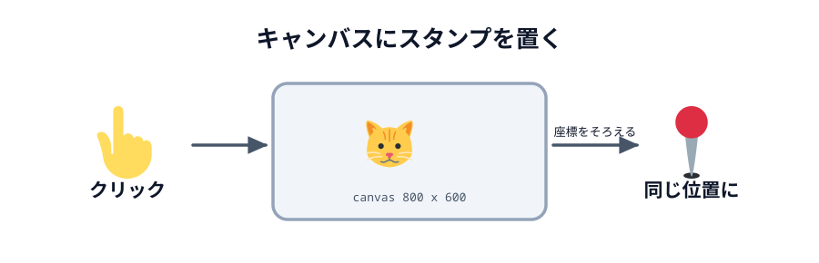
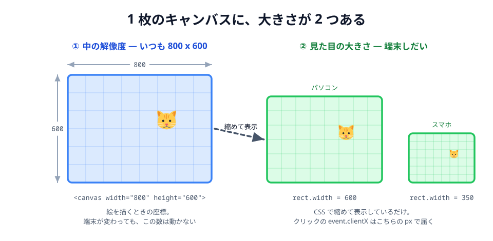
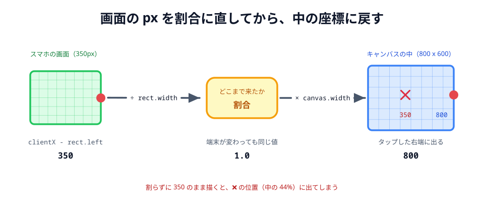

# 01 キャンバスにスタンプを置く



ここからお絵かきツールを作ります。

この節では、**クリックした場所にスタンプを置く**ところまで作ります。
通信はまだ出てきません。PeerJS も読み込みません。**1 人で遊べるものを先に完成させます**。

[02 章 02 節](../../02-design/02-plan/LECTURE.md) で決めたとおり、
章の中は**簡単なものから**です。スタンプは「1 回押したら 1 個置く」だけなので、
キャンバスの使い方を覚えるのにちょうどいい大きさです。

> **今回さわる `app/`:** `index.html`・`style.css`・`main.js` を新しく作る

## 新しく 3 つのファイルを作る

03 章のライトとは**別のアプリ**なので、ファイルは作り直します。

```text
app/
├── index.html   画面の骨組み
├── style.css    見た目
└── main.js      動き
```

3 つとも全文を書き直すので、03 章の `app/` にそのまま上書きしても構いません。
ライトのほうも残しておきたい人は、別のフォルダを作ってください。

## index.html — 画面の骨組み

:::code[`app/index.html`（全文）]{filepath=index.html offset=1}

```html
<!doctype html>
<html lang="ja">
  <head>
    <meta charset="utf-8" />
    <meta name="viewport" content="width=device-width, initial-scale=1" />
    <title>キャンバスとスタンプ</title>
    <link rel="stylesheet" href="style.css" />
    <script src="main.js" defer></script>
  </head>
  <body>
    <div class="tools">
      <button class="stamp selected" data-stamp="🐱">🐱</button>
      <button class="stamp" data-stamp="🌸">🌸</button>
      <button class="stamp" data-stamp="⭐">⭐</button>
    </div>

    <div class="stage">
      <canvas id="canvas" width="800" height="600"></canvas>
    </div>
  </body>
</html>
```

:::

- `data-stamp="🐱"` … `data-` で始まる属性は、自由に付けられる**入れ物**です。
  JavaScript から `button.dataset.stamp` で取り出せます。
  ボタンごとに「このボタンはどのスタンプか」を持たせています
- `width="800" height="600"` … キャンバスの**中の解像度**です。CSS の大きさとは別物で、
  ここがズレの原因になります（後述）
- `<div class="stage">` … キャンバスを置く場所です。
  「道具バーを引いた残りの高さ」をこの枠が受け持ち、キャンバスはその中に収まります

## style.css — 見た目

:::code[`app/style.css`（全文）]{filepath=style.css offset=1}

```css
body {
  box-sizing: border-box;
  /* 画面（iframe やスマホ）の高さぴったりに収めて、ページごと縦スクロールしないようにする */
  height: 100dvh;
  display: flex;
  flex-direction: column;
  margin: 0;
  padding: 16px;
  font-family: sans-serif;
  background: #222;
  color: #fff;
}

.tools {
  display: flex;
  flex-wrap: wrap;
  align-items: center;
  gap: 8px;
  margin-bottom: 12px;
}

button {
  font-size: 16px;
  padding: 6px 10px;
}

/* いま選んでいる道具・色が分かるようにする */
.selected {
  outline: 3px solid #ffd60a;
}

/* キャンバスを置く場所。上のバーを引いた残りの高さを、ここが全部使う */
.stage {
  flex: 1;
  /* flex の中身は既定では縮まないので、縮んでよいことを伝える */
  min-height: 0;
}

canvas {
  display: block;
  background: #fff;
  border-radius: 8px;
  /* 実際の解像度は 800x600 のまま、あいている場所に収まる大きさで表示する。
     こうすると、どの端末でも同じ座標で絵を共有できて、画面もスクロールしない。 */
  max-width: 100%;
  max-height: 100%;
}
```

:::

- `body` の `height: 100dvh` と `display: flex` … 画面の高さぴったりの縦並びにします
  （`dvh` はスマホのアドレスバーを除いた実際の高さです）
- `.stage` の `flex: 1` … 道具バーを置いた**残りの高さを全部**もらいます。
  `min-height: 0` は「必要なら縮んでよい」という意味で、これが無いと縮まずにはみ出します
- キャンバスの `max-width` / `max-height` … 縦横の比（`800 x 600`）を保ったまま、
  `.stage` に収まる大きさまで縮んで表示されます。**画面がどんな大きさでもスクロールしません**

## main.js — 部品をつかむ

「部品を取っておく」から始めるのは、[03 章 01 節](../../03-connect/01-light/LECTURE.md) と同じです。
取るのはキャンバス 1 つだけです。

:::code[`app/main.js`（先頭）]{filepath=main.js offset=1}

```js
// 画面の部品を取っておく
const canvas = document.querySelector('#canvas');
const ctx = canvas.getContext('2d');

// いま選んでいるスタンプ
let stamp = '🐱';
```

:::

`canvas.getContext('2d')` で取れる `ctx` が、実際に絵を描く道具です。
「キャンバス」が板だとすると、`ctx` は筆にあたります。

`stamp` は `const` ではなく `let` です。ボタンを押すと中身が変わるからです。

## 描く道具を作る

:::code[`main.js`（`let stamp` の下）]{filepath=main.js offset=8}

```js
function drawStamp(x, y, emoji) {
  ctx.font = '48px sans-serif';
  ctx.textAlign = 'center';
  ctx.textBaseline = 'middle';
  ctx.fillText(emoji, x, y);
}

function clearCanvas() {
  ctx.fillStyle = '#ffffff';
  ctx.fillRect(0, 0, canvas.width, canvas.height);
}
```

:::

- `ctx.fillText(絵文字, x, y)` … 絵文字は「文字」なので、文字を書く命令で置けます
- `textAlign` / `textBaseline` を `center` / `middle` にすると、**指定した座標が絵文字の中心**になります。
  既定のままだと左下が基準になり、クリックした場所からズレます
- `clearCanvas` は白で全面を塗りつぶします。キャンバスは最初は透明なので、
  最後にこれを 1 回呼んで白くしておきます

## 座標のズレを直す

ここがこの節でいちばん大事なところです。
先に**前提**を 2 つ確認します。

**1 つめ。`width="800" height="600"` は、見た目の大きさではありません。**
キャンバスが中に持っている**方眼の数**です（横 800・縦 600）。
`ctx.fillText(emoji, x, y)` の `x` / `y` は、この方眼で数えた番地です。
右端はどの端末でも `800` で、ここが変わることはありません。

**2 つめ。CSS がしているのは、その方眼をまるごと縮めて表示することだけです。**
`max-width: 100%` を書いたので、キャンバスは空いている場所に収まるまで縮みます。
でも縮むのは**見た目の大きさ**だけで、中の方眼は 800 x 600 のままです。
パソコンなら 600px、スマホなら 350px に見えるかもしれません。



_図: 中の方眼はいつも 800 x 600。CSS が変えるのは見た目の大きさだけ。_

この 2 つがぶつかります。クリックされた位置（`event.clientX`）は**画面上の px** で届くからです。
350px で表示されているスマホの右端をタップすると `350` が来ますが、
その `350` を `ctx` にそのまま渡すと、**方眼の 350 番地**、つまり左から 44% の
真ん中あたりに描かれてしまいます。

間に**割合**をはさむと直ります。「左端から何割のところか」は `0` 〜 `1` の数なので、
見た目が何 px でも同じ値になります。そこに `800` を掛ければ、中の座標に戻ります。



_図: 350 ÷ 350 = 1.0（右端まで来た）。それに 800 を掛けて 800。_

:::code[`main.js`（`clearCanvas` の下）]{filepath=main.js offset=20}

```js
// canvas は 800x600 のまま、空いている場所に合わせて縮めて表示している。
// クリックされた位置は「画面上の px」なので、縮めた比率で割って
// 800x600 の中での座標に戻す。これをやらないと 2 台で線がズレる。
function positionOf(event) {
  const rect = canvas.getBoundingClientRect();

  return {
    x: ((event.clientX - rect.left) / rect.width) * canvas.width,
    y: ((event.clientY - rect.top) / rect.height) * canvas.height,
  };
}
```

:::

- `getBoundingClientRect()` … キャンバスが画面上のどこに、どの大きさで表示されているかを返します
- `event.clientX - rect.left` … 画面の左端からではなく、**キャンバスの左端から**何 px かに直します
- `/ rect.width * canvas.width` … 「見た目の何割の位置か」を出してから、`800` を掛けて中の座標にします

いまは 1 人で描いているので、無くても困りません。
効いてくるのは相手とつないでからです。**送る座標を、端末に依存しない値にそろえている**ので、
PC で置いたスタンプがスマホでも同じ場所に出ます。

## クリックでスタンプを置く

:::code[`main.js`（`positionOf` の下）]{filepath=main.js offset=32}

```js
canvas.addEventListener('pointerdown', function (event) {
  const pos = positionOf(event);

  drawStamp(pos.x, pos.y, stamp);
});

document.querySelectorAll('.stamp').forEach(function (button) {
  button.addEventListener('click', function () {
    stamp = button.dataset.stamp;
    select(button, '.stamp');
  });
});

// 同じ仲間のボタンから選択の印を外して、押されたものだけに付ける
function select(button, group) {
  document.querySelectorAll(group).forEach(function (other) {
    other.classList.remove('selected');
  });
  button.classList.add('selected');
}

clearCanvas();
```

:::

`pointerdown` は、マウスのクリックでも指でのタップでも同じように呼ばれるイベントです。
`mousedown` と `touchstart` を別々に書かなくて済みます。
[02 章 01 節](../../02-design/01-requirements/LECTURE.md) で「PC ＋ スマホで試せる」を条件にしましたが、
それはこれで守れます。

`select` は「同じ仲間のボタンから `selected` を外して、押されたものだけに付ける」係です。
道具はこのあとペン・色・けしごむと増えるので、最初から使い回せる形にしておきます。

## 動かす

`index.html` をブラウザで開きます。
キャンバスをクリックすると、選んでいるスタンプが置かれます。
上のボタンでスタンプを切り替えられます。

::preview[このステップの完成イメージ（実際に触って動かせます）]{height="560"}

## まだ 1 人で遊んでいるだけ

ここまでは、いつもの Web ページと何も変わりません。
次の節で、03 章で書いたつなぐコードを持ってきて、**相手とつなぎます**。

::codeview{defaultFile="main.js" base="none"}
