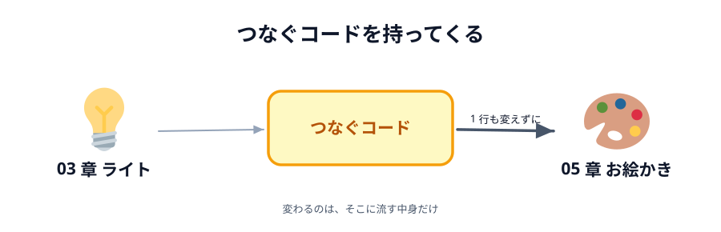
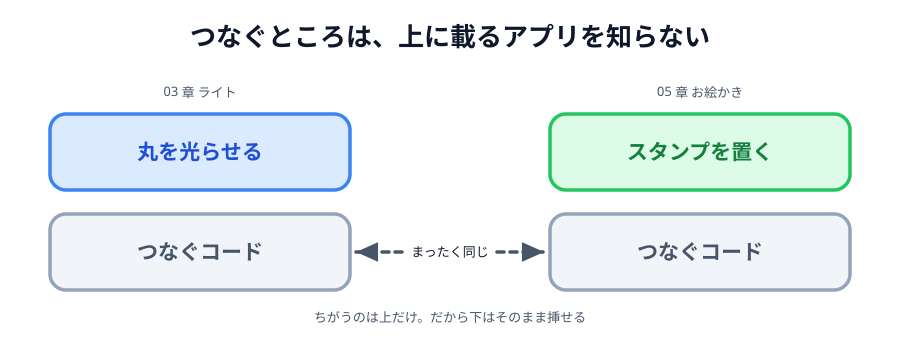

# 02 つなぐコードを持ってくる



スタンプは置けるようになりましたが、まだ 1 人です。この節で**相手とつなぎます**。

うれしいお知らせがあります。**つなぐコードは 1 行も書き直しません**。
03 章で書いた「名乗る・呼び出す・送る・受け取る」を、そっくりそのまま持ってきます。

ただし、まだスタンプは送りません。
[03 章 04 節](../../03-connect/04-peer/LECTURE.md) と同じように、
両方の画面に `つながりました` と出るところまでです。

> **今回さわる `app/`:** `index.html` に PeerJS の読み込みとヘッダー、
> `style.css` に 2 行、`main.js` につなぐコード

## なぜ、そのまま使い回せるのか

03 章で書いたつなぐコードを読み返してみてください。
**丸も、ひからせるボタンも、色も出てきません**。
出てくるのは「あいことば」「へやをつくる／へやにはいる」「つながりました」だけです。



_図: つなぐところは、上に載るアプリが何であるかを知らない。_

つまりあのコードは、**アプリが何をするものかを知りません**。
知らないからこそ、ライトにも、お絵かきにも、そのまま挿せます。

アプリの中身を知っているのは `conn.send(...)` に渡す**中身**と、
`conn.on('data', ...)` で**受け取ったあとの処理**だけです。
そこは次の節でお絵かき用に書きます。この節で足すのは、中身を知らない部分だけです。

## PeerJS を読み込む

`index.html` の `<head>` に、PeerJS 本体を読み込む行を足します。
`main.js` より**先**に書いてください。`main.js` の中で `Peer` を使うからです。

:::code[`index.html` の `<head>`（`main.js` の行のすぐ上）]{filepath=index.html offset=8}

```html
<script src="https://cdnjs.cloudflare.com/ajax/libs/peerjs/1.5.5/peerjs.min.js"></script>
```

:::

## ヘッダーを足す

`<body>` の先頭、`.tools` の上にヘッダーを足します。
中身は 03 章の完成形とまったく同じです。

:::code[`index.html` の `<body>` の先頭（`.tools` の上）]{filepath=index.html offset=12}

```html
<header>
  <input id="word" placeholder="あいことば" value="test" />
  <button id="host">へやをつくる</button>
  <button id="guest">へやにはいる</button>
  <span id="status">まだつながっていません</span>
</header>
```

:::

03 章では状態表示が `<p id="status">` でしたが、ここでは `<span>` にしています。
`<p>` は前後で行が変わるので、ボタンと同じ行に並べたいときは `<span>` のほうが素直です。

## style.css を 2 か所直す

ヘッダーも道具バーと同じ横並びにします。セレクタに 1 行足すだけです。

:::code[`style.css` の `.tools`]{filepath=style.css offset=14 newOffset=14}

```diff
+ header,
  .tools {
    display: flex;
    flex-wrap: wrap;
    align-items: center;
    gap: 8px;
    margin-bottom: 12px;
  }
```

:::

入力欄もボタンと同じ大きさにそろえます。

:::code[`style.css` の `button`]{filepath=style.css offset=22 newOffset=23}

```diff
+ input,
  button {
    font-size: 16px;
    padding: 6px 10px;
  }
```

:::

## 部品を取り出す

ここから `main.js` です。まず、足したヘッダーの部品をつかみます。

:::code[`main.js` の先頭]{filepath=main.js offset=1 newOffset=1}

```diff
  // 画面の部品を取っておく
+ const wordInput = document.querySelector('#word');
+ const hostButton = document.querySelector('#host');
+ const guestButton = document.querySelector('#guest');
+ const statusText = document.querySelector('#status');
  const canvas = document.querySelector('#canvas');
  const ctx = canvas.getContext('2d');
```

:::

相手との通り道を入れておく変数も足します。

:::code[`main.js`（部品の下、`let stamp` の上）]{filepath=main.js offset=9}

```js
// つながった相手との通り道。まだつながっていないので null。
let conn = null;
```

:::

## つなぐコードを書く

`let stamp = '🐱';` の下、`drawStamp` の**上**に、まとめて書き足します。
[03 章の完成コード](../../03-connect/06-deploy/LECTURE.md)からのコピーで構いません。

:::code[`main.js`（`let stamp` の下、`drawStamp` の上）]{filepath=main.js offset=15}

```js
// あいことばから、PeerJS Cloud で名乗る名前を作る。
// PeerJS Cloud は世界中の人と共有しているので「test」のような短い名前は
// すでに誰かに使われている。長めの前置きを付けてぶつかりにくくする。
function roomId(word) {
  return 'webrtc-handson-' + word;
}

// へやをつくる側（ホスト）。あいことばを自分の名前として名乗り、誰かが来るのを待つ。
hostButton.addEventListener('click', function () {
  const peer = new Peer(roomId(wordInput.value));

  peer.on('open', function () {
    statusText.textContent = 'あいてを待っています…';
  });

  peer.on('connection', function (newConn) {
    conn = newConn;
    conn.on('open', ready);
  });

  peer.on('error', showError);
});

// へやにはいる側（ゲスト）。名前は名乗らず、あいことばの相手に向かってつなぎに行く。
guestButton.addEventListener('click', function () {
  const peer = new Peer();

  peer.on('open', function () {
    conn = peer.connect(roomId(wordInput.value));
    conn.on('open', ready);
  });

  peer.on('error', showError);
});

// PeerJS から届くエラーを、日本語のことばにして出す。
// err.type にどんなエラーかが入っている。
function showError(err) {
  if (err.type === 'unavailable-id') {
    statusText.textContent =
      'そのあいことばは使われています。別のあいことばにするか「へやにはいる」を押してください';
  } else if (err.type === 'peer-unavailable') {
    statusText.textContent =
      'そのあいことばのへやが見つかりません。相手が「へやをつくる」を押したか確かめてください';
  } else {
    statusText.textContent = 'つながりませんでした（' + err.type + '）';
  }
}

// ホストでもゲストでも、つながったあとにやることは同じ。
function ready() {
  statusText.textContent = 'つながりました';

  conn.on('close', function () {
    statusText.textContent = 'せつだんされました';
  });
}
```

:::

`ready()` の中に `conn.on('data', ...)` が無いことに気づいたかもしれません。
03 章では、ここで届いた色を「あいて」の丸に塗っていました。
お絵かき用の受け取り処理は次の節で書くので、いまは空のままにしておきます。

:::danger[あいことばは書き換えてください]
入力欄の初期値は `test` のままです。
会場の全員が `test` のまま「へやをつくる」を押すと、最初のひとり以外は
`そのあいことばは使われています` で弾かれます。
自分の名前など、**他の人とかぶらない文字列**に書き換えてから押してください。
:::

## 動かす

**2 つのタブ**で `index.html` を開いてください。

1. 両方のタブに、**同じあいことば**を入れます
2. 1 つ目のタブで「へやをつくる」を押す → `あいてを待っています…`
3. 2 つ目のタブで「へやにはいる」を押す → **両方**が `つながりました` になる

::preview[こちらで「へやをつくる」を押す]{height="560"}

::preview[こちらで「へやにはいる」を押す]{height="560"}

:::warning
このページのプレビューは、あいことばの初期値が `test` です。
同時に同じページを見ている人がいるとぶつかるので、
上下そろえて別の文字列に書き換えてから押してください。
:::

## つながったのに、スタンプは相手に出ない

`つながりました` と出たあとにスタンプを置いても、相手の画面には何も出ません。
通り道はできましたが、**まだ何も流していない**からです。

ここまでで、お絵かきアプリには「描く」と「届ける」の両方がそろいました。
ただし、2 つはまだつながっていません。次の節でつなぎます。

::codeview{defaultFile="main.js"}
