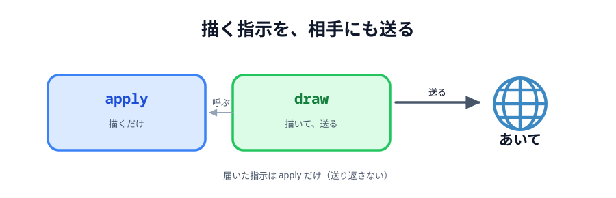

# 02 スタンプを送り合う



前の節で、クリックした場所にスタンプが置けるようになりました。
この節で、それを**相手のキャンバスにも出します**。

やることは 03 章と同じです。ただ、ここで 1 つ形を整えておきます。
このあと線・色・消しゴムと種類が増えるので、**最初に土台を作っておく**と後が楽になります。

> **今回さわる `app/`:** `main.js` に `apply` と `draw` を足し、`pointerdown` を書き換え

## 「描く」と「送る」をセットにする

素直に書くと、こうなりそうです。

```js
// こうは書きません
canvas.addEventListener('pointerdown', function (event) {
  const pos = positionOf(event);
  drawStamp(pos.x, pos.y, stamp); // 自分に描いて
  conn.send({ ... });             // 相手にも送る
});
```

これでも動きます。でも、線・色・消しゴムと増やすたびに
「描いて、送る」を書くことになり、**片方だけ書き忘れる**事故が起きます。

そこで、**必ずセットで行う関数**を 1 つ用意します。

:::code[`main.js`（`ready` の下）]{filepath=main.js offset=76}

```js
// 指示のとおりにキャンバスへ描く。
// 自分が出した指示も、相手から届いた指示も、かならずここを通る。
function apply(data) {
  if (data.type === 'stamp') {
    drawStamp(data.x, data.y, data.emoji);
  }
}

// 自分のキャンバスに描いてから、同じ指示を相手にも送る。
// 「描く」と「送る」を必ずセットにするので、2 つの画面が同じ絵になる。
function draw(data) {
  apply(data);

  if (conn) {
    conn.send(data);
  }
}
```

:::

2 つに分けているのがポイントです。

- **`apply`** … 指示のとおりに描くだけ。送らない
- **`draw`** … `apply` してから、同じ指示を送る

自分が操作したときは `draw` を呼びます。相手から届いたときは `apply` を呼びます。
届いたものをさらに送り返すと、無限に往復してしまうからです。


_図: `apply` は共通、送るかどうかだけが違う。_

## 受け取る

`ready()` に 1 行足します。

:::code[`main.js` の `ready` の中（`conn.on('close', ...)` の下）]{filepath=main.js offset=72}

```js
// 相手から届いた指示も、自分が出した指示と同じ apply に通す。
conn.on('data', apply);
```

:::

`conn.on('data', apply)` という短い書き方に注目してください。
届いたデータがそのまま `apply` の引数になります。
`conn.on('data', function (data) { apply(data); })` と同じ意味です。

## 送る

`pointerdown` の中を、`drawStamp` から `draw` に変えます。

:::code[`main.js` の `pointerdown`]{filepath=main.js offset=97 newOffset=118}

```diff
  canvas.addEventListener('pointerdown', function (event) {
    const pos = positionOf(event);

-   drawStamp(pos.x, pos.y, stamp);
+   draw({ type: 'stamp', x: pos.x, y: pos.y, emoji: stamp });
  });
```

:::

送っているのは、こういうオブジェクトです。

```js
{ type: 'stamp', x: 412.5, y: 233.1, emoji: '🐱' }
```

`type` を付けているのは、このあと `line` や `clear` が増えるからです。
受け取った側は `type` を見て、どう描くかを決めます。

## 動かす

2 つのタブ（またはプレビュー 2 つ）でつないでから、片方でキャンバスをクリックしてください。
もう片方の同じ位置に、同じスタンプが出ます。

::preview[こちらで「へやをつくる」]{height="560"}

::preview[こちらで「へやにはいる」]{height="560"}

`positionOf` で座標をそろえてあるので、**プレビューの幅が違っても同じ場所**に出ます。
2 つのプレビューの幅を変えて試してみてください。

## 相手のスタンプは、相手が選んだもの

自分が 🐱 を選んでいても、相手が 🌸 を置けば 🌸 が出ます。
`emoji` を指示に含めて送っているからです。

もし `emoji` を送らず、受け取り側の `stamp` を使ってしまうと、
**2 つの画面で違う絵になります**。「画面に必要な情報は、全部指示に入れる」のが基本です。

::codeview{defaultFile="main.js"}
