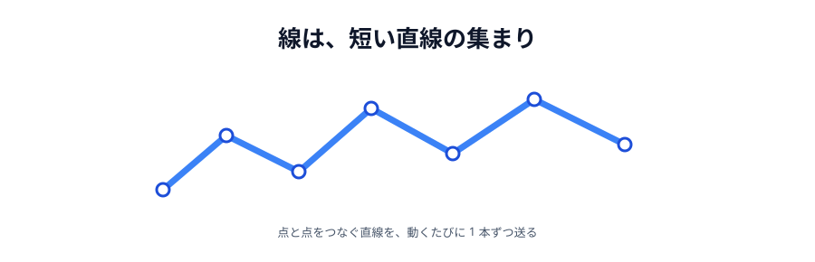
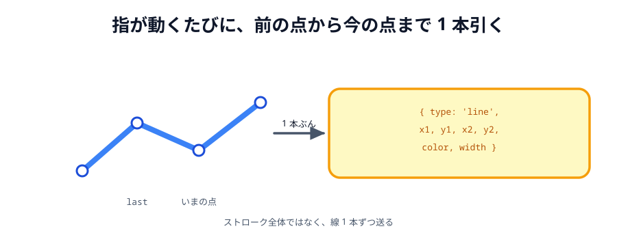

# 03 線を引く



スタンプが送れるようになったので、次は**線**です。お絵かきツールの本体です。

スタンプは「1 回押したら 1 個」でした。線は「押している間ずっと」なので、
考え方が少し変わります。

> **今回さわる `app/`:** `index.html` にペンのボタン、`style.css` に 1 行、
> `main.js` に線を引く処理

## 線は「短い線の集まり」

キャンバスに曲線を引く命令はありません。実際にやっているのはこうです。

1. 指（マウス）が動くたびに、**前の位置から今の位置まで**まっすぐな線を引く
2. それをたくさんつなげると、曲線に見える



_図: なめらかな線に見えるが、実際は短い直線の集まり。_

つまり送るのも「前の点」と「今の点」の組です。ストローク全体を送る必要はありません。

## ペンのボタンを足す

道具が 2 種類になったので、切り替えボタンを足します。

:::code[`index.html` の `.tools` の中（スタンプの上）]{filepath=index.html offset=20 newOffset=20}

```diff
+ <button class="tool selected" data-tool="pen">🖊 ペン</button>
- <button class="stamp selected" data-stamp="🐱">🐱</button>
+ <button class="stamp" data-stamp="🐱">🐱</button>
  <button class="stamp" data-stamp="🌸">🌸</button>
  <button class="stamp" data-stamp="⭐">⭐</button>
```

:::

最初に選ばれているのをスタンプからペンに移すので、`selected` を付け替えます。

## スマホでスクロールしないようにする

指でキャンバスをなぞると、ブラウザは「ページをスクロールしたいのだろう」と解釈します。
これを止めます。

:::code[`style.css` の `canvas` の中]{filepath=style.css offset=37}

```css
/* 指でなぞったときにページがスクロールしないようにする（スマホ用） */
touch-action: none;
```

:::

この 1 行が無いと、スマホでまともに描けません。PC では違いが出ないので忘れがちです。

## いま選んでいる道具を覚える

:::code[`main.js`（`let conn = null;` の下）]{filepath=main.js offset=12 newOffset=12}

```diff
- // いま選んでいるスタンプ
+ // いま選んでいる道具とスタンプ
+ let tool = 'pen';
  let stamp = '🐱';
```

:::

## 線を描く関数

:::code[`main.js`（`draw` の下、`drawStamp` の上）]{filepath=main.js offset=98}

```js
function drawLine(x1, y1, x2, y2, lineColor, lineWidth) {
  ctx.strokeStyle = lineColor;
  ctx.lineWidth = lineWidth;
  ctx.lineCap = 'round';
  ctx.beginPath();
  ctx.moveTo(x1, y1);
  ctx.lineTo(x2, y2);
  ctx.stroke();
}
```

:::

- `beginPath()` … 「これから新しい線を引きます」の合図。これを忘れると、
  前に引いた線まで一緒に描き直されて、色がおかしくなります
- `moveTo` / `lineTo` … 筆を置く位置と、引く先
- `stroke()` … ここではじめて実際に描かれます
- `lineCap = 'round'` … 線の端を丸くします。短い線をつないでいるので、
  これが無いと継ぎ目が角ばって見えます

## `apply` に線を足す

:::code[`main.js` の `apply` の中]{filepath=main.js offset=78 newOffset=79}

```diff
  function apply(data) {
+   if (data.type === 'line') {
+     drawLine(data.x1, data.y1, data.x2, data.y2, data.color, data.width);
+   }
    if (data.type === 'stamp') {
      drawStamp(data.x, data.y, data.emoji);
    }
  }
```

:::

`apply` に足すだけで、**自分が引いた線も、相手から届いた線も**両方描けるようになります。
前の節で `apply` と `draw` を分けておいた効果がここで出ます。

## なぞって線を引く

`pointerdown` を書き換え、`pointermove` と `pointerup` を足します。

:::code[`main.js`（`positionOf` の下をまるごと置き換え）]{filepath=main.js offset=132}

```js
// 直前のペン先の位置。線は「前の点から今の点まで」をつなげて描く。
let last = null;

canvas.addEventListener('pointerdown', function (event) {
  const pos = positionOf(event);

  if (tool === 'stamp') {
    draw({ type: 'stamp', x: pos.x, y: pos.y, emoji: stamp });
    return;
  }

  last = pos;
});

canvas.addEventListener('pointermove', function (event) {
  if (last === null) return;

  const pos = positionOf(event);

  draw({
    type: 'line',
    x1: last.x,
    y1: last.y,
    x2: pos.x,
    y2: pos.y,
    color: '#333333',
    width: 4,
  });

  last = pos;
});

canvas.addEventListener('pointerup', function () {
  last = null;
});

canvas.addEventListener('pointerleave', function () {
  last = null;
});
```

:::

- **`last`** … 直前のペン先の位置です。`null` のときは「いま描いていない」という意味になります
- `pointerdown` … スタンプなら 1 個置いて終わり（`return`）。ペンなら `last` を置くだけで、まだ描きません
- `pointermove` … `last` が `null` なら何もしません。マウスは押していなくても動くので、この番人が要ります
- `pointerup` / `pointerleave` … `last` を `null` に戻して、描くのをやめます。
  `pointerleave`（キャンバスの外に出た）も見ておかないと、外で離して戻ってきたときに
  変な直線が引かれます

## 道具の切り替えボタン

:::code[`main.js`（末尾の `select` の上）]{filepath=main.js offset=123 newOffset=172}

```diff
+ document.querySelectorAll('.tool').forEach(function (button) {
+   button.addEventListener('click', function () {
+     tool = button.dataset.tool;
+     select(button, '.tool, .stamp');
+   });
+ });

  document.querySelectorAll('.stamp').forEach(function (button) {
    button.addEventListener('click', function () {
+     tool = 'stamp';
      stamp = button.dataset.stamp;
-     select(button, '.stamp');
+     select(button, '.tool, .stamp');
    });
  });
```

:::

スタンプのボタンを押したら、道具も自動で `stamp` に切り替わります。
「スタンプを選んだのに、なぜか線が引かれる」を防ぐためです。

`select(button, '.tool, .stamp')` の第 2 引数が `'.tool, .stamp'` になったのは、
ペンとスタンプが**同じグループ**（どれか 1 つだけ選ぶもの）になったからです。

## 動かす

ドラッグすると線が引けます。スタンプのボタンを押せばスタンプに戻ります。
つないだ相手の画面にも、同じ線が出ます。

::preview[こちらで「へやをつくる」]{height="560"}

::preview[こちらで「へやにはいる」]{height="560"}

## 動きが重いと感じたら

`pointermove` は、指を動かしているあいだ 1 秒に何十回も呼ばれます。
そのたびに `conn.send()` しているので、けっこうな数の指示が飛んでいます。

いまの規模なら問題ありませんが、「重い」と感じたら
**何回かに 1 回だけ送る**、**何ミリ秒かぶんをまとめて送る**といった工夫をします。
リアルタイム通信では、送る回数を減らす工夫がよく効きます。

::codeview{defaultFile="main.js"}

## 次の節へ

[04 色を変える](../04-color/LECTURE.md)
