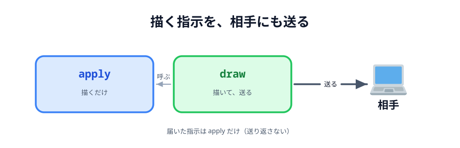
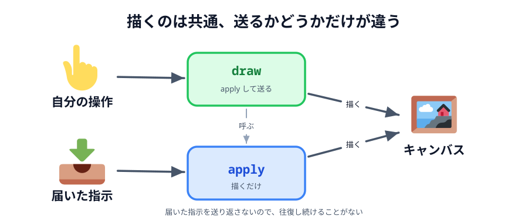
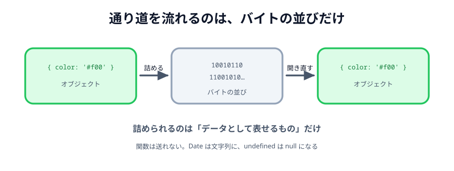

# 03 スタンプを送り合う



スタンプが置けて、相手ともつながりました。あとは**その 2 つをつなぐ**だけです。
この節で、置いたスタンプを**相手のキャンバスにも出します**。

送る・受け取るのやり方は 03 章と同じです。ただ、ここで 1 つ形を整えておきます。
このあと線・色・消しゴムと種類が増えるので、**最初に土台を作っておく**と後が楽になります。

> **今回さわる `app/`:** `main.js` に `apply` と `draw` を足し、`pointerdown` を書き換え

## 「描く」と「送る」をセットにする

素直に書くと、こうなりそうです。

```js
// こうは書きません
canvas.addEventListener('pointerdown', function (event) {
  const pos = positionOf(event);
  drawStamp(pos.x, pos.y, stamp); // 自分に描いて
  conn.send({ ... });             // 相手にも送る
});
```

これでも動きます。でも、線・色・消しゴムと増やすたびに
「描いて、送る」を書くことになり、**片方だけ書き忘れる**事故が起きます。

そこで、**必ずセットで行う関数**を 1 つ用意します。

:::code[`main.js`（`ready` の下）]{filepath=main.js offset=76}

```js
// 指示のとおりにキャンバスへ描く。
// 自分が出した指示も、相手から届いた指示も、かならずここを通る。
function apply(data) {
  if (data.type === 'stamp') {
    drawStamp(data.x, data.y, data.emoji);
  }
}

// 自分のキャンバスに描いてから、同じ指示を相手にも送る。
// 「描く」と「送る」を必ずセットにするので、2 つの画面が同じ絵になる。
function draw(data) {
  apply(data);

  if (conn) {
    conn.send(data);
  }
}
```

:::

2 つに分けているのがポイントです。

- **`apply`** … 指示のとおりに描くだけ。送らない
- **`draw`** … `apply` してから、同じ指示を送る

自分が操作したときは `draw` を呼びます。相手から届いたときは `apply` を呼びます。
届いたものをさらに送り返すと、無限に往復してしまうからです。



_図: `apply` は共通、送るかどうかだけが違う。_

## 受け取る

`ready()` に 1 行足します。

:::code[`main.js` の `ready`]{filepath=main.js offset=64 newOffset=64}

```diff
  // ホストでもゲストでも、つながったあとにやることは同じ。
  function ready() {
    statusText.textContent = 'つながりました';

    conn.on('close', function () {
      statusText.textContent = 'せつだんされました';
    });
+
+   // 相手から届いた指示も、自分が出した指示と同じ apply に通す。
+   conn.on('data', apply);
  }
```

:::

`conn.on('data', apply)` という短い書き方に注目してください。
届いたデータがそのまま `apply` の引数になります。
`conn.on('data', function (data) { apply(data); })` と同じ意味です。

## 送る

`pointerdown` の中を、`drawStamp` から `draw` に変えます。

:::code[`main.js` の `pointerdown`]{filepath=main.js offset=97 newOffset=118}

```diff
  canvas.addEventListener('pointerdown', function (event) {
    const pos = positionOf(event);

-   drawStamp(pos.x, pos.y, stamp);
+   draw({ type: 'stamp', x: pos.x, y: pos.y, emoji: stamp });
  });
```

:::

送っているのは、こういうオブジェクトです。

```js
{ type: 'stamp', x: 412.5, y: 233.1, emoji: '🐱' }
```

`type` を付けているのは、このあと `line` や `clear` が増えるからです。
受け取った側は `type` を見て、どう描くかを決めます。

## 送ったオブジェクトは、そのまま飛んでいるわけではない

`conn.send(...)` にオブジェクトを渡すと、相手側では同じオブジェクトが届きます。
ただし、**そのままの姿で線を流れているわけではありません**。
通信路を流れるのは**バイトの並び**だけです。

そこで PeerJS は、オブジェクトを一度バイトの並びに**詰め**（シリアライズ）、
受け取った側で**開き直し**（デシリアライズ）ています。



_図: 通り道を流れているのはバイトの並び。オブジェクトが飛んでいるわけではない。_

詰められるのは「データとして表せるもの」だけなので、送れるものには制限があります。

::preview[押すと、送ったものと届いたものを並べて比べます]{demo="what-arrives" height="380"}

| 送ったもの                 | 届くもの                   |
| -------------------------- | -------------------------- |
| 文字列                     | そのまま                   |
| 数値・真偽値・`null`       | そのまま                   |
| 配列                       | そのまま                   |
| オブジェクト（入れ子も可） | そのまま                   |
| `Date`                     | **文字列に変わる**         |
| `undefined`                | **`null` に変わる**        |
| `Uint8Array`               | **`ArrayBuffer` に変わる** |
| 関数                       | **送れない（例外になる）** |

`Date` は「1970 年から数えた時刻」という**意味**を持った特別なオブジェクトですが、
詰めた先ではその意味を保てず、文字列として運ばれます。
関数にいたっては、そもそもデータではないので運べません。

::codeview[このデモの中身]{path="demos/what-arrives"}

:::notice
JSON でも同じことが起きます（`JSON.parse(JSON.stringify(obj))` を思い出してください）。
「ネットワークの向こうに送れるのは、データとして表せるものだけ」というのは
WebRTC に限った話ではなく、通信全般に共通する制約です。
:::

いま送っている `{ type: 'stamp', x: …, y: …, emoji: '🐱' }` は数値と文字列だけなので、
この制限に引っかかりません。**キャンバスの絵そのもの**ではなく**描く指示**を送っているのが、
結果的に効いています。

### 届く順番は入れ替わらない

お絵かきで気になるのは「順番」です。
線を A → B → C の順で引いたのに、C → A → B の順に届いたら絵が壊れます。

WebRTC のデータチャネルは、**既定で順番どおり・取りこぼしなし**（ordered / reliable）です。
`conn.send()` を呼んだ順に、そのまま相手へ届きます。
だから、このハンズオンでは順番の心配をしなくて済みます。

:::notice
この既定を**あえて外す**こともできます。
ゲームで「最新の位置だけ届けばよく、古いものは捨ててよい」ような場合は、
順序保証を切って遅延を減らす、という設計があります。
PeerJS の `peer.connect(id, { reliable: false })` がそれにあたります。
:::

大きいデータも送れます。1 回に送れる大きさには上限がありますが、
PeerJS が自動で分割して送り、受け取り側で組み立て直してくれます。
ただし、線を引くたびに大きなデータを送れば当然もたつきます。
**送るものは小さく保つ**のが、リアルタイム性を出すコツです。

## 動かす

2 つのタブ（またはプレビュー 2 つ）でつないでから、片方でキャンバスをクリックしてください。
もう片方の同じ位置に、同じスタンプが出ます。

::preview[こちらで「へやをつくる」]{height="560"}

::preview[こちらで「へやにはいる」]{height="560"}

`positionOf` で座標をそろえてあるので、**プレビューの幅が違っても同じ場所**に出ます。
2 つのプレビューの幅を変えて試してみてください。

## 相手のスタンプは、相手が選んだもの

自分が 🐱 を選んでいても、相手が 🌸 を置けば 🌸 が出ます。
`emoji` を指示に含めて送っているからです。

もし `emoji` を送らず、受け取り側の `stamp` を使ってしまうと、
**2 つの画面で違う絵になります**。「画面に必要な情報は、全部指示に入れる」のが基本です。

:::questions

- `conn.send()` に渡したオブジェクトは、そのままの形で線を流れている [x]
- `Date` を送ると、相手側でも `Date` として受け取れる [x]
- データチャネルは、既定で送った順に届く [o]
- お絵かきでは、絵の画像そのものより「描く指示」を送るほうが軽い [o]

:::

::codeview{defaultFile="main.js"}
