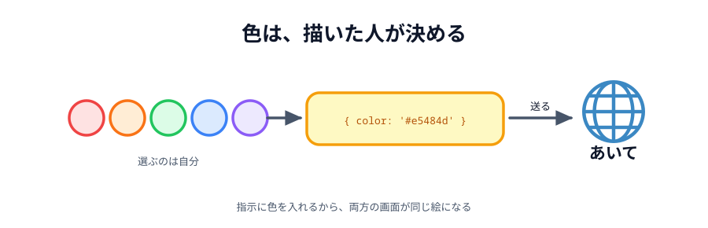
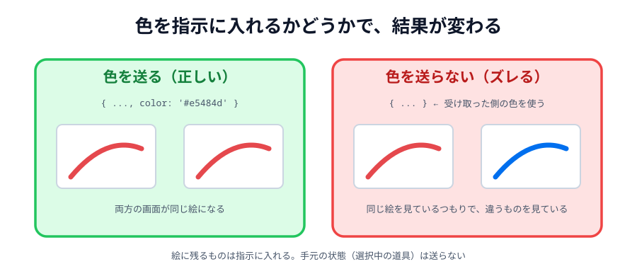

# 05 色を変える



いまの線は黒（`#333333`）で決め打ちです。色を選べるようにします。

短い節ですが、**色を送る側が決めるのか、受け取る側が決めるのか**という
リアルタイム共有の考えどころが出てきます。

> **今回さわる `app/`:** `index.html` に色ボタン、`style.css` に色ボタンの見た目、
> `main.js` に選んだ色を覚える処理

## 色ボタンを足す

:::code[`index.html` の `.tools` の中（ペンとスタンプのあいだ）]{filepath=index.html offset=22}

```html
<button class="color selected" data-color="#333333"></button>
<button class="color" data-color="#e5484d"></button>
<button class="color" data-color="#f5a524"></button>
<button class="color" data-color="#17c964"></button>
<button class="color" data-color="#006fee"></button>
```

:::

ボタンの中身は空です。**見た目の色は `data-color` から JavaScript で流し込みます**。
こうしておくと、色を増やしたいとき HTML に 1 行足すだけで済みます。
CSS に `.color-red { background: ... }` のような定義を増やす必要がありません。

## 色ボタンの形を整える

:::code[`style.css`（`input, button { ... }` の下）]{filepath=style.css offset=29}

```css
.color {
  width: 32px;
  height: 32px;
  padding: 0;
  border: 2px solid #fff;
  border-radius: 50%;
  /* 色そのものは data-color から JavaScript で流し込む */
}
```

:::

## いま選んでいる色を覚える

:::code[`main.js`（道具の状態のところ）]{filepath=main.js offset=12 newOffset=12}

```diff
- // いま選んでいる道具とスタンプ
+ // いま選んでいる道具と色とスタンプ
  let tool = 'pen';
+ let color = '#333333';
  let stamp = '🐱';
```

:::

## 決め打ちをやめる

:::code[`main.js` の `pointermove` の中]{filepath=main.js offset=157 newOffset=158}

```diff
-   color: '#333333',
+   color: color,
    width: 4,
```

:::

## 色ボタンを押せるようにする

:::code[`main.js`（`.stamp` のループの下、`select` の上）]{filepath=main.js offset=188}

```js
document.querySelectorAll('.color').forEach(function (button) {
  // ボタンの見た目の色を data-color から流し込む
  button.style.background = button.dataset.color;

  button.addEventListener('click', function () {
    color = button.dataset.color;
    select(button, '.color');
  });
});
```

:::

`select(button, '.color')` の第 2 引数が `'.color'` だけなのに注目してください。
**色は道具とは別のグループ**です。「ペンを選んでいる」と「赤を選んでいる」は同時に成り立つので、
選択の印を外し合う相手も別になります。

## 色は「送る側」が決める

ここが今回の考えどころです。

送っているのはこういう指示でした。

```js
{ type: 'line', x1: ..., y1: ..., x2: ..., y2: ..., color: '#e5484d', width: 4 }
```

`color` が指示の中に入っています。つまり **描いた人が選んだ色**が、そのまま相手の画面でも使われます。

もし `color` を送らず、受け取り側が自分の `color` を使ったらどうなるでしょう。
相手が青を選んでいれば、こちらが赤で描いた線が**相手の画面では青**になります。
同じ絵を見ているつもりが、実は違うものを見ていることになります。



_図: 「見た目に必要な情報は、すべて指示に入れる」。_

一方、**送らないほうがいい情報**もあります。たとえば「いまペンを選んでいる」という状態です。
それは自分の手元の話で、相手の画面には関係ありません。

- **絵に残るもの**（座標・色・太さ・スタンプの絵柄）… 指示に入れて送る
- **手元の状態**（選択中の道具、選択中の色そのもの）… 送らない

## 動かす

色を選んでから線を引くと、相手の画面にも同じ色で出ます。
2 つのプレビューで別々の色を選んで、交互に描いてみてください。

::preview[こちらで「へやをつくる」]{height="560"}

::preview[こちらで「へやにはいる」]{height="560"}

::codeview{defaultFile="main.js"}
