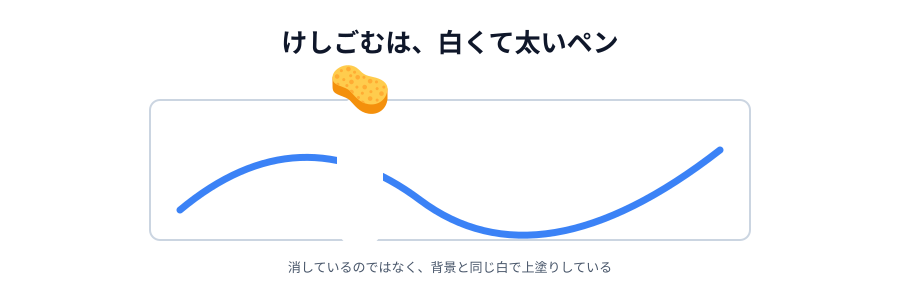
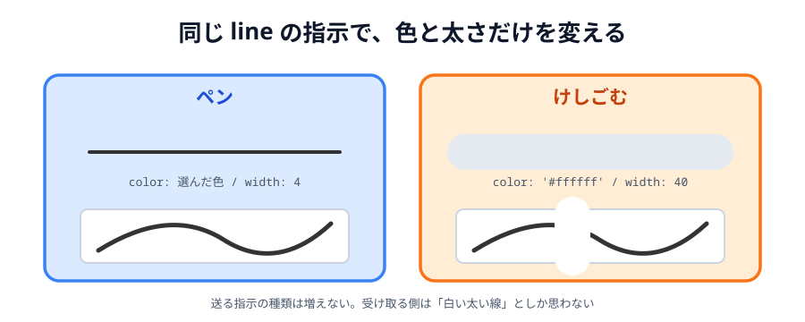

# 05 けしごむと「ぜんぶ消す」



最後の道具です。**けしごむ**と、**ぜんぶ消す**ボタンを足します。

けしごむは、実は新しい仕組みをほとんど使いません。
「白くて太いペン」として作れてしまいます。

> **今回さわる `app/`:** `index.html` にボタン 2 つ、`main.js` に少しずつ

## けしごむは「白い太いペン」

キャンバスの背景は白（`#ffffff`）です。
そこに白い線を引けば、下に描いてあったものが隠れて、消えたように見えます。



_図: 実際には「消して」いない。白で上塗りしている。_

この作り方には、うれしい副作用があります。
**送る指示の種類が増えません**。`line` のまま、色と太さを変えるだけです。
受け取り側は「白くて太い線が来た」としか思いませんが、結果は同じになります。

:::notice
本格的なお絵かきツールなら、`ctx.globalCompositeOperation = 'destination-out'` を使って
本当にピクセルを透明にします。背景に写真を敷きたい場合などは、この方法でないと困ります。
今回は背景が白一色なので、単純なほうを選びました。
:::

## ボタンを 2 つ足す

:::code[`index.html` の `.tools` の中]{filepath=index.html offset=21}

```html
<button class="tool" data-tool="eraser">🧽 けしごむ</button>
```

:::

:::code[`index.html` の `.tools` の最後（スタンプの下）]{filepath=index.html offset=32}

```html
<button id="clear">ぜんぶ消す</button>
```

:::

## ボタンを取り出す

:::code[`main.js` の先頭]{filepath=main.js offset=5 newOffset=5}

```diff
  const statusText = document.querySelector('#status');
+ const clearButton = document.querySelector('#clear');
  const canvas = document.querySelector('#canvas');
```

:::

## けしごむで描く

`pointermove` の中の `color` と `width` を、道具によって切り替えます。

:::code[`main.js` の `pointermove` の中]{filepath=main.js offset=158 newOffset=162}

```diff
-   color: color,
-   width: 4,
+   // けしごむは「背景と同じ白い色で、太く描くペン」として作る
+   color: tool === 'eraser' ? '#ffffff' : color,
+   width: tool === 'eraser' ? 40 : 4,
```

:::

`条件 ? A : B` は三項演算子です。「条件が成り立てば A、そうでなければ B」を 1 行で書けます。

```js
// 上の書き方は、これと同じ意味
let lineColor;
if (tool === 'eraser') {
  lineColor = '#ffffff';
} else {
  lineColor = color;
}
```

けしごむのときだけ太さを `40` にしているのは、
細いけしごむだと消すのが大変だからです。

けしごむのボタンには `class="tool"` を付けたので、
[03 節](../03-line/LECTURE.md) で書いた `.tool` のループがそのまま拾ってくれます。
ボタンの処理を書き足す必要はありません。

## 「ぜんぶ消す」を足す

新しい種類の指示 `clear` を作ります。

:::code[`main.js` の `apply` の中（最後）]{filepath=main.js offset=88}

```js
if (data.type === 'clear') {
  clearCanvas();
}
```

:::

:::code[`main.js`（`.color` のループの下、`select` の上）]{filepath=main.js offset=203}

```js
clearButton.addEventListener('click', function () {
  draw({ type: 'clear' });
});
```

:::

`draw({ type: 'clear' })` を呼ぶだけで、自分のキャンバスが白くなり、
**同じ指示が相手にも飛んで**相手の画面も白くなります。
`apply` と `draw` を分けた土台が、ここでもそのまま効いています。

送っている指示は `{ type: 'clear' }` だけです。座標も色もありません。
「全部消して」という命令に、それ以上の情報は要らないからです。

:::warning
「ぜんぶ消す」は相手の絵も消します。確認は出しません。
相手が一生懸命描いている最中に押すと、当然もめます。
本物のサービスなら「本当に消しますか？」を出すところです。
:::

## 動かす

- けしごむを選んでなぞると、線が消えます。**相手の画面でも消えます**
- 「ぜんぶ消す」を押すと、両方の画面が白紙になります

::preview[こちらで「へやをつくる」]{height="560"}

::preview[こちらで「へやにはいる」]{height="560"}

これでお絵かきツールとしては完成です。次の節で最後の仕上げをして、公開します。

::codeview{defaultFile="main.js"}

## 次の節へ

[06 あとから来た人にも見せて、公開する](../06-deploy/LECTURE.md)
