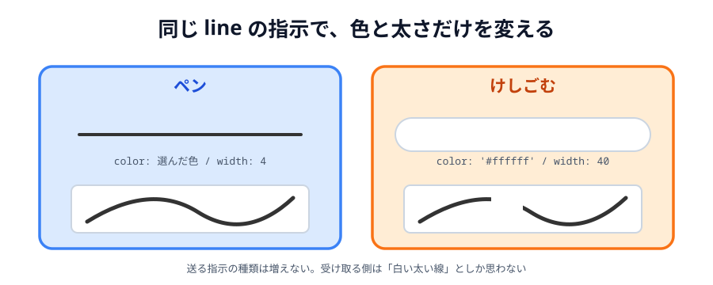

# 06 けしごむ


道具の最後は **けしごむ**です。

けしごむは、実は新しい仕組みをほとんど使いません。
「白くて太いペン」として作れてしまいます。

> **今回さわる `app/`:** `index.html` にボタン 1 つ、`main.js` に 2 行

## けしごむは「白い太いペン」

キャンバスの背景は白（`#ffffff`）です。
そこに白い線を引けば、下に描いてあったものが隠れて、消えたように見えます。



_図: 実際には「消して」いない。白で上塗りしている。_

この作り方には、うれしい副作用があります。
**送る指示の種類が増えません**。`line` のまま、色と太さを変えるだけです。
受け取り側は「白くて太い線が来た」としか思いませんが、結果は同じになります。

:::notice
本格的なお絵かきツールなら、`ctx.globalCompositeOperation = 'destination-out'` を使って
本当にピクセルを透明にします。背景に写真を敷きたい場合などは、この方法でないと困ります。
今回は背景が白一色なので、単純なほうを選びました。
:::

## ボタンを足す

:::code[`index.html` の `.tools` の中（ペンの下）]{filepath=index.html offset=21}

```html
<button class="tool" data-tool="eraser">🧽 けしごむ</button>
```

:::

書き足すのはこれだけです。**JavaScript 側にボタンの処理は要りません。**

けしごむのボタンには `class="tool"` を付けたので、
[04 節](../04-line/LECTURE.md) で書いた `.tool` のループがそのまま拾ってくれます。

```js
// 04 節で書いたこれが、けしごむのボタンも面倒を見てくれる
document.querySelectorAll('.tool').forEach(function (button) {
  button.addEventListener('click', function () {
    tool = button.dataset.tool;
    select(button, '.tool, .stamp');
  });
});
```

`data-tool="eraser"` と書いておけば、押されたときに `tool` が `'eraser'` になります。
**道具を増やすたびに JavaScript を書き足さなくていい**形になっているわけです。

## けしごむで描く

あとは、線を引くときの色と太さを道具によって切り替えるだけです。

:::code[`main.js` の `pointermove` の中]{filepath=main.js offset=158 newOffset=158}

```diff
-   color: color,
-   width: 4,
+   // けしごむは「背景と同じ白い色で、太く描くペン」として作る
+   color: tool === 'eraser' ? '#ffffff' : color,
+   width: tool === 'eraser' ? 40 : 4,
```

:::

`条件 ? A : B` は三項演算子です。「条件が成り立てば A、そうでなければ B」を 1 行で書けます。

```js
// 上の書き方は、これと同じ意味
let lineColor;
if (tool === 'eraser') {
  lineColor = '#ffffff';
} else {
  lineColor = color;
}
```

けしごむのときだけ太さを `40` にしているのは、
細いけしごむだと消すのが大変だからです。

## 送っているものは、やっぱり線

けしごむでなぞったときに飛んでいく指示を見てみます。

```js
{ type: 'line', x1: ..., y1: ..., x2: ..., y2: ..., color: '#ffffff', width: 40 }
```

`type` は `line` のままです。受け取った側は「白くて太い線を引け」としか読みません。
それでも画面は同じになります。

[05 節](../05-color/LECTURE.md) で書いた「見た目に必要な情報は、すべて指示に入れる」を
守っているので、**新しい種類の指示を作らなくても済んでいる**わけです。

## 動かす

けしごむを選んでなぞると、線が消えます。**相手の画面でも消えます**。

::preview[こちらで「へやをつくる」]{height="560"}

::preview[こちらで「へやにはいる」]{height="560"}

けしごむで消したあと、もう一度ペンに戻して描けることも確かめてください。
`tool` を切り替えているだけなので、行ったり来たりできます。

次の節で、「ぜんぶ消す」ボタンを足します。

::codeview{defaultFile="main.js"}
