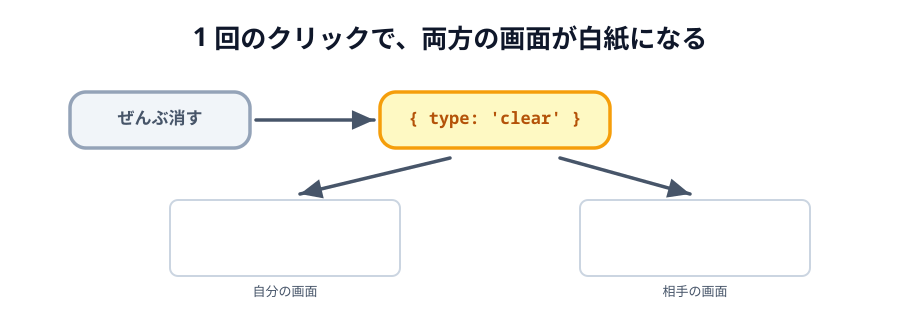
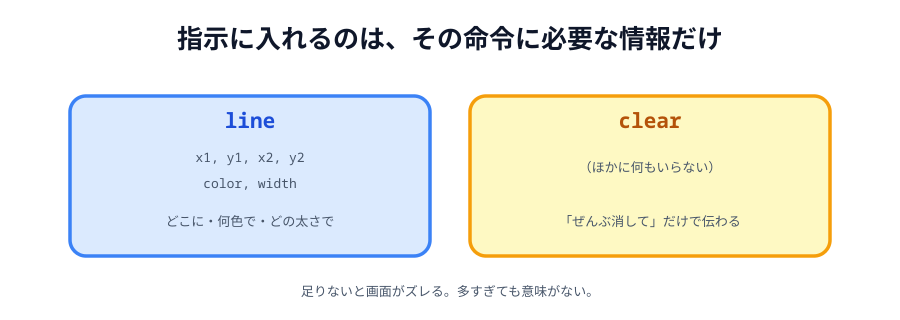

# 07 ぜんぶ消す



けしごむは、なぞったところだけを消す道具でした。
この節では、**キャンバスをまるごと白紙に戻す**ボタンを足します。

けしごむが `line` を送っていたのに対して、こちらは**新しい種類の指示**を作ります。
とはいえ、いままででいちばん短い指示になります。

> **今回さわる `app/`:** `index.html` にボタン 1 つ、`main.js` に 3 か所

## ボタンを足す

けしごむと違って、こちらは道具ではありません。
「選んで使うもの」ではなく「押したら即座に効くもの」なので、`class="tool"` は付けません。

:::code[`index.html` の `.tools` の最後（スタンプの下）]{filepath=index.html offset=32}

```html
<button id="clear">ぜんぶ消す</button>
```

:::

`class` ではなく `id` を付けたのは、押されたときの処理を自分で書くからです。

## ボタンを取り出す

:::code[`main.js` の先頭]{filepath=main.js offset=5 newOffset=5}

```diff
  const statusText = document.querySelector('#status');
+ const clearButton = document.querySelector('#clear');
  const canvas = document.querySelector('#canvas');
```

:::

## `clear` という指示を作る

`apply` に、新しい種類の指示を受け付ける枝を足します。

:::code[`main.js` の `apply`]{filepath=main.js offset=80 newOffset=81}

```diff
  function apply(data) {
    if (data.type === 'line') {
      drawLine(data.x1, data.y1, data.x2, data.y2, data.color, data.width);
    }
    if (data.type === 'stamp') {
      drawStamp(data.x, data.y, data.emoji);
    }
+   if (data.type === 'clear') {
+     clearCanvas();
+   }
  }
```

:::

`clearCanvas` は [01 節](../01-canvas/LECTURE.md) で書いたきり、
最後に 1 回呼んで白くするだけの関数でした。ここでようやく出番が来ます。

## ボタンを押せるようにする

:::code[`main.js`（`.color` のループの下、`select` の上）]{filepath=main.js offset=203}

```js
clearButton.addEventListener('click', function () {
  draw({ type: 'clear' });
});
```

:::

`draw({ type: 'clear' })` を呼ぶだけで、自分のキャンバスが白くなり、
**同じ指示が相手にも飛んで**相手の画面も白くなります。

[03 節](../03-share/LECTURE.md) で `apply` と `draw` を分けた土台が、ここでもそのまま効いています。
「描いて、送る」を自分で書く必要はありません。

## 指示に入れるのは、必要な情報だけ

送っている指示は `{ type: 'clear' }` だけです。座標も色も太さもありません。



_図: 「ぜんぶ消して」を伝えるのに、それ以上の情報は要らない。_

[05 節](../05-color/LECTURE.md) では「見た目に必要な情報は、すべて指示に入れる」と書きました。
これは裏を返すと「**要らない情報は入れない**」でもあります。

- `line` … どこに・何色で・どの太さで引くかが分からないと、相手の画面が違う絵になる
- `clear` … 「全部消して」で足りる。それ以上は相手も知る必要がない

指示は小さいほど速く届きます。1 秒に何十回も飛ぶ `line` を軽くしておくのは効きますし、
`clear` のように減らせるものはとことん減らしてかまいません。

:::warning
「ぜんぶ消す」は相手の絵も消します。確認は出しません。
相手が一生懸命描いている最中に押すと、当然もめます。
本物のサービスなら「本当に消しますか？」を出すところです。
:::

## 動かす

「ぜんぶ消す」を押すと、両方の画面が白紙になります。

::preview[こちらで「へやをつくる」]{height="560"}

::preview[こちらで「へやにはいる」]{height="560"}

つないでいないときに押しても、自分の画面だけが白くなります。
`draw` の中の `if (conn)` が、送る相手がいないことを見てくれているからです。

これでお絵かきツールとしては完成です。次の節で最後の仕上げをして、公開します。

::codeview{defaultFile="main.js"}
