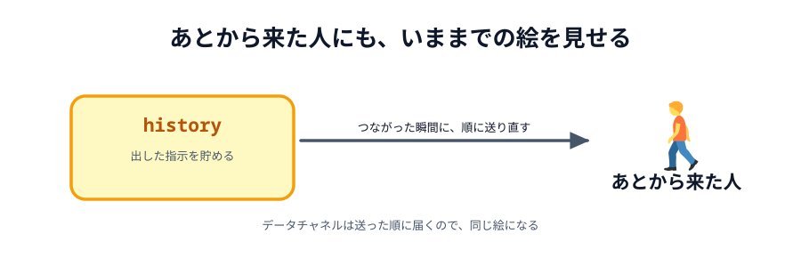
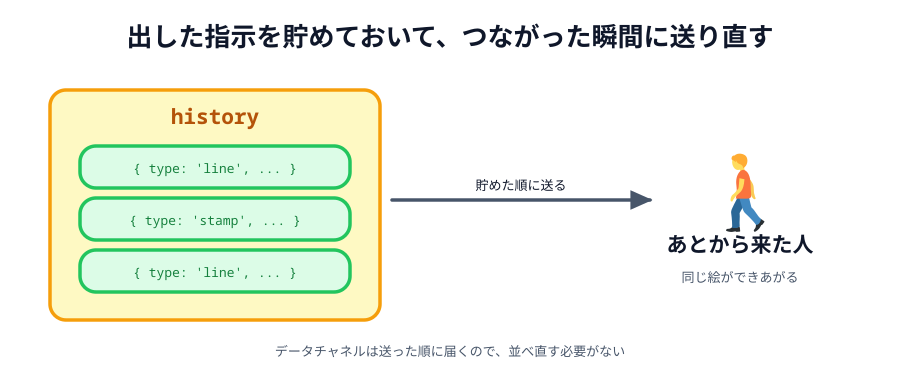

# 07 あとから来た人にも見せて、公開する



最後の節です。1 つだけ機能を足して、公開します。

足すのは「**あとから入ってきた相手にも、いままでの絵を見せる**」ことです。
いまは、先に描いていても、相手がつないだ時点では相手の画面は白紙のままです。

> **今回さわる `app/`:** `main.js` に `history` を足す

## なぜ白紙のままなのか

[02 章](../../02-how-it-connects/01-server-vs-p2p/LECTURE.md) で見たとおり、
P2P には「記録係」がいません。

サーバー経由のチャットなら、サーバーが過去の発言を持っているので、
あとから入った人に見せられます。今回はその役をやる人が誰もいないのです。

送った指示は相手に届いた瞬間に役目を終え、どこにも残っていません。

## 自分が記録係になる

いないなら、自分がやります。**自分が出した指示を覚えておいて、
つながった瞬間に全部送り直す**だけです。



_図: 指示を順に送り直せば、相手の画面に同じ絵ができあがる。_

[04 章](../../04-data/01-message/LECTURE.md) で見たとおり、
データチャネルは**送った順に届きます**。だから、貯めた順に送り直せば同じ絵になります。

## 覚えておく場所を作る

:::code[`main.js`（道具の状態の下）]{filepath=main.js offset=18}

```js
// これまでに描いた指示をぜんぶ覚えておく
const history = [];
```

:::

## 出した指示を貯める

:::code[`main.js` の `draw` の中]{filepath=main.js offset=95 newOffset=104}

```diff
  function draw(data) {
    apply(data);
+
+   // 出した指示は覚えておく（あとから来た相手に送り直すため）
+   if (data.type === 'clear') {
+     history.length = 0;
+   } else {
+     history.push(data);
+   }

    if (conn) {
      conn.send(data);
    }
  }
```

:::

`clear` のときは貯めずに、**それまでの記録を捨てます**。
「ぜんぶ消す」のあとに残っている指示は、もう絵に残らないからです。
`history.length = 0` は、配列を空にする書き方です。

`draw` の中に置いたのがポイントです。`apply` の中に置くと、
**相手から届いた指示まで貯めてしまいます**。それでも動きますが、
「自分が描いたもの」という意味がぼやけます。

## つながったときに送り直す

:::code[`main.js` の `ready` の中（`conn.on('data', apply)` の下）]{filepath=main.js offset=81}

```js
// 自分がこれまでに描いたものを送り直して、相手の画面にも同じ絵を出す。
// あとから入ってきた人にも、いまの絵が見えるようになる。
history.forEach(function (data) {
  conn.send(data);
});
```

:::

きれいなのは、**ホストとゲストで書き分けなくていい**ところです。

つないだ直後、あとから来たほうの `history` は空なので、送るものがありません。
先に描いていたほうだけが送ります。両方が同じコードで、正しく動きます。

## 動かす

1. 片方のプレビューで「へやをつくる」を押す
2. **つなぐ前に**、そちらのキャンバスに何か描く
3. もう片方で「へやにはいる」を押す

つないだ瞬間に、あとから入ったほうの画面にも絵が出れば成功です。

::preview[こちらで「へやをつくる」→ 先に描く]{height="560"}

::preview[こちらで、あとから「へやにはいる」]{height="560"}

## 公開する

[03 章](../../03-connect/06-deploy/LECTURE.md) と同じ手順です。

1. https://app.netlify.com/drop を開きます
2. `app` フォルダをまるごとドラッグ&ドロップします
3. あたらしい `https://....netlify.app` が出てきます

**URL は 03 章のときとは別のものになります。** 落とすたびに新しいサイトが作られるからです。
出てきた URL を、スマホにもう一度送ってください。

あとは、あいことばを決めて 2 台でつなぐだけです。
PC で線を引くと、スマホに同じ線が出ます。

## できたもの

3 つのファイル、あわせて 300 行ちょっとです。
サーバーは 1 行も書いていません。それでも、2 つの端末が直接つながって、
同じ絵をリアルタイムで共有できています。

振り返ると、通信のためのコードは驚くほど少なかったはずです。

```js
new Peer(あいことば); // 名乗る
peer.connect(あいことば); // 呼び出す
conn.send(指示); // 送る
conn.on('data', apply); // 受け取る
```

残りは全部、ふつうの HTML・CSS・キャンバスの話でした。

## ここから先へ

本編はここまでです。お疲れさまでした。

もっと遊びたい人のために、**06 章をおまけ**として用意しました。
こちらは組み立てる形ではなく、**答えが最初から書いてあります**。
どれもこの節の完成コードに 1 つだけ足したものなので、好きなものだけ拾ってください。

- [01 線の太さを選べるようにする](../../06-extra/01-width/LECTURE.md)
- [02 相手のカーソルを表示する](../../06-extra/02-cursor/LECTURE.md)
- [03 画像を背景に敷く](../../06-extra/03-background/LECTURE.md)
- [04 3 人以上でつなぐ](../../06-extra/04-multi/LECTURE.md)
- [05 自分の PeerServer を立てる](../../06-extra/05-peerserver/LECTURE.md)
- [06 TURN を用意する](../../06-extra/06-turn/LECTURE.md)

::codeview{defaultFile="main.js"}
