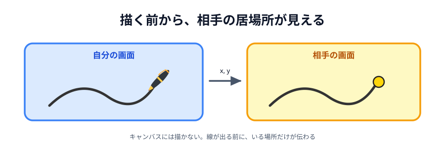
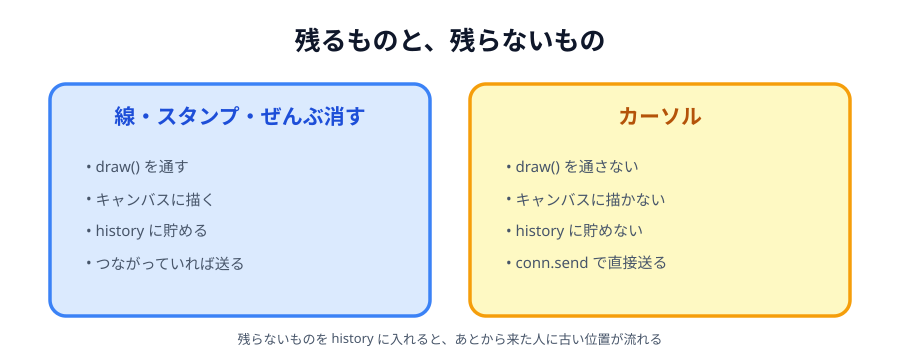

# 01 相手のカーソルを表示する



相手のペン先の位置に、小さい丸を出します。
線が出てくる前に「いま相手がここにいる」が見えるので、**相手がいる感じ**が一気に増えます。

[05 章の完成コード](../../05-drawing/08-deploy/LECTURE.md)に、この機能だけを足したものが
ページの下に置いてあります。

> **今回さわる `app/`:** 3 ファイルとも少しずつ

## カーソルは「絵」ではない

いままで送ってきた指示は、ぜんぶ**キャンバスに残るもの**でした。
だから `draw` を通し、`apply` でキャンバスに描き、`history` に貯めました。

カーソルは違います。

- キャンバスに描いてはいけない（描いたら跡が残る）
- `history` に貯めてはいけない（あとから送り直しても意味がない）
- 届かなくても、次の位置がすぐ来るので困らない

つまり **`draw` を通してはいけない**指示です。専用の道を作ります。



_図: 同じ通り道（`conn`）を使うが、通す前の扱いが違う。_

## 丸を置く場所を作る

キャンバスの上に重ねるので、両方を包む枠を用意します。

:::code[`index.html`（`<canvas>` を置きかえる）]{filepath=index.html offset=35}

```html
<div class="stage">
  <canvas id="canvas" width="800" height="600"></canvas>
  <div id="cursor"></div>
</div>
```

:::

キャンバスを包んでいる `.stage` は 05 章から使っているものです。
ここに `position: relative` を足して、**中の `absolute` がこの枠を基準に動く**ようにします。

:::code[`style.css` の `.stage`]{filepath=style.css offset=43 newOffset=43}

```diff
- /* キャンバスを置く場所。上のバーを引いた残りの高さを、ここが全部使う */
+ /* キャンバスを置く場所。上のバーを引いた残りの高さを、ここが全部使う。
+    position: relative にしておくと、中の absolute がこの枠を基準に動く。 */
  .stage {
+   position: relative;
    flex: 1;
```

:::

:::code[`style.css`（`canvas` の下）]{filepath=style.css offset=64}

```css
/* 相手のペン先を表す丸。left / top は JavaScript から px で入れる。 */
#cursor {
  position: absolute;
  /* 中心を座標に合わせるため、自分の半分だけ左上にずらす */
  margin: -9px 0 0 -9px;
  width: 18px;
  height: 18px;
  border: 2px solid #222;
  border-radius: 50%;
  background: #ffd60a;
  /* 丸がクリックを横取りしないようにする */
  pointer-events: none;
  /* 相手が動くまでは出さない */
  display: none;
}
```

:::

`pointer-events: none` を忘れると、丸の下をなぞったときに線が途切れます。
丸がマウスの合図を横取りしてしまうからです。

## 部品を取り出す

:::code[`main.js` の先頭]{filepath=main.js offset=7}

```js
const canvas = document.querySelector('#canvas');
const cursorMark = document.querySelector('#cursor');
const ctx = canvas.getContext('2d');
```

:::

## 送る側

:::code[`main.js`（`draw` の下）]{filepath=main.js offset=123}

```js
// ペン先の位置を相手に知らせる。pos が null なら「キャンバスの外に出た」。
// 絵ではないので draw を通さない。apply もしないし、history にも入れない。
function sendCursor(pos) {
  if (conn === null) return;

  conn.send({
    type: 'cursor',
    x: pos === null ? null : pos.x,
    y: pos === null ? null : pos.y,
  });
}
```

:::

`conn.send` を直接呼んでいるところがポイントです。
`draw` を呼ぶと、自分のキャンバスに描かれ、`history` にも貯まってしまいます。

## 受け取る側

:::code[`main.js` の `apply` の中（最後）]{filepath=main.js offset=101}

```js
if (data.type === 'cursor') {
  showCursor(data.x, data.y);
}
```

:::

:::code[`main.js`（`sendCursor` の下）]{filepath=main.js offset=135}

```js
// 相手のペン先を、キャンバスの上に重ねた丸で表す。
// 800x600 の中での座標に、いま表示しているキャンバスの大きさを掛けて画面の px に直す。
// キャンバスが縮んで表示されていてもズレない。
function showCursor(x, y) {
  if (x === null) {
    cursorMark.style.display = 'none';
    return;
  }

  cursorMark.style.display = 'block';
  cursorMark.style.left = (x / canvas.width) * canvas.clientWidth + 'px';
  cursorMark.style.top = (y / canvas.height) * canvas.clientHeight + 'px';
}
```

:::

`canvas.width`（`800`）ではなく `canvas.clientWidth`（**いま画面に出ている幅**）で掛けるのがコツです。
キャンバスは空いている場所に収まるまで縮んで表示されるので、
`800` のまま計算すると、縮んだぶんだけ丸がズレます。

## 位置を送る

`pointermove` は、**ボタンを押していなくても**マウスが動くたびに呼ばれます。
だから `last === null` で帰る前に送ります。

:::code[`main.js` の `pointermove` の中（先頭）]{filepath=main.js offset=197}

```js
canvas.addEventListener('pointermove', function (event) {
  const pos = positionOf(event);

  // 描いていないときも、ペン先の位置だけは送り続ける
  sendCursor(pos);

  if (last === null) return;
```

:::

もとのコードは `if (last === null) return;` が先で `positionOf` があとでした。
順番を入れかえています。

:::code[`main.js` の `pointerleave`]{filepath=main.js offset=223}

```js
canvas.addEventListener('pointerleave', function () {
  // キャンバスから出たことを伝えて、相手の画面の丸を消してもらう
  sendCursor(null);
  last = null;
});
```

:::

これが無いと、相手がキャンバスから出たあとも丸が残り続けます。

## 動かす

2 つのプレビューをつないで、**描かずにマウスを動かして**ください。
もう片方に黄色い丸が付いてきます。

::preview[こちらで「へやをつくる」]{height="560"}

::preview[こちらで「へやにはいる」]{height="560"}

:::notice
指の端末（スマホ・タブレット）では、`pointermove` は**画面に触れている間しか**呼ばれません。
なぞっている間だけ相手に丸が出て、離すと止まります。マウスのようにずっと追いかけては来ません。
:::

## 送りすぎに注意

`pointermove` は、速く動かすと 1 秒に何十回も呼ばれます。
いまは線を引くときも同じ回数だけ送っているので、通信量は倍くらいにしかなりません。

ただし線と違って、カーソルは**描いていない間もずっと**送り続けます。
気になるなら、前に送った時刻を覚えておいて「16 ミリ秒あけて送る」ようにすると、
だいたい 1 秒 60 回に抑えられます。

```js
let lastSentAt = 0;

function sendCursor(pos) {
  if (conn === null) return;

  const now = Date.now();
  if (pos !== null && now - lastSentAt < 16) return;
  lastSentAt = now;

  // …あとは同じ
}
```

「外に出た」の合図（`pos === null`）だけは、間引かずに必ず送ります。
これを落とすと、相手の画面に丸が残ってしまいます。

::codeview{defaultFile="main.js"}
