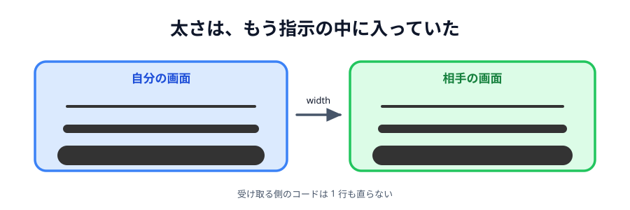

# 01 線の太さを選べるようにする



太い線と細い線を切り替えられるようにします。

この章はぜんぶ**答えが書いてあるおまけ**です。
[05 章の完成コード](../../05-drawing/07-deploy/LECTURE.md)に、この機能だけを足したものが
ページの下に置いてあります。ほかのおまけとは混ざっていないので、好きなものだけ拾えます。

> **今回さわる `app/`:** `index.html` にボタン 3 つ、`main.js` に 3 か所、`style.css` に少し

## 送るものは何も変わらない

いま送っている線の指示は、こうなっています。

```js
{
  type: ('line', x1, y1, x2, y2, color, width);
}
```

**`width` はもう入っています。** ずっと `4` を入れて送っていただけです。
つまり相手側の `apply` も `drawLine` も、直すところがありません。

やることは「いま選ばれている太さを覚えて、`4` の代わりにそれを入れる」だけです。
[04 節の色](../../05-drawing/04-color/LECTURE.md)とまったく同じ形です。

## ボタンを 3 つ足す

けしごむの下、色の上に置きます。

:::code[`index.html` の `.tools` の中]{filepath=index.html offset=23}

```html
<button class="width selected" data-width="4">細</button>
<button class="width" data-width="12">中</button>
<button class="width" data-width="28">太</button>
```

:::

数字は `data-width` に入れておきます。あとで JavaScript から取り出します。

## いま選んでいる太さを覚える

:::code[`main.js` の先頭（道具の状態のところ）]{filepath=main.js offset=13}

```js
// いま選んでいる道具と色とスタンプと線の太さ
let tool = 'pen';
let color = '#333333';
let stamp = '🐱';
let penWidth = 4;
```

:::

`width` ではなく `penWidth` という名前にしています。
`drawLine` の中で `lineWidth` という名前をすでに使っているので、
どちらの太さの話なのか分かるようにするためです。

## 線を引くときに使う

:::code[`main.js` の `pointermove` の中]{filepath=main.js offset=179}

```js
// けしごむは「背景と同じ白い色で、太く描くペン」として作る
color: tool === 'eraser' ? '#ffffff' : color,
width: tool === 'eraser' ? 40 : penWidth,
```

:::

けしごむのときは `40` のままにします。
けしごむの太さまで細くできるようにすると、選ぶものが増えて操作が面倒になるからです。

## ボタンを押したときの処理

:::code[`main.js`（`.color` のループの下）]{filepath=main.js offset=220}

```js
document.querySelectorAll('.width').forEach(function (button) {
  button.addEventListener('click', function () {
    // data-width は文字列なので、数値に直してから使う
    penWidth = Number(button.dataset.width);
    select(button, '.width');
  });
});
```

:::

`Number()` を忘れると `penWidth` が文字列の `'12'` になります。
`ctx.lineWidth` に文字列を入れると、ブラウザによっては無視されて太さが変わりません。

`select(button, '.width')` の第 2 引数が `'.width'` なのがポイントです。
太さは道具や色とは別のグループなので、印を消し合うのは太さボタン同士だけにします。

## ボタンの幅をそろえる

:::code[`style.css`（`.color` の下）]{filepath=style.css offset=38}

```css
.width {
  min-width: 44px;
}
```

:::

## 動かす

太さを変えて線を引くと、**相手の画面にも同じ太さで出ます**。
相手側は何も直していないのに、です。指示の中に太さが入っていたからです。

::preview[こちらで「へやをつくる」]{height="560"}

::preview[こちらで「へやにはいる」]{height="560"}

::codeview{defaultFile="main.js"}
